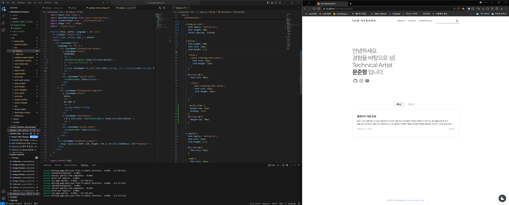
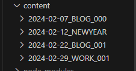

## Gatsby 블로그

블로그 작업을 앞두고 기존 Gatsby기반 블로그, Velog, Tistory 등 다양한 방안을 생각했습니다.

기존 Gatsby 블로그의 경우, 글 작성이 vscode에서 마크다운을 작성해야해,  
개발 환경이 되지 않는 곳에서는 작성이 힘들기에, 블로그 글을 자주 작성하지 않는 문제가 있었습니다.

다만 현재 사적인 내용은 네이버 블로그로 작성을 진행하고 있으며,  
노션이나 Obsidian 처럼 마크다운 기반 툴에서 작성 후, Gatsby 이식이 그리 어렵다고 생각되지 않아서,  
결국 **Gatsby 기반 블로그로 다시 돌아가기로 결정했습니다.**  

*실제로 해보니, 이미지 부분과 줄바꿈 부분만 수정해주면 끝입니다..!*

---

## 기존 블로그 리셋 및 전체 디자인 수정

기존 블로그 세팅 및 작성글들을 전부 리셋해주겠습니다.  
추가로 디자인을 추가할 부분들은 작업해주겠습니다.

기존에 작성한 Gatsby 기반 블로그는 [zoomkoding](https://github.com/zoomkoding/zoomkoding-gatsby-blog) 템플릿 기반입니다.

### 작성글 삭제

기존 작성글을 삭제합니다.  
다만 전체 작성 방식은 까먹을 수 있으니, 확인용으로 백업해두었습니다.




### 전체 디자인 수정

확실히 포트폴리오 사이트로 Nextjs 작업을 하다보니, 비록 프레임워크는 다르지만  
React 기반이기에, 전체적인 파일 구조와 작성 방식이 예전에 헤딩으로 작성하던 때에 비교해서 훨씬 수월하게 작업이 진행되었습니다.

전체적으로 기존 홈페이지에서 수정할 내용은 다음 정도입니다.

- **폰트 수정** : Noto Sans -> Pretendard
	- 제목 폰트 및 상단 카테고리 폰트 : Noto Sans -> Montserrat
- **index 페이지 아이콘 추가** : 깃허브, 이메일 -> 깃허브, 인스타그램, 이메일
- **전체 디자인 손보기** :
	- 여백 수정
	- font-weight 수정 등


### 리포지토리 재생성

기존 junyangyee.github.io 의 경우,
포크한 리포지토리라서 master branch가 제가 수정하는 것이 아니었습니다.

해당 리포지토리 / git 삭제 후, 
새로 생성하여 github action을 사용한 푸쉬 - 자동 배포를 사용했습니다.

기존 파일에 build 폴더를 삭제하고, .github/workflow 디렉토리에 `deploy.yml` 파일을 생성하여 작업하였습니다.  
기존처럼 gh-pages 브랜치에서 배포되지만, master 브랜치에서 코드 전문을 확인할 수 있습니다.

```yml
name: Blog Publish

on:
  push:
    branches:
      - master

jobs:
  build:
    runs-on: ubuntu-latest
    steps:
      - uses: actions/checkout@v3
      - uses: enriikke/gatsby-gh-pages-action@v2
        with:
          access-token: ${{ secrets.BLOG_TOKEN }}
          deploy-branch: gh-pages
```

토큰은 날짜 제한 없는 것을 생성하려 했으나, 보안상 문제가 있다고하여 60일로 생성하였습니다.


---

## 예전 작성글 이전 관련

기존 개인 옵시디언과 노션에 작성했던 내용들을 차근차근 이 블로그로 이전할 예정입니다.  
예전에 작성한 글의 작성일도 함께 가져오기에, 날짜 순으로 정렬되는 블로그 특성 상 이 글의 이전에 위치할 수 있습니다.  

---

## 여담

개인적인 이야기는 네이버 블로그를 통해서 진행합니다.  
~네이버 블로그 링크는... 아는사람들만 아는...~

그럼, 다시 열심히 시작해보겠습니다 :)

> 포트폴리오 링크는 [🔗여기로 들어가시면 됩니다.](https://junyangyee.vercel.app/)

---

```toc
```