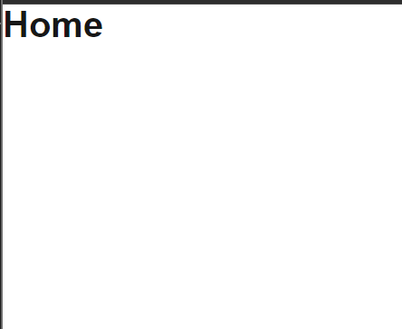
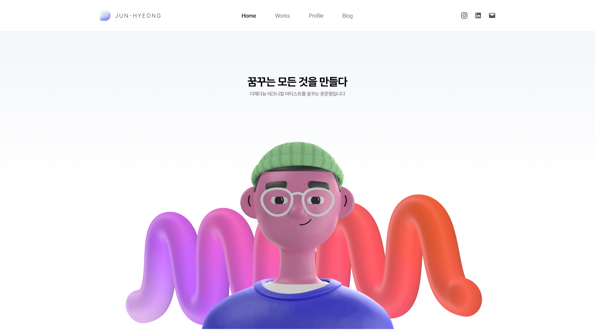
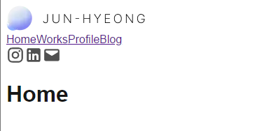
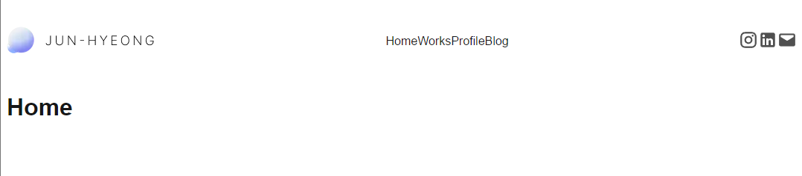
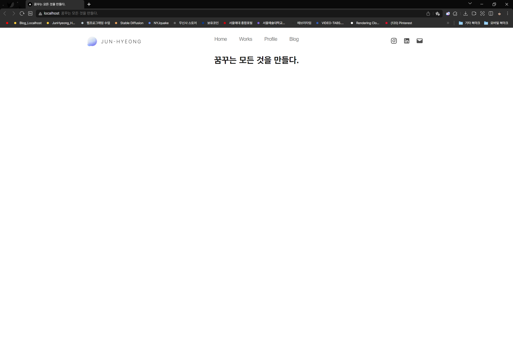

> 기본 css를 작업했습니다.  
> 작업 중 다시 초기화했으나, 과정을 남겨둡니다.

---

## CSS 기본 설정

기본적인 css 구조를 설정하려고 합니다.

기본 `:root` 변수 및 기본 html 및 body 부분 소스코드는 기본 소스코드를 유지하겠습니다.

```css
/* app/globals.css */

/* css 유지 부분 */

:root {
	--background: #ffffff;
	--foreground: #171717;
}

html, body {
	max-width: 100vw;
	overflow-x: hidden;
}

body {
	color: var(--foreground);
	background: var(--background);
	font-family: Arial, Helvetica, sans-serif;
	
	/* 해당 부분은 특정 브라우저(웹킷을 사용하는)에 폰트가 부드럽게 보여지게 설정하는 부분입니다. */
	-webkit-font-smoothing: antialiased;
	-moz-osx-font-smoothing: grayscale;
}
```

전체 선택자 `*` 및 링크 `a` 부분의 css는 모두 지워주겠습니다.

```css
/* app/globals.css */

/* css 삭제 부분 */

* {
	box-sizing: border-box;
	padding: 0;
	margin: 0;
}

a {
	color: inherit;
	text-decoration: none;
}
```

현재 기본 css코드는 사용자의 시스템 테마에 따라 라이트/다크 테마로 변경되게 되어있습니다.  
다만 굳이 다크모드가 필요없는 형태의 사이트이기 때문에, 관련한 코드는 전부 지워주었습니다.

```css
/* app/globals.css */

/* css 삭제 부분 */

@media (prefers-color-scheme: dark) {
	:root {
		--background: #0a0a0a;
		--foreground: #ededed;
	}
}

@media (prefers-color-scheme: dark) {
	html {
		color-scheme: dark;
	}
}
```



---

## 글로벌 폰트 설정

글로벌 폰트를 **Pretendard** 폰트로 변경하겠습니다.  
파일 자체는 정적 폰트 및 가변 폰트 모두 존재하나, 코드의 복잡도를 줄이기 위해 가변폰트 (Variable)를 사용합니다.

Nextjs 기본 설정으로 `.woff` 파일을 사용하고 있어, 
`PretendardVariable.woff2` 파일을 다운르도 받아 적용하겠습니다.  
그와 함께, 기존 fonts폴더에 있던 폰트 `GeistMonoVF.woff`, `GeistVF.woff` 폰트는 삭제합니다.

해당 내용 업데이트를 위해선 `globals.css` 뿐 아니라 `layout.js` 파일도 수정해주어야 하는 것으로 확인되었습니다.  
기존 코드를 바탕으로 Pretendard폰트 적용하였습니다.

```jsx
// app/layout.js

// layout.js 기존코드

import localFont from "next/font/local";
import "./globals.css";

const geistSans = localFont ({
	src: "./fonts/GeistVF.woff",
	variable: "--font-geist-sans",
	weight: "100 900",
});

const geistMono = localFont ({
	src: "./fonts/GeistMonoVF.woff",
	variable: "--font-geist-mono",
	weight: "100 900",
});

export const metadata = {
	. . .
}

export default function RootLayout ({ chiildren }) {
	return (
		<html lang="kr">
			<body className = {`${geistSans.variable} ${geistMono.variable}`}>
				{children}
			</body>
		</html>
	)
}

// layout.js Pretendard 적용 코드

import localFont from "next/font/local";
import "./globals.css";

const pretendard = localFont({
	src: "./fonts/PretendardVariable.woff2",
	variable: "--font-pretendard",
	display: "swap",
	weight: "45 920",
});

export const metadata = {
	. . .
};

export default function RootLayout({ children }) {
	return (
		<html lang="kr">
			<body className={`${pretendard.variable}`}>
				{children}
			</body>
		</html>
	);
}
```


---

## Layout - Navigation Bar 제작

현재 변경된 디자인입니다.



메인으로 사용될 nav bar를 제작해보겠습니다.  
현재 생각하는 구성은 다음과 같습니다.

- Logo | 클릭 시 메인 페이지로
- Category
	- Home | 클릭 시 메인 페이지로
	- Works | 클릭 시 작업물 페이지 ( /works )
	- Profile | 클릭 시 프로필 페이지 ( /profile )
	- Blog | 클릭 시 블로그 ( 외부 링크 )
- Contact
	- Instagram | 클릭 시 인스타그램 오픈 ( 외부 링크 )
	- Facebook (LinkedIn)
	- Mail


### 기본 이미지 추가

웹에서 사용할 로고 및 다양한 아이콘들을 가져왔습니다.  
파일 관리를 위해 상위 폴더에 `public` 폴더를 만들어 `/images`, `/icons` 폴더를 생성하여 구분하였습니다.


### HTML 구조 짜기

해당 네비게이션바는 모든 페이지에 노출이 되어야하는 만큼, `layout.js` 부분에 작성하겠습니다.  
`<nav>` 를 사용하여 진행하겠습니다.

```jsx
// app/layout.js

const iconSize = 26;

export default function RootLayout({ children }) {
    return (
        <html lang="kr">
            <body className={`${pretendard.variable}`}>
                <nav className="nav">
                    <div className="navLogo">
                        <a href="./">
                            <Image src={"/images/logo.png"} 
                            width={200} height={36} alt="JunHyeong"/>
                        </a>
                    </div>
                    
                    <div className="navMenu">
                        <a href="./">Home</a>
                        <a href="/works">Works</a>
                        <a href="/profile">Profile</a>
                        <a href="https://junyangyee.github.io/" 
                        target="_blank">Blog</a>
                    </div>

                    <div className="navContact">
                        <a href="https://www.instagram.com/ju_nyang_yee/" 
                        target="_blank">
                            <Image src={"/icons/Instagram.svg"} width={iconSize} 
                            height={iconSize} alt="Instagram" title="Instagram"/>
                        </a>
                        <a href="" target="_blank">
                            <Image src={"/icons/LinkedIn.svg"} width={iconSize} 
                            height={iconSize} alt="LinkedIn" title="LinkedIn"/>
                        </a>
                        <a href="mailto:answnsgud19@gmail.com">
                            <Image src={"/icons/Mail.svg"} width={iconSize} 
                            height={iconSize} alt="Mail" title="Mail"/>
                        </a>
                    </div>
                </nav>
                {children}
            </body>
        </html>
    );
}
```




### CSS 꾸미기

일단 가장 보기 싫은 저 text decoration 먼저 없애주겠습니다.

```css
/* app/globals.css */

a {
    color: inherit;
    text-decoration: none;
}
```

좌우로 펼쳐져 있는 구조를 위해 최상위 `.nav` 클래스의 css를 제작했습니다.

```css
/* app/globals.css */

.nav {
	height: 100px;
	display: flex;
	justify-content: space-between;
	align-items: center;
}
```


- `height: 100px` : figma에서 제작한 대로 GNB의 높이를 100px로 설정합니다.
- `display: flex;` : 세로로 되어있는 nav 내용물을 가로로 배열합니다.
- `justify-content: space-between;` : 아이템 ( `<div>`아이템 ) 사이의 간격을 균일하게 벌립니다.
- `align-items: center;` : 아이템들을 가운데 정렬해줍니다.

## 작업 중단 / 초기화

작업을 진행하면서 문제가 발생하였습니다.  
기존 제가 원하던 것은 메뉴바는 정 중앙에 있고, 로고와 Contact 부분은 양 끝으로 가는 것을 생각하였습니다. 다만 작업을 진행하다보니 메뉴바가 중앙이 아닌 로고/Contact 사이에 위치하는 것을 확인하였습니다.  
아무래도 `justify-content: space-between`때문인 것으로 보여 이것저것 수정을 진행하면서, 어떻게든 중앙으로 오도록 제작하긴 했으나, 
어긋나는 부분도 있고 이해를 못한채로 막 만져보다보니 코드가 지저분해진 부분도 있어,  
다시 처음부터 진행해보려합니다.

이전까지 진행한 내용들을 일단 복사해놓겠습니다.  
추후 어떤 부분이 문제였는지 파악하면서 작업을 진행하려합니다.



```jsx
// app/layout.js

export default function RootLayout({ children }) {
    return (
        <html lang="kr">
            <body className={`${pretendard.variable}`}>
                <nav className="nav">
                    <div className="navLogo">
                        <a href="./">
                            <Image src={"/images/logo.png"} width={200} height={36} alt="JunHyeong"/>
                        </a>
                    </div>
                    
                    <div className="navMenu">
                        <a href="./">Home</a>
                        <a href="/works">Works</a>
                        <a href="/profile">Profile</a>
                        <a href="https://junyangyee.github.io/" target="_blank">Blog</a>
                    </div>

                    <div className="navContact">
                        <a href="https://www.instagram.com/ju_nyang_yee/" target="_blank">
                            <Image src={"/icons/Instagram.svg"} width={iconSize} height={iconSize} alt="Instagram" title="Instagram"/>
                        </a>
                        <a href="" target="_blank">
                            <Image src={"/icons/LinkedIn.svg"} width={iconSize} height={iconSize} alt="LinkedIn" title="LinkedIn"/>
                        </a>
                        <a href="mailto:answnsgud19@gmail.com">
                            <Image src={"/icons/Mail.svg"} width={iconSize} height={iconSize} alt="Mail" title="Mail"/>
                        </a>
                    </div>
                </nav>
                {children}
            </body>
        </html>
    );
}
```

``` css
/* app/globals.css */

:root {
    --background: #ffffff;
    --foreground: #171717;
}

* {
    margin: 0;
    padding: 0;
} 

html,
body {
    max-width: 100vw;
    overflow-x: hidden;
}

body {
    color: var(--foreground);
    background: var(--background);
    /* 해당 부분은 특정 브라우저(웹킷을 사용하는)에 폰트가 부드럽게 보여지게 설정하는 부분입니다. */
    -webkit-font-smoothing: antialiased;
    -moz-osx-font-smoothing: grayscale;
    margin: 0 320px;
}

a {
    color: inherit;
    text-decoration: none;
}

.nav {
    max-width: 1280px;
    height: 100px;
    display: flex;
    justify-content: space-between;
    align-items: center;
}

.nav .navLogo {
    margin-left: 0;
    width: 200px;
    height: 36px;
}

.nav .navMenu {
    width: 400px;
    height: 36px;
    display: flex;
  
    font-size: 18px;
    font-weight: 45;
    color: #787878;
    letter-spacing: -0.03em;
    text-align: center;
    justify-content: space-evenly;
}
  
.nav .navContact {
    min-width: 142px;
    height: 36px;
    padding-left: 58px;
  
    display: flex;
    align-items: center;
    justify-content: space-around;
}
  
h1 {
    text-align: center;
}
```


---

## Todo

이렇게 헤메는 이유가, 기본적인 구조를 짜놓지 않고 Figma에서 이미지만 만들어두고 그대로 따라 만들려다보니 발생하는 문제인 것 같습니다.  
Figma에서부터 구조를 생각하면서 디자인을 하고, 그런 다음 작업을 진행해야 조금 더 수월하게 될 것 같습니다.

전체적인 페이지 레이아웃을 그려놓고 작업을 진행해보려합니다.  
HTML 부분부터 다시 새롭게 진행하려하며, 전체 페이지를 Grid로 구분한 후 Grid 바탕으로 css를 구성할 생각입니다.

참고 페이지는 [포르쉐](https://www.porsche.com/) 홈페이지입니다.
해당 페이지도 Grid 기반으로 되어있어 해당 페이지를 참고할 생각입니다.


---

```toc
```