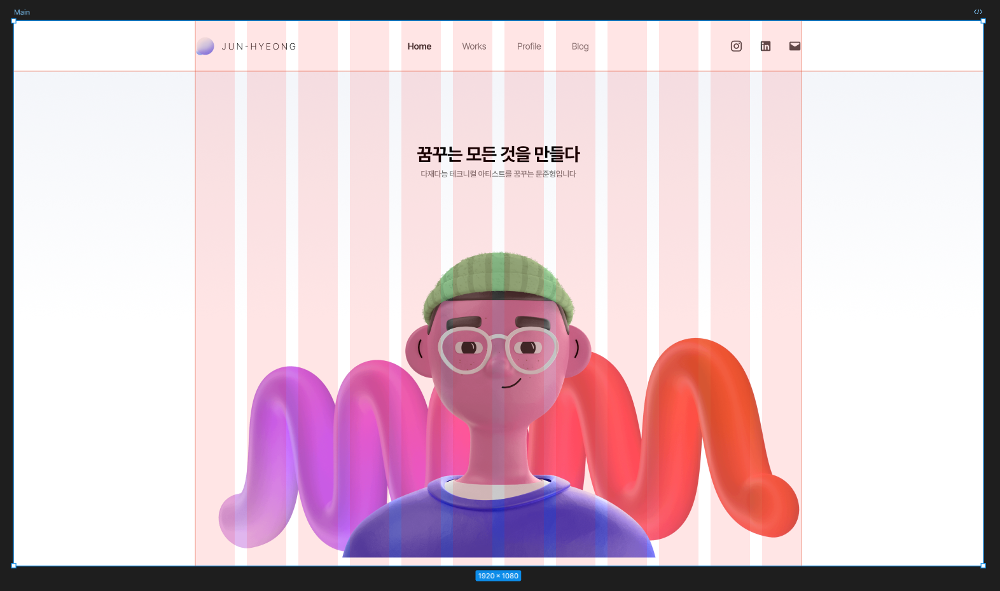
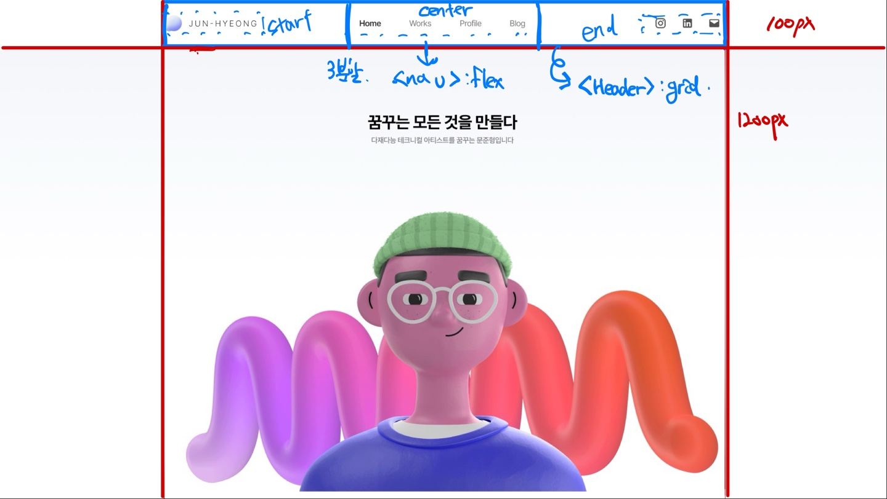
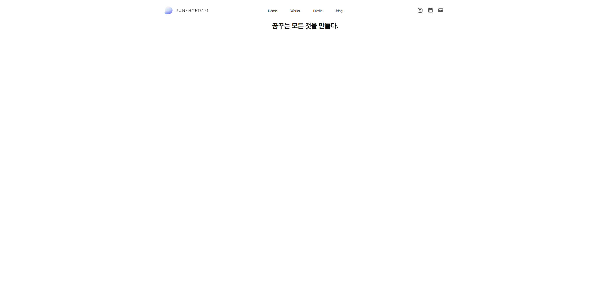
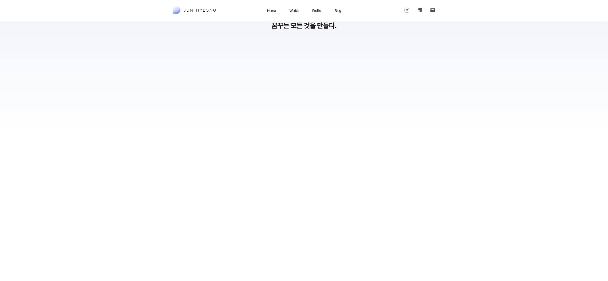
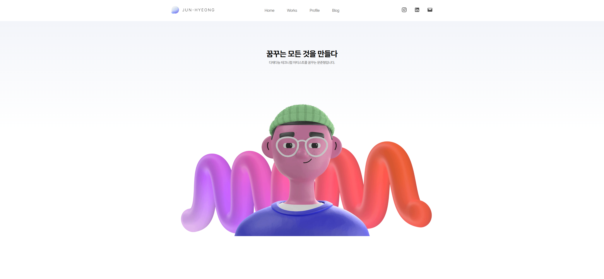
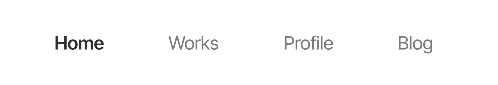
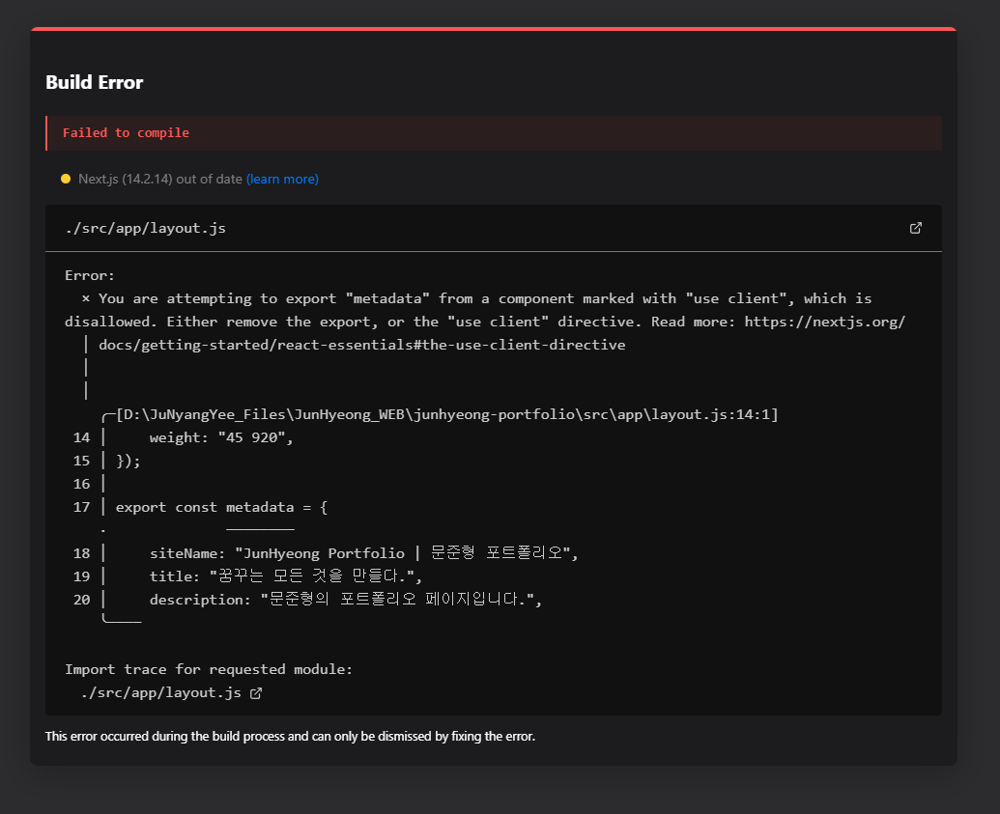
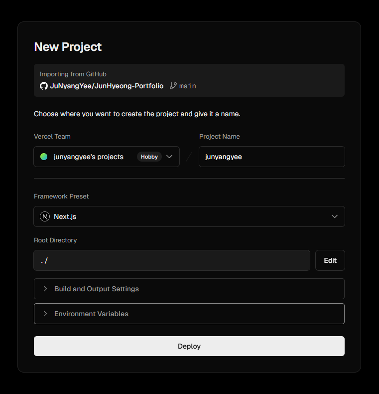

> 메인 페이지를 제작하였습니다.  
> 배포까지 진행해 바로바로 수정사항이 배포될 수 있도록 설정하였습니다.

---

##  기존코드 오류 수정

예전에 윈도우를 예쁘게 써보겠다고 MacType을 사용해서  
윈도우 전체 폰트를 Pretendard로 변경했었습니다. (예쁘게 쓰긴 했습니다.)  
다만 이런 상태로 폰트를 변경하는 작업을 하다보니, 기존에 Pretendard 를 적용했던 게 잘 적용된 것으로 보였습니다.  
혹시 몰라 MacType 해제 후 다시 확인해보니, 적용이 안된 채로 맑은 고딕으로 보이고 있었습니다.

확인해보니 `<body className={'${pretendard.variable}'}>` 이렇게 코드를 작성했었는데,  
해당 부분이 전역으로 폰트를 설정하는 것이 아닌 포인트를 줄 수있도록 된 것이었습니다.  
`variable` 부분을 `className` 으로 변경하면 전역으로 사용되게 됩니다.

해당 부분에 대한 이해는 아직 잘 되지 않습니다.  
사실 기존 css 에 font-family 로 하는 것이 더 익숙하지만, 폰트 최적화에서는 해당 방법이 더 좋다고 하기에 이 방법으로 계속 진행해보려 합니다.

추가로 `$` 표시가 의미하는 것을 찾아보려 했으나, 무슨 의미인지 확인하지 못했습니다.  
인터넷에선 제거한 것과 안 한 것 다 있어서, 지운채로 사용하겠습니다.  
문법과 관련 정보를 계속해서 찾아보려고 합니다.

```jsx
// app/layout.js

export default function RootLayout({ children }) {
    return (
        <html lang="kr">
            <body className={pretendard.className}>
                {children}
            </body>
        </html>
    );
}
```


---

## 메인 페이지 레이아웃 수정

이전에 문제라고 생각했던 레이아웃 구상 부분을 구체화해보려합니다.

기존 피그마 작업물은 그리드나 다른 것들을 구상하지 않고 그냥 이미지만 제작한 상황입니다.  
해당 작업물을 조금 더 수치화하고 구조를 생각하면서 진행해보려합니다.

컨테이너의 크기를 기존 1280px 에서 1200px로 축소하였습니다.  
추후 1280px 비율의 디자인을 진행할 때, 좌우 40px 정도 마진을 주기위해 축소하였습니다.



그리드는 추후 관련 작업이 필요할 경우를 위해 만들어두었으나,
지금 현재에는 필요없는 부분인 것 같아 코드 상에는 구현하지 않았습니다.



구상 단계에서부터 구조를 어떻게 짤지 그림으로 그려본 후, 코딩 작업으로 넘어갔습니다.

### HTML 코드 구성

기존에는 HTML코드부터 정리되지 않고 구체화되지 않은채로 nav로 모든 것을 묶어둔 상태였습니다.  
새롭게 코드를 작성해서 구조화되고 깔끔하게 보이도록 진행하였습니다.

```jsx
// app/layout.js

export default function RootLayout({ children }) {
    return (
        <html lang="kr">
            <body className={pretendard.className}>
                <header className="gnbContainer">
                    <div className="pageLogo">
                        <a href="./">
                            <Image src={"/images/logo.png"} width={200} height={36} alt="JunHyeong"/>
                        </a>
                    </div>
                    <nav className="pageMenu">
                        <ul className="menuList">
                            <li>
                                    <a href="./">Home</a>
                                </li>
                                <li>
                                    <a href="/works">Works</a>
                                </li>
                                <li>
                                    <a href="/profile">Profile</a>
                                </li>
                                <li>
                                    <a href="https://junyangyee.github.io/" target="_blank">Blog</a>
                                </li>
                        </ul>
                    </nav>
                    <div className="pageContact">
                        <ul className="contactList">
                            <li>
                                <a href="https://www.instagram.com/ju_nyang_yee/" target="_blank">
                                    <Image src={"/icons/Instagram.svg"} width={26} height={26} alt="Instagram" title="Instagram"/>
                                </a>
                            </li>
                            <li>
                                <a href="" target="_blank">
                                    <Image src={"/icons/LinkedIn.svg"} width={26} height={26} alt="LinkedIn" title="LinkedIn"/>
                                </a>
                            </li>
                            <li>
                                <a href="mailto:answnsgud19@gmail.com">
                                    <Image src={"/icons/Mail.svg"} width={26} height={26} alt="Mail" title="Mail"/>
                                </a>
                            </li>
                        </ul>
                    </div>
                </header>
                {children}
            </body>
        </html>
    );
}
```

`<header>` 태그로 gnb 전체를 감싸주었으며, 다양한 아이템이 있을 경우 리스트 태그를 사용하여 감싸주었습니다.

### CSS 디자인

기존 코드는 GNB 자체를 `display: flex;`로 묶어두었습니다.  
다만 이 방법으로는 중앙 메뉴바를 가운데로 정렬하기에 난이도가 있었으며, 기존에는 중앙 메뉴바의 가로 길이가 로고와 컨텍메뉴 사이를 꽉 채우는 것으로 구상하여 중앙 정렬에 난이도가 조금 더 있었던 것 같습니다.

```css
/* app/globals.css */

:root {
    --background: #ffffff;
    --foreground: #171717;

    --font-black: #303030;
    --font-gray: #787878;
    --font-extrabold: 800;
    --font-semibold: 600;
    --font-regular: 400;
}

* {
    margin: 0;
    padding: 0;
}

html,
body {
    max-width: 100vw;
    overflow-x: hidden;
}

body {
    width: 100%;
    max-width: 1200px;
    margin-left: auto;
    margin-right: auto;
    padding-right: 40px;
    padding-left: 40px;
  
    color: var(--foreground);
    background: var(--background);
  
    font-size: 16px;
    letter-spacing: -0.05rem;
    font-weight: var(--font-regular);
    /* 해당 부분은 특정 브라우저(웹킷을 사용하는)에 폰트가 부드럽게 보여지게 설정하는 부분입니다. */
    -webkit-font-smoothing: antialiased;
    -moz-osx-font-smoothing: grayscale;
}
  
ul, li {
    list-style: none;
}
  
a {
    color: inherit;
    text-decoration: none;
}
  
.gnbContainer {
    width: 100%;
    height: 100px;
    display: grid;
    grid-template-columns: 1fr auto 1fr;
    grid-template-rows: 1fr;
    gap: 0px 0px;
    grid-template-areas: "left center right";
}
  
.pageLogo {
    display: flex;
    grid-area: left;
    justify-self: start;
    align-items: center;
  
    position: relative;
}
  
.pageMenu {
    display: flex;
    grid-area: center;
    justify-self: center;
    align-items: center;
    text-align: center;
    position: relative;
}
  
.menuList {
    display: flex;
    width: 400px;
    justify-content: space-around;
    
    font-size: 1.125rem;
    color: var(--font-gray);
}
  
.pageContact {
    display: flex;
    grid-area: right;
    justify-self: end;
    align-items: center;
    position: relative;
}
  
.contactList {
    display: flex;
    width: 144px;
    justify-content: space-between;
}
  
h1 {
    text-align: center;
}
```



기본적으로 body 컨테이너 부분을 중앙정렬하기 위해 `max-width` 및 `margin` 부분을 작업하였습니다. 추가로 좌우 40px의 패딩을 주어서 최소 1280px까지 body 컨테이너 구간을 설정하였습니다.

전체적인 수치는 figma 작업 기준으로 진행하였습니다.  
GNB 전체를 `.gnbContainer` 클래스로 묶어서 작업을 진행하였으며 큰 레이아웃은 `display: grid`로 구분하였습니다.  
그리드는 `1fr auto 1fr` 로 작업하여 가운데 부분이 자동으로 설정되어 중앙정렬되도록 설정하였습니다.  
크게 그리드의 지역을 left center right로 나뉘어 area 설정을 진행하였으며, 위치에 맞게 아이템 정렬을 진행하였습니다.

메뉴 리스트는 400px로 여유있게 설정하였으며, 우측 컨택 리스트는 144px로 8x16 사이즈로 작업하였습니다.  
내부는 `display: flex`로 설정하여 아이템들을 정렬하기 편하도록 작업하였습니다.

#### px 단위와 rem 단위

예전에 HTML/CSS 를 배울때에 `rem em xp vh vw`등 다양한 단위가 있다는 건 배웠었습니다.  
다만 이걸 정확히 어떻게 사용해야할지 잘 몰라서 익숙한 px 단위를 사용하였습니다.  
이번에 css를 수정하면서 다양한 정보들을 찾아보았는데, 대부분 rem 단위를 사용해서 그 이유를 찾아보았습니다.

[CSS에서 rem 단위 사용하기](https://blog.jeongtae.com/rem-%EA%B3%A0%EC%B0%B0)  
해당 블로그를 통해서 관련한 내용을 참고하였습니다.

px단위의 경우 다양한 디자인 툴에서 디자인 한 것을 그대로 구현할 수 있다는 장점이 있습니다.  
포토샵과 figma 등 다양한 툴에서 px를 기본으로 사용하기에, 디자인툴에 익숙한 저로써는 더욱 px를 사용하려고 했습니다.

다만 px단위의 단점으로는 다음과 같은 부분이 있습니다.
- 전체적인 폰트 크기 수정을 하려면 상위부터 하위 클래스까지 전부 수치를 바꾸어야한다.
- 모든 디바이스/브라우저에서 글씨가 같은 크기로 나온다.
	- 폰트 크기를 조절하는 경우 일정하게 조절되지 않는다.
	- 즉, 브라우저의 기본 폰트 크기를 조절해도 대응되지 않는다.

이런 부분때문에 폰트의 경우는 rem단위를 사용하는 경우가 많다고합니다.

rem 단위는 Root 요소 (html / 브라우저의 font-size)를 바탕으로 계산이 되는 단위입니다.  
장점으로는 다음과 같은 부분이 있습니다.
- 웹 브라우저마다 다른 기본 폰트 사이즈에 대응 가능하다.
- 저시력자 접근성이 좋다
- 전체 스타일의 스케일을 손쉽게 조정할 수 있다.

단점으로는 px단위 기반으로 디자인하는 경우가 많아 계산이 불편하다는 점이 있지만,  
[해당 사이트](https://nekocalc.com/px-to-rem-converter)처럼 px과 rem 계산을 해주는 사이트가 존재하여, 디자인된 px를 rem으로 변경하면 될 것 같습니다.


---

## CSS 모듈화

현재 `globals.css`에 모든 css 디자인이 들어가있습니다.  
이렇게 될 경우 추후 `globals.css`에 너무 많은 부분이 들어가 점점 복잡해질 가능성이 있습니다.  
각 페이지에 맞게 css를 모듈화하여 작업을 진행해보려합니다.

현재 글로벌 세팅으로 두어야하는 것들 (a, li의 스타일, :root 색상 정보 등)은 `globals.css`에,
`layout.js`에만 사용되는 부분들은 모듈화하여 `layout.module.js`에 저장하도록 하겠습니다.

### CSS 모듈화란?

사실 Next.js의 기본으로 있던 `page.module.css` 파일이 무슨 역할인지 1일차 설정 때 찾아보고 처음 알았습니다.  
기존 css의 경우, 코드가 복잡해짐과 함께 클래스의 충돌이 발생할 여지가 상당히 많습니다.  
예전에 html/css를 배울때에는 그렇게 복잡해질 일이 별로 없었으나, 이렇게 페이지를 직접 제작하다보면 복잡해지고 충돌이 일어날 가능성이 매우 높아집니다.

css 모듈화는 다음과 같은 방식으로 진행됩니다.  
파일명을 `모듈이름.module.css`로 생성한 후 js에 임포트합니다.  
`import styles from "./모듈이름.module.css";`

그 이후 기존에 있던 클래스들을 다음과 같이 수정합니다.
`<div className={styles.클래스이름}/>`

물론 최상단에 `import "./globals.css";`는 작성해야 글로벌 css가 적용됩니다.

### 코드 수정

수정을 진행하면서 기존 구분을 위해 복잡하게지었던 클래스명도 간단하게 수정하여 적용하였습니다.

```jsx
// app/layout.js

import styles from "./layout.module.css";

export default function RootLayout({ children }) {
	return (
		// 
			<header className={styles.container}>
				<div className={styles.logo}>
				</div>
				<nav className={styles.menu}>
					<ul className={styles.memuList}>
					</ul>
				</nav>
				<div className={styles.contact}>
					<ul className={styles.contactList}>
					</ul>
				</div>
			</header>
		//
	)
}
```

```css
/* app/layout.module.css */

.container {
    width: 100%;
    height: 100px;
    display: grid;
    grid-template-columns: 1fr auto 1fr;
    grid-template-rows: 1fr;
    gap: 0px 0px;
    grid-template-areas: "left center right";
}
  
.logo {
    display: flex;
    grid-area: left;
    justify-self: start;
    align-items: center;
  
    position: relative;
}
  
.menu {
    display: flex;
    grid-area: center;
    justify-self: center;
    align-items: center;
    text-align: center;
    position: relative;
}
  
.memuList {
    display: flex;
    width: 400px;
    justify-content: space-around;
    
    font-size: 1.125rem;
    color: var(--font-gray);
}
  
.contact {
    display: flex;
    grid-area: right;
    justify-self: end;
    align-items: center;
    position: relative;
}
  
.contactList {
    display: flex;
    width: 144px;
    justify-content: space-between;
}
```


---

## 배경 그라디언트 작업

GNB 제작이 완료되었으니 메인화면 작업을 진행해보겠습니다.  
현재 피그마에 제작된 배경의 경우 배경 전체에 그라디언트가 들어가있습니다.

현재 작업했던 css는 body를 1200px의 중앙 부분만 적용해두었습니다.  
html에 `background-image`를 활용하여 전체에 적용시켜보겠습니다.

### CSS 그라디언트 작업

배경을 추가하면서 상단 헤더부분이 1200px 위치만 하얗게 가려지는 문제가 발생하였습니다.  
해당 문제를 해결하기 위해 해더의 높이인 100px만큼 position을 내려주었습니다.

그와 함께 body내에 있던 `background-color` 부분이 뒷 배경을 가리고 있어 해당 부분을 삭제하였습니다.

추가로 body에 있는 color 부분도 의미가 없어서 삭제한 후 `:root`에 있던 `--background` `--foreground` 변수도 삭제하였습니다.

```css
/* app/globals.css */

html {
    background-position: 0px 100px;
    background-image: linear-gradient(to bottom, #F3F5FA, #ffffff);
    background-repeat: no-repeat;
    background-size: 100vw 500px;
}
```



---

## 메인페이지 작업

이제는 `page.js` 에서 작업을 진행합니다.  
기존 텍스트에 서브텍스트 추가 및 아바타 이미지를 임시로 추가해두겠습니다.

메인페이지 역시 `main.module.css`파일을 생성하여 css 모듈을 만들어주겠습니다.

```jsx
// app/page.js

import styles from "./main.module.css";
import Image from "next/image";

export default function Home() {
    return (
        <main className={styles.main}>
            <div className={styles.title}>
                <h1 className={styles.titleText}>꿈꾸는 모든 것을 만들다</h1>
                <p className={styles.titleSub}>다재다능 테크니컬 아티스트를 꿈꾸는 문준형입니다.</p>
            </div>

            <div className={styles.image}>
                <Image src={"/images/Profile_Avatar.png"} fill></Image>
            </div>
        </main>
    );
}
```

```css
/* app/main.module.css */

.main {
    width: 100%;
    display: block;
    justify-content: center;
    align-items: center;
}

.title {
    display: block;
    padding-top: 120px;

    text-align: center;
}

.titleText {
    font-size: 2.25rem;
    color: #000000;
    font-weight: var(--font-bold);
}
  
.titleSub {
    margin-top: 0.575rem;
    font-size: 1rem;
    font-weight: var(--font-medium);
    color: #777777;
}
  
.image {
    width: 1200px;
    height: 660px;
    margin-top: 9rem;
    display: block;
    position: relative;
    text-align: center;
}
```




---

## 코드 최적화

찾아보니 현재 nav 메뉴에서 사용한 `<a>`태그의 경우, 외부링크에는 효율적이지만 내부 페이지 이동에서는 전체 렌더링이 다시 진행되어 느릴 수 있다고 합니다.  
이를 위해서 nextjs에서는 `<Link>` 컴포넌트를 만들어두어서, 이를 사용하려고 합니다.

```jsx
// app/layout.js

import Link from "next/link";

//
	<li>
		<Link href="./">Home</Link>
	</li>
	<li>
		<Link href="/works">Works</Link>
	</li>
	<li>
		<Link href="/profile">Profile</Link>
	 </li>
	<li>
		<a href="https://junyangyee.github.io/" target="_blank">Blog</a>
	</li>
//
```

외부로 이동하는 링크는 계속해서 `<a>` 태그를 사용하고, 내부 페이지 이동만 `<Link>` 태그를 이용하겠습니다.


---

## 컴포넌트 분리

### 분리하는 이유

navMenu에서 현재 오픈된 페이지의 텍스트가 굵게 보이는 것을 구현하기 위해 찾아보고 있었습니다.



이 부분을 구현하기 위해서 다음과 같은 코드를 발견하였습니다.

```jsx
// https://mariais.tistory.com/entry/Nextjs-useSelectedLayoutSegment-%ED%98%84%EC%9E%AC-%EC%9E%88%EB%8A%94-%ED%8E%98%EC%9D%B4%EC%A7%80%EC%9D%98-%EC%A3%BC%EC%86%8C%EB%A5%BC-%EC%95%8C%EA%B3%A0-%EC%8B%B6%EC%9D%80-%EA%B2%BD%EC%9A%B0

'use client';

import { useSelectedLayoutSegment } from "next/navigation";
import Link from "next/link";

export default function NavMenu() {
	const segment = useSelectedLayoutSegment();
	console.log(segment);
	return (
		<>
			<li>
				<Link href="/home">
					<div>
						{segment === "home" ? (
							<>
								<div style={{ fontWeight: "bold" }}>홈이당</div>
							</>
						) : (
							<>
								<div>홈아니당</div>
							</>
						)}
					</div>
				</Link>
			</li>
```

```jsx
// https://www.geeksforgeeks.org/how-to-add-styling-to-an-active-link-in-nextjs/

'use client';
import { usePathname } from "next/navigation";
import Link from "next/link";
import "./globals.css";

export default function RootLayout({ children }) {
	const pathname = usePathname();
	return (
		<html lang="en">
			<body>
				<nav>
					<Link
						className={`${pathname === "/" ? "active" : ""}`}
						href="/"
					>
						Home
					</Link>
```

이처럼 `next/navigation`에 있는 `{ useRouter }` `{ usePathname }` `{ useSelectedLayoutSegment ]` 등 다양한 라우팅기반 기능들을 찾을 수 있었습니다.

이 내용들을 `layout.js`에 추가하고자 다음 부분을 추가하였습니다.

```jsx
// app/layout.js

'use client';
import { usePathname } from "next/navigation";

export default function RootLayout({ children }) {
	const pathname = usePathname();
	return ( );
```

이렇게 실행하니 다음과 같은 오류화면이 나왔습니다.



이유를 찾아보니 `export const metadata = {}` 부분인 메타데이터 부분에서 오류가 발생한다는 것을 확인했습니다.

Nextjs에서 메타데이터는 클라이언트사이드(CSR)에서 작동하지 않고, 서버사이드에서 작동합니다.  
허나 `'use client'`를 사용하여 클라이언트사이드에서 돌아가게 설정하여, 오류가 발생했다는 것을 알았습니다.

이를 해결하기 위해서 컴포넌트를 분리하면 제대로 동작한다는 것을 확인하고 분리를 진행하려합니다.


### 컴포넌트 분리하기

분리하는 부분은 GNB 중 nav 부분입니다.  
다른 부분은 클라이언트사이드에서 만질 것들이 아직은 없는 것 같아, 해당 부분만 컴포넌트로 분리하여 작업해보겠습니다.

먼저 `src/components` 폴더를 생성하겠습니다.  
그 후 안에 `navMenu.js` 파일을 생성하여 작업을 진행해보겠습니다.

기존에 필요하던 것들을 임포트하겠습니다.

```jsx
// app/components/navMenu.js

'use client';
import { usePathname } from "next/navigation";
```

그리고 기본적으로  필요한 구조를 생성해서 추가하겠습니다.  
기존 코드 중 `<nav>` 부분을 그대로 가져오며, 그에 맞게 `import Link from "next/link"`도 추가해줍니다.  
추가적으로 활성되는 스타일은 기존 css를 그대로 사용하기 위해 모듈 css도 추가해주겠습니다.

```jsx
// app/components/navMenu.js

import Link from "next/link";
import styles from "../app/layout.module.css";

export default function NavMenu() {
	return (
	...
		<nav className={styles.menu}>
			...
		</nav>
	...
	)
}
```

현재 경로를 파악하기 위한 코드를 추가하고, className에 조건을 추가하여 현재 페이지 경로에 따라 css에서 온오프 되도록 설정하였습니다.

```jsx
// src/components/navMenu.js

import styles from "../app/layout.module.css";

export default function NavMenu() {
	const pathname = usePathname();
	return (
	...
		<Link href="./" 
		className={pathname === "/" ? styles.active : styles.none}>
		Home</Link>
		...
		<Link href="/works" 
		className={pathname === "/works" ? styles.active : styles.none}>
		Works</Link>
		...
		<Link href="/profile" 
		className={pathname === "/profile" ? styles.active : styles.none}>
		Profile</Link>
		...
	...
	)
}
```

추가로 모듈css에서 스타일도 적용해줍니다.

```css
/* src/app/layout.module.css */

.memuList {
    display: flex;
    width: 400px;
    justify-content: space-around;
    font-size: 1.125rem;
}

.active {
    color: var(--font-black);
    font-weight: var(--font-semibold);
}

.none {
    color: var(--font-gray);
    font-weight: var(--font-regular);
}
```


### 컴포넌트 적용

컴포넌트를 적용하기위해 `layout.js`에 컴포넌트 파일을 임포트합니다.

```jsx
// src/app/layout.js

import Nav from "../components/navMenu";
```

그리고 기존에 있던 부분을 `<Nav></Nav>` 형태로 대체하여 적용합니다.

```jsx
// src/app/layout.js

export default function RootLayout({ children }) {
	return (
		...
		<div className={styles.logo}></div>
		
		<Nav></Nav>
		
		<div className={styles.contact}></div>
		...
	)
}
```

최종 적용한 모습입니다.


---

## Vercel로 임시 배포

일단 배포를 먼저 해두고 싶어서 배포를 했습니다.  
[이 사이트](https://ziszini.tistory.com/146)에서 도움을 받아서 진행했습니다.

~*[임시 배포 링크](https://junyangyee.vercel.app/)*~  
*현재 포트폴리오 공식 배포 링크입니다. 클릭 시 포트폴리오 사이트로 이동합니다.*




---

## Todo

> 추후 작업할 내용입니다.  
> 순서대로 작성한 것이 아니며,
> 확정이 아니기에 추후 작업하면서 변경될 수 있습니다.

- **Profile 및 Works 페이지 만들기 (Figma)**
	- 레이아웃 구상
	- 기초 레이아웃 잡아두기

- **Profile 페이지 만들기**
	- HTML 구조 짜놓기

---

```toc
```