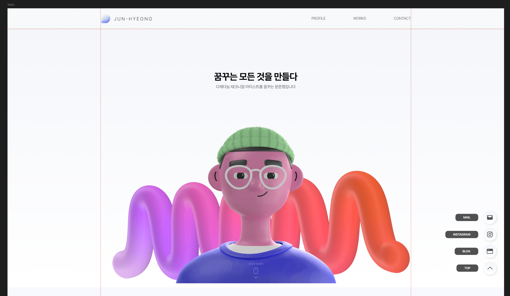
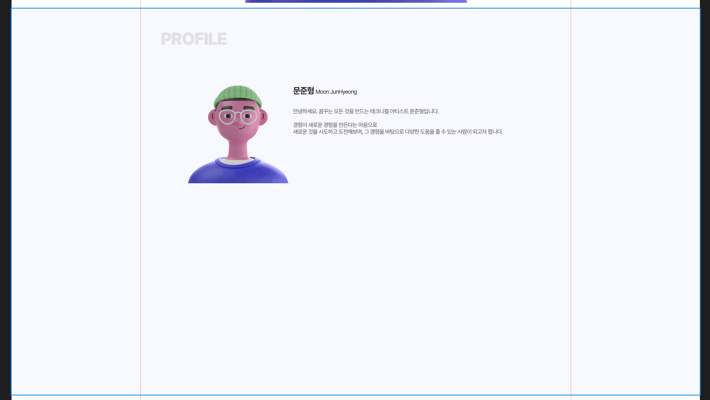

> 전체 레이아웃을 원 페이지 형태로 변경하였습니다.  
> 개발 과정보다는 레이아웃 고민을 진행한 흔적입니다.

---

## 프로필 페이지 디자인

기존 작업했던 figma에서 디자인 작업을 이어서 진행하겠습니다.  
생각보다 전체적인 레이아웃을 어떻게 잡아야할지 헷갈리는 상황이었습니다.  
일단은 일반적으로 사용하는 디자인을 바탕으로 일단 작업을 시작하려고합니다.

- **자기소개 인사**
- **About Me**
	- 직무
	- 경력
	- 교육
- **Tech Stack**

### 원 페이지 스크롤 vs 멀티 페이지

이쯤에서 고민되는 부분이 있습니다.

포트폴리오 사이트 레퍼런스를 찾기위해 돌아다녀보니,
최근 대부분의 포트폴리오 사이트들은 원 페이지 스크롤 형태로, 여러 페이지를 이동하지 않고 한 페이지 내에 모든 내용을 다 담아두는 형태가 많았습니다.

현재 제가 작업하던 내용은 Home / Works / Profile
큰 카테고리 3가지의 페이지를 제작해 이동하게 하는 형태였습니다.

원 페이지와 멀티 페이지의 장단점은 다음과 같다고 생각합니다.

**원 페이지**
- 장점
	- 한 페이지 안에 모든 정보를 담아, 이탈율이 적어진다.
	- 모바일로 확인하기 편리하다
- 단점
	- 작업물이 많아지면 UX가 복잡해진다.
	- 페이지 로딩에 시간이 걸린다.

**멀티 페이지**
- 장점
	- 확실한 구분으로 원하는 정보를 헤매지 않고 찾을 수 있다.
	- 작업물들을 따로 정리해둔 페이지가 있기에 UX가 단순해진다.
- 단점
	- 모든 정보를 확인하지 않은채 이탈할 가능성이 높다.
	- 모바일에서 확인하기 불편하다.


---

## 원 페이지 스크롤 레이아웃으로 변경

고민 끝에 **원페이지 스크롤 형식**으로 변경하려고 합니다.  
변경하게된 이유는 다음과 같습니다.

- 기존 형식은 메인 페이지의 의미가 사실 희미했습니다.
	- 메인 페이지에서 보여주고자하는 내용이 사실 애매했습니다.
	- 한 줄 자기소개 문장 이외에 그 아래에는 들어갈 것이 애매했습니다.
- 모바일 대응이 편리합니다.
	- 모바일 구조 상 탭으로 이동하는 것보다 스크롤 형식으로 변경하는 것이 좋겠다 생각했습니다.
- 작업물 구분은 페이지를 나누어도 된다고 판단했습니다.
	- 스크롤 페이지에 Works 섹션에는 메인이 되는 작업물 (자신있는 작업물)을 두고,  
	  "다른 작업 보러가기 ➡"와 같은 버튼을 만들어서 페이지 이동을 유도하는 방법이 더 깔끔할 것 같습니다.
- 입사용 포트폴리오인 만큼, 한 페이지 안에 담는 것이 좋다고 생각했습니다.
	- 면접을 보는 사람들이 탭을 들어가면서까지 확인하지 않을 수 있기에  
	  첫 페이지에서 몇번의 스크롤만으로 포트폴리오를 확인할 수 있도록 유도하려합니다.

물론 기존에 있던 작업물을 조금 많이 수정해야한다는 점.  
특히 css 부분을 많이 바꾸어야한다는 점이 있겠지만, 그래도 처음부터 방향을 잘 잡고 하는 것이 좋을 것 같습니다.

일단 기존 레이아웃을 수정해야할 것 같습니다.

※ 지금까지 작업들은 파일들을 복사해서 백업해두려고합니다.  
추후 다른 형태로 사용할 수 있도록 보관할 생각입니다. ※


---

## 레이아웃 수정

기존 레이아웃을 크게 수정합니다.  
Figma에서 기존 작업을 바탕으로 원페이지 스크롤 형태로 수정을 진행하고있습니다.



해당 메인 페이지는 풀 스크린으로 보이게 제작할 예정입니다.

상단 메뉴바를 3개로 단축하였으며, 해당 버튼들은 상단에 고정된 형태로 스크롤을 따라오게 할 예정입니다.  
순서는 스크롤하는 순서로 적용하였습니다.  
기존엔 현재 페이지의 메뉴는 볼드처리가 되었으나, 지금은 스크롤 형태이기에, 일단은 제외하였습니다.

우측 하단에는 바로 클릭할 수 있게 버튼들을 생성하였습니다.  
현재 블로그로 이동하는 버튼을 우측 하단에 만들어 놓았으나, 기존처럼 상단에 넣을까도 고민 중입니다.  
다만 다른 버튼들은 스크롤 이동인데, 블로그만 페이지 이동이기에 버튼형식으로 상단에 남길지, 혹은 우측 하단에만 남길지 계속해서 고민해보겠습니다.

### Profile



프로필 부분을 디자인하고 있습니다.  
현재 캐릭터는 메인페이지에 들어간 캐릭터와 동일한 것으로 넣어두었으나, 실제 프로필 사진과 아바타를 어떻게 배치할지는 계속해서 고민하는 중입니다.

현재 메인페이지 캐릭터와 디자인도 기본 에셋이기에 추후 어떤 식으로 추가할지 고민 중입니다.

---

```toc
```