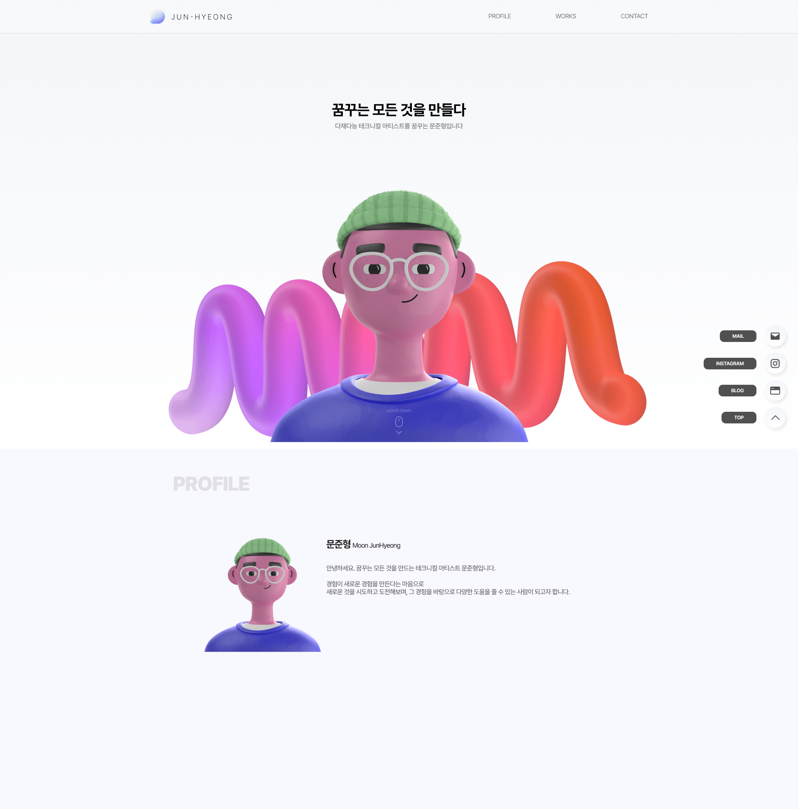
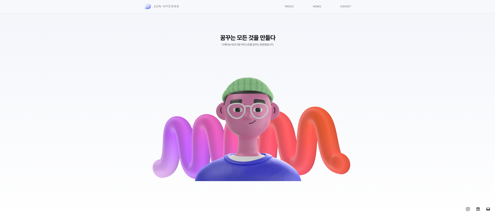
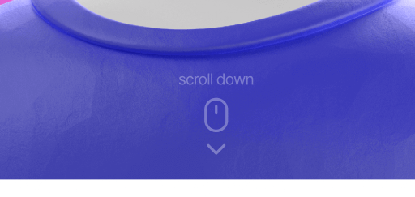
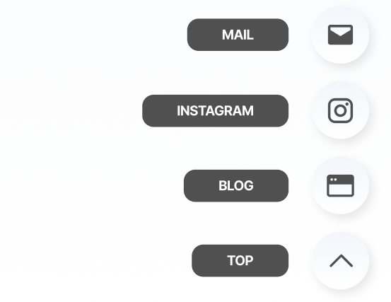
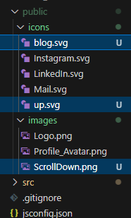
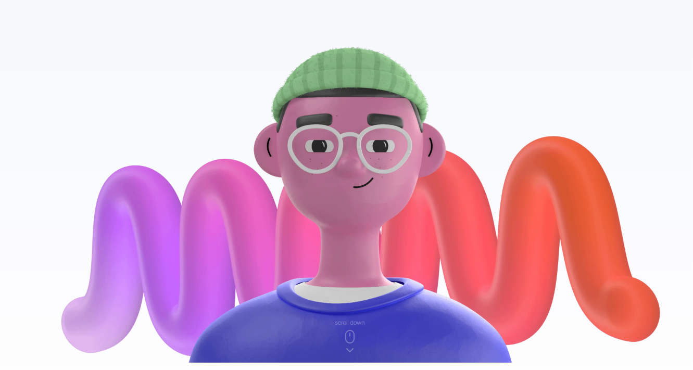
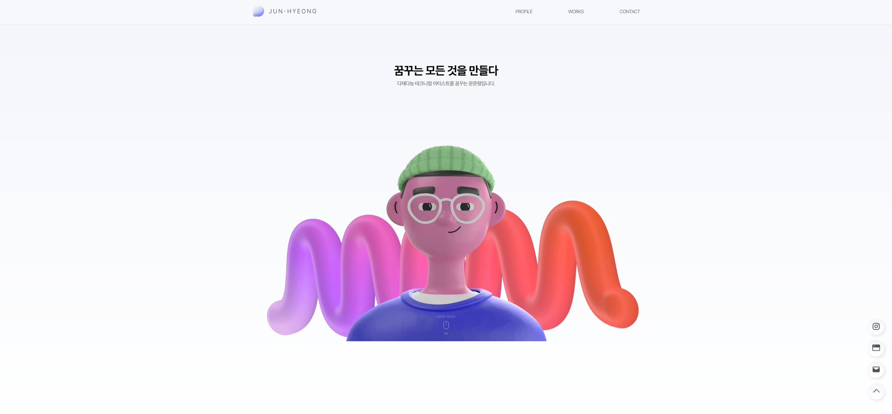

## 메인 페이지 레이아웃 변경

기존 형태에서 변경된 페이지 형태로 다시 작성하겠습니다.  
수정하는 내용이 많아서 중점적으로 수정한 부분을 작성하고 마지막에 완성된 코드를 작성하겠습니다.



### page

메인 페이지는 스크린을 가득 채우도록 디자인 할 예정입니다.  
메인 부분은 기존에 작성한 `<main>` 태그 내에  `<section>` 태그로 구분하여 진행하겠습니다.

추가로 기존 배경은 상단바 아래에 있어 배경색의 위치를 수정해주었으나, 추후 section 단위로 배경이 변경될 예정입니다.  
지금은 gnb 및 floatingButton의 디자인을 먼저 하기위해서, 간단하게 배경을 수정하였습니다.

```jsx
// src/app/page.js

import styles from "./main.module.css";
import Image from "next/image";

export default function Home() {
    return (
        <main className={styles.main}>
            <section className={styles.mainPage}>
                <div className={styles.title}>
                    <h1 className={styles.titleText}>꿈꾸는 모든 것을 만들다</h1>
                    <p className={styles.titleSub}>다재다능 테크니컬 아티스트를 꿈꾸는 문준형입니다.</p>
                </div>
                <div className={styles.image}>
                    <Image src={"/images/Profile_Avatar.png"} fill></Image>
                </div>
            </section>
        </main>
    );
}
```
```css
/* src/app/globals.css */

html {
    background-position: 0px 0px;
    background-image: linear-gradient(to bottom, #F3F5FA, #ffffff);
    background-repeat: no-repeat;
    background-size: 100vw 100vh;
}

body {
    width: 100%;
    margin-left: auto;
    margin-right: auto;
    letter-spacing: -0.05rem;
    font-weight: var(--font-regular);

    /* 해당 부분은 특정 브라우저(웹킷을 사용하는)에 폰트가 부드럽게 보여지게 설정하는 부분입니다. */
    -webkit-font-smoothing: antialiased;
    -moz-osx-font-smoothing: grayscale;
}
```

### layout

기존 구분된 라우팅 폴더들을 지우고 진행하겠습니다.  
추가로 `layout.js`에는 기존처럼 GNB와 추가로 플로팅 버튼 구역을 표현하도록 구성하겠습니다.

컴포넌트로 구분했던 `<Nav>` 부분은 Home과 Blog 파트를 제외하고 PROFILE / WORKS / CONTACT 로 작성하였습니다. 링크는 아직 추가하지 않았습니다.  
플로팅 버튼 부분도 컴포넌트화하여 작성하겠습니다.

css도 컴포넌트별로 구분하여 사용하기 위해 기존에 작성한 css 도 옮겨서 작성하겠습니다.

기존 코드에서는 전체 body 부분에 `max-width`를 적용해서, 상단 gnb 수정시 1200px 만큼만 배경 색이 지정되었습니다.  
해당 부분 수정을 위해서 `globals.css`에서 관련 부분을 삭제한 후, 섹션별로 `max-width`를 지정해주었습니다.

gnb 부분은 높이가 기존 100px에서 80px로 수정하였으며, 배경색은 흰색에 blur처리를 진행하였고, 아래쪽 외곽선을 추가했습니다.

```jsx
// src/app/layout.js

import localFont from "next/font/local";
import "./globals.css";
import styles from "./layout.module.css";

// Components
import Nav from "@/components/navMenu/navMenu";
import FAB from "@/components/floatingButton/floatingButton";
import Logo from "@/components/logo/logo"
  
const pretendard = localFont({
    src: "./fonts/PretendardVariable.woff2",
    variable: "--font-pretendard",
    display: "swap",
    weight: "45 920",
});
  
export const metadata = {
    siteName: "JunHyeong Portfolio | 문준형 포트폴리오",
    title: "꿈꾸는 모든 것을 만들다.",
    description: "문준형의 포트폴리오 페이지입니다.",
};
  
export default function RootLayout({ children }) {
    return (
        <html lang="kr">
            <body className={pretendard.className}>
            
                <header className={styles.header}>
                    <div className={styles.gnb}>
                        <Logo></Logo>
                        <Nav></Nav>
                    </div>
                </header>
                
                {children}
                
                <section className={styles.fab}>
                    <FAB></FAB>
                </section>

            </body>
        </html>
    );
}
```
```css
/* src/app/layout.module.css */

.header {
    width: 100%;
    background-color: #ffffff4d;
    backdrop-filter: blur(10px);
    border-bottom: 1px solid #0000001a;
}

.gnb {
    max-width: 1200px;
    height: 80px;
    margin: 0 auto;
    padding: 0 40px;
  
    display: grid;
    grid-template-columns: 1fr auto 1fr;
    grid-template-rows: 1fr;
    gap: 0px 0px;
    grid-template-areas: "left center right";
}
  
.fab {
    position: fixed;
    right: 30px;
    bottom: 50px;
}
```

#### navMenu

페이지 내에서 이동하게 될 내용입니다.  
기존처럼 `pathname`을 사용하게될 수도 있기에 `'use client'`로 CSR 모드로 두겠습니다.

메뉴바가 우측 정렬이 되도록 간단하게 수정을 진행했습니다.

```jsx
// src/components/navMenu/navMenu.js

'use client';
import { usePathname } from "next/navigation";
import Link from "next/link";
import styles from "./nav.module.css";
  
export default function NavMenu() {
    const pathname = usePathname();
    return (
        <nav className={styles.menu}>
            <ul className={styles.memuList}>
                <li>
                    <Link href="./">PROFILE</Link>
                </li>
                <li>
                    <Link href="./">WORKS</Link>
                </li>
                <li>
                    <Link href="./">CONTACT</Link>
                </li>
            </ul>
        </nav>
    );
}
```
```css
/* src/components/navMenu/nav.module.css */

.menu {
    display: flex;
    grid-area: right;
    justify-self: right;
    align-items: center;
    text-align: center;
    position: relative;
}

.memuList {
    display: flex;
    width: 385px;
    justify-content: space-between;
    font-size: 0.938rem;
    color: var(--font-gray);
    font-weight: var(--font-regular);
}
```

#### logo

로고도 컴포넌트로 변경하였습니다.  
html 및 css는 기존과 동일합니다.

```jsx
// src/components/logo/logo.js

import Image from "next/image";
import styles from "./logo.module.css";
import Link from "next/link";
  
export default function FloatingMenu() {
    return (
        <div className={styles.logo}>
            <Link href="./">
                <Image src={"/images/Logo.png"} width={200} height={36} alt="JunHyeong"/>
            </Link>
        </div>
    );
}
```
```css
/* src/components/logo/logo.module.css */

.logo {
    display: flex;
    grid-area: left;
    justify-self: start;
    align-items: center;
    position: relative;
}
```

#### floatingButton

기존 Contact 메뉴를 그대로 floatingButton으로 전환시켰습니다.  
기존 `<div>`태그로 구분되어있던 것을 `<section>`으로 구분하였습니다.

css 수정은 다음 부분에서 아이콘 저장과 함께 수정하겠습니다.

```jsx
// src/components/floatingButton/floatingButton.js

import Image from "next/image";
import styles from "./floating.module.css";
  
export default function FloatingButton() {
    return (
        <section className={styles.floatingButton}>
            <ul className={styles.floatingList}>
                <li>
                    <a href="https://www.instagram.com/ju_nyang_yee/" target="_blank">
                        <Image src={"/icons/Instagram.svg"} width={26} height={26} alt="Instagram" title="Instagram"/>
                    </a>
                </li>
                <li>
                    <a href="" target="_blank">
                        <Image src={"/icons/LinkedIn.svg"} width={26} height={26} alt="LinkedIn" title="LinkedIn"/>
                    </a>
                </li>
                <li>
                    <a href="mailto:answnsgud19@gmail.com">
                        <Image src={"/icons/Mail.svg"} width={26} height={26} alt="Mail" title="Mail"/>
                    </a>
                </li>
            </ul>
        </section>
    );
}
```
```css
/* src/components/floatingButton/floating.module.css */

.floatingButton {
    display: flex;
    grid-area: right;
    justify-self: end;
    align-items: center;
    position: relative;
}
  
.floatingList {
    display: flex;
    width: 144px;
    justify-content: space-between;
}
```




---

## 이미지 추가 (아이콘 및 스크롤 이미지)

새롭게 디자인하면서 추가된 아이콘과 이미지들을 추가하려합니다.  
일단 이미지 파일을 `public/icons` 와 `public/images` 폴더에 모두 추가하겠습니다.  
기존에 사용했던 링크드인 아이콘은 혹시 모르니 계속 보관해두겠습니다.

플로팅 버튼의 팝업 텍스트창은 추후에 작업하고 아이콘부터 생성하겠습니다.





### 이미지 적용

일단 스크롤다운 이미지부터 적용하겠습니다.  
기존 이미지가 있던 섹션에 단순하게 추가하겠습니다.

```jsx
// src/app/page,js

import styles from "./main.module.css";
import Image from "next/image";
  
export default function Home() {
    return (
        <main className={styles.main}>
            <section className={styles.mainPage}>
                <div className={styles.title}>
                    <h1 className={styles.titleText}>꿈꾸는 모든 것을 만들다</h1>
                    <p className={styles.titleSub}>다재다능 테크니컬 아티스트를 꿈꾸는 문준형입니다.</p>
                </div>
                <div className={styles.image}>
                    <Image src={"/images/Profile_Avatar.png"} fill></Image>
                </div>
                <div className={styles.scrollDown}>
                    <Image src={"/images/ScrollDown.png"} fill></Image>
                </div>
            </section>
        </main>
    );
}
```
```css
/* src/app/main.module.css */

.scrollDown {
    width: 58px;
    height: 72px;
    margin: 0 auto;
    position: relative;
    bottom: 100px;
    z-index: 2;
    opacity: 0.3;
}
```




---

## 플로팅 버튼 제작

아이콘을 적용하기 위해선 기존에 3개밖에 없던 버튼을 4개로 늘려야합니다.  
아직 위로가기 버튼의 링크는 작성하지 않았습니다.

기존 `<a>`태그로 이동하던 것을 `<Link>`태그와 함께 `<button>`태그를 사용하는 것으로 변경했습니다.  
그와 함께 기존 `<ul><li>` 구조를 사용하던 것을 단순히 `<div>` 구조로 변경하였습니다.

```jsx
// src/components/floatingButton/floatingButton.js

import Image from "next/image";
import Link from "next/link";
import styles from "./floating.module.css";
  
export default function FloatingButton() {
    return (
        <section className={styles.floatingButton}>
            <div className={styles.floatingList}>
                <Link href="https://www.instagram.com/ju_nyang_yee/" target="_blank">
                    <button className={styles.button}>
                        <Image src={"/icons/Instagram.svg"} width={26} height={26} alt="Instagram" title="Instagram"/>
                    </button>
                </Link>
  
                <Link href="https://junyangyee.github.io/" target="_blank">
                    <button className={styles.button}>
                        <Image src={"/icons/blog.svg"} width={26} height={26} alt="Blog" title="Blog"/>
                    </button>
                </Link>
  
                <Link href="mailto:answnsgud19@gmail.com">
                    <button className={styles.button}>
                        <Image src={"/icons/Mail.svg"} width={26} height={26} alt="Mail" title="Mail"/>
                    </button>
                </Link>
  
                <Link href="./">
                    <button className={styles.button}>
                        <Image src={"/icons/up.svg"} width={36} height={36} alt="Top" title="Top"/>
                    </button>
                </Link>
            </div>
        </section>
    );
}
```
```css
/* src/components/floatingButton/floating.module.css */

.floatingButton {
    display: flex;
    justify-content: center;
    align-items: center;
    position: relative;
    z-index: 50;
}
  
.floatingList {
    height: 250px;
    display: flex;
    flex-direction: column;
    justify-content: space-between;
}
  
.button {
    width: 50px;
    height: 50px;
    background: linear-gradient(to bottom, #F3F5FA, #ffffff);
    box-shadow: 3px 4px 10px #0000001a;
    border-radius: 99999px;
    border: 0;
  
    cursor: pointer;
}
```



### next.js의 button 사용

기존 HTML에서는 아래 형식으로 버튼을 생성했습니다.  
`<button type="button" onclick="window.open('URL')">` 

다만 Next.js에서 해당 방식으로 작성하니 버튼을 눌러도 이동하지 않는 문제가 있었습니다.  
관련 해결법을 찾던 중, 기존에 사용했던 것처럼 `<Link>` 를 사용하면 된다는 답을 찾았습니다.  
같이 사용하면 버튼에 자동으로 링크가 적용됩니다.

```jsx
<Link href="URL" target="_blank">
	<button>
	</button>
</Link>
```

Nextjs의 `Link`의 경우, 기존에 사용하던 `<a>`태그의 속성 값을 사용할 수 있으며, `<button>`과 `<div>`등 다양한 컴포넌트에서 사용이 가능하다는 장점이 있다고 합니다.  
[해당 정보](https://brunch.co.kr/@hee072794/82)


---

## GNB Fixed 수정

원스크롤 페이지인만큼 상단 GNB를 계속 고정해두려합니다.  
블러와 투명도는 이미 위에서 조절 했으니, 포지션과 z-index 부분을 수정하겠습니다.

스크롤하는 것을 봐야하기에,  html의 높이를 늘려서 확인해보겠습니다.

```css
/* src/app/layout.module.css */

.header {
    width: 100%;
    background-color: #ffffff4d;
    backdrop-filter: blur(10px);
    border-bottom: 1px solid #0000001a;

    position: fixed;
    z-index: 50;
}
```


이렇게 수정하니, 기존에는 `<header>` 다음 `<main>` 부분이 이어졌으나, 지금은 `<main>` 섹션 위에 `<header>`가 덮는 모양이 되어, 전체적으로 위로 올라가 여백이 이상해졌습니다.

해당 부분은 메인 페이지 수정과 함께 진행해보겠습니다.


---

