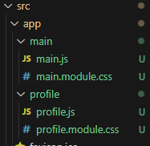
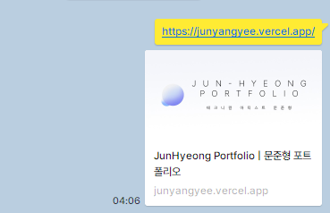
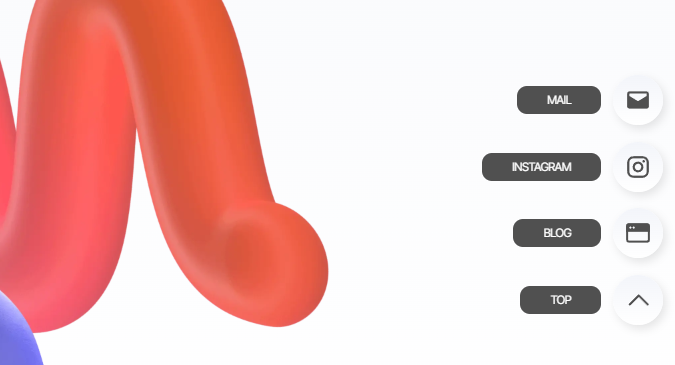

> 전체적인 메인 페이지의 디자인과 스크롤 형태를 완성했습니다.  
> 추가로 파일 정리 및 마우스 인터랙션(:hover) 작업을 진행했습니다. 

---

## CSS 반응형?

지금 작업 중인 방식은 해상도가 높거나 낮은 디바이스에서 본다면 문제가 있는 상황입니다.  
완전한 반응형은 제가 프론트엔드 개발자가 아닌지라, 미디어쿼리로 단계를 나눠서 코딩을 진행하려 합니다.

추가적으로 현재 Figma에서 디자인은 FHD 해상도 기준으로 작업을 진행하고 있으나, 제 모니터가 `3440 x 1440` 해상도이기에 작업을 진행하면서 계속 혼선이 빚어지고 있습니다.

작업은 크롬 개발자 도구에서 1920 x 1080 기준으로 진행하는 것으로 문제를 해결하려하며, 디바이스별 문제는, 보통 나누는 방식으로 단계를 나누어 계산해보도록 하겠습니다.  
[관련 사이트](https://velog.io/@yunazzi/device-media-query)

```css
/* PC ( ~ 1280px ) */
@media screen and (min-width:1280px) {

} 

/* Tablet ( 1279px ~ 768px ) */
@media screen and (min-width:768px) and (max-width:1279px) {
  
}
  
/* Mobile ( 767px ~ 480px ) */
@media screen and (min-width:480px) and (max-width:767px) {
  
}
  
/* Low Mobile ( 479px ~ 360px ) */
@media screen and (min-width:360px) and (max-width:479px) {
  
}
```


---

## 기존 CSS 수정

현재 메인 페이지에 있는 이미지의 경우, 마진/패딩을 사용해 단순하게 위치를 고정해놓은 형태입니다.

해당 이미지는 반응형으로 움직여야 조금 더 자연스럽게 첫 페이지 표현이 가능할 것 같아, 전체적인 크기가 어울리게 조절되도록 작업해보려합니다.

추가적으로 현재 스크롤 이미지도 어거지로 위치를 겨우겨우 맞춰놓은 느낌이라, 메인 이미지와 함께 조절해보겠습니다.

기존 타이틀 텍스쳐는 `padding-top: 150px;`로 고정형으로 설정되어 있었습니다.  
해당 부분을 `vh`단위로 조절하여 수정하였습니다

기존 정리가 안되어있던 이미지 css 부분을 수정했습니다.  
아직 이해가 안되긴 하지만, 천천히 작업을 해보겠습니다.

```css
/* src/app/main.module.css */

.main {
    width: 100%;
    display: block;
    justify-content: center;
    align-items: center;
}
  
.mainPage {
    max-width: 1200px;
    height: 100vh;
    min-height: 980px;
    margin: 0 auto;
    padding-left: 40px;
    padding-right: 40px;
    padding-top: 80px;
    position: relative;
}
  
.title {
    width: 100%;
    display: flex;
    flex-direction: column;
    margin-top: 13vh;
    justify-content: center;
    text-align: center;
}
  
.titleText {
    font-size: 3rem;
    color: #000000;
    font-weight: var(--font-bold);
    letter-spacing: -0.07rem;
}
  
.titleSub {
    margin-top: 0.575rem;
    font-size: 1.25rem;
    font-weight: var(--font-medium);
    color: #777777;
}
  
.imgArea {
    width: 100%;
    max-width: 1200px;
  
    position: absolute;
    bottom: 0;
}
  
.image {
    width: 1200px;
    height: 660px;
    margin: 0 auto;
  
    position: relative;
}
  
.scrollDown {
    width: 58px;
    height: 72px;
  
    margin: 0 auto;
  
    display: block;
    position: relative;
  
    bottom: 100px;
  
    z-index: 2;
    opacity: 0.5;
}
```


---

## Profile 섹션 스크롤

스크롤로 다음 섹션으로 넘어가도록 구상이 되어있습니다.  
기존 메인화면은 그대로 남아있고, 그 위로 다음 섹션이 덮는 느낌의 페이지를 구상했습니다.

`position: sticky;` 스타일을 사용해 메인페이지는 남겨두고 아래 섹션이 올라오도록 작업해보았습니다.

세부 내용은 아직 디자인중이라, 간단하게 Profile 탭을 만들었습니다.  
기존 main 탭과 구분을 위해, 전체 장면은 `<div class="root">` 로 따로 묶어주었습니다.

```jsx
// src/app/page.js

import styles from "./main.module.css";
import Image from "next/image";
  
export default function Home() {
    return (
        <div className={styles.root}>
            <main className={styles.main}>
                <section className={styles.mainPage}>
                    <div className={styles.title}>
                        <h1 className={styles.titleText}>꿈꾸는 모든 것을 만들다</h1>
                        <p className={styles.titleSub}>다재다능 테크니컬 아티스트를 꿈꾸는 문준형입니다.</p>
                    </div>
                    <div className={styles.imgArea}>
                        <div className={styles.image}>
                            <Image src={"/images/Profile_Avatar.png"} fill objectFit="contain"></Image>
                        </div>
                        <div className={styles.scrollDown}>
                            <Image src={"/images/ScrollDown.png"} fill></Image>
                        </div>
                    </div>
                </section>
            </main>
  
            <div className={styles.profile}>
  
            </div>
  
        </div>
    );
}
```

sticky 옵션의 경우, 부모 속성에 `height`값이 들어가야하기에, `globals.css`의 `body` 클래스에 `height: 100vh;`를 추가한 후 작업을 진행했습니다.

전체 부분인 `main`클래스에 sticky옵션과 top 옵션을 설정해주었습니다.  
추가로 Profile 부분이 덮어질 때, 단순 평면이 조금 어색해보여 `box-shadow`옵션도 추가했습니다.

추후 Profile 부분은 디자인이 끝나는대로 수정할 예정입니다.

```css
/* src/app/main.module.css */

.main {
    width: 100%;
    justify-content: center;
    align-items: center;
  
    position: sticky;
    top: 0;
    
    background-image: linear-gradient(to bottom, #F3F5FA, #ffffff);
}

.profile {
    width: 100%;
    height: 2000px;
    position: relative;
  
    background: #ffffff;
    box-shadow: 0px 0px 10px #0000002a;  
}
```


---

## 메인 페이지 분리

현재 메인에 있는 내용들이 점점 복잡해집니다.  
현재 root 클래스로 묶어두었기에, 기존에 있던 메인 페이지 내용 및 css를 분리하여 관리하고자 합니다.

`src/app` 폴더에 `main` 폴더 및 `profile` 폴더를 생성했습니다.  
해당 폴더에 js 파일 및 모듈 css 파일을 추가하고 내용을 이식했습니다.



최종적으로 메인인 `page.js`는 다음과 같이 깔끔한 모습으로 정리되었습니다.

```jsx
// src/app/page.js

import Main from "./main/main"
import Profile from "./profile/profile"
  
export default function Portfolio() {
    return (
        <div id="root">
        
            <Main/>
            <Profile/>

        </div>
    );
}
```


---

## 파일 정리

마구잡이로 만지면서 작업을 진행하다보니 폴더 구조도 정리가 제대로 되어있지 않습니다.  
비록 폴더 구조를 어떻게 잡아야하는지는 잘 모르겠지만, [이런 사이트](https://miriya.net/blog/cliz752zc000lwb86y5gtxstu)의 도움을 받아서 파일들을 조금씩 정리했습니다.

### public/fonts

기존 `src/app`에 있던 `fonts`파일은 밖으로 빠져서 `public`으로 들어가는 것이 더 어울릴 것 같아 이동시켰습니다.  
기존에는 `./fonts/` 구조로 되어있었기에 이동한 후, `layout.js` 에서 `.../`같은 방법으로 정리해야하나 싶었던 찰나, 기존 `<Image>`태그에서 public 폴더를 읽어오는 방식이 단순한 `images/` 였던 것처럼 같은 방식으로 해도 괜찮을 것 같아 적용했습니다. ~~성공적이었습니다.~~

#### 오류 발생

`npm run dev` 상태에서는 잘 작동하였으나, 커밋/푸쉬 후 deploy가 안된다는 오류가 있어서 확인해보니 폰트 경로를 읽지 못하는 것 같아, 다시 기존처럼 `src/app/fonts/~~.woff2` 경로로 변경하였습니다.  
아무래도 `<Image>`태그는 내부에서 경로 지정이 되어있지만, 단순하게 Font도 될거라고 생각해서 그런 것 같습니다.  
Public 경로 설정은 추후에 다시 진행해야할 것 같습니다.


### src/app/styles

현재 폴더 내에 `globals.css`와 `layout.module.css`를 비롯하여 `layout.js`, `page.js`가 섞여있어 정신이 없는 느낌입니다.  
app 폴더에는 단순히 js 파일 두개만 있으면 좋을 것 같아, styles 폴더를 만들어 정리하였습니다.

상위 폴더인 src 폴더에 만들어서 모든 css 파일을 넣으려했으나, 그렇게 하기에는 css 파일이 많아서 해당 방법으로는 진행하지 않았습니다.  
이게 맞는 방법인지는 모르겠으나, 깔끔하게 정리부터 하고, 추후 수정을 하는 게 더욱 좋을 것 같습니다.


---

## Metadata 작업

일단 메인 페이지 구조가 어느정도 완성이 되었으니, 기존에 대충 작성했던 메타데이터를 조금 수정하고자 합니다.

현재 `src/app/`폴더에 있는 `favicon.ico`는 파일을 교체한 뒤 public 폴더로 이동할 예정입니다.  
추가로 og 이미지등 다른 내용들은 구조를 일단 작성해두고 추후 파일을 연결하는 방향으로 진행하겠습니다.

아이콘은 기존에 작업했던 로고를 잠시 그대로 사용하겠습니다.  
관련 내용은 [해당 글](https://velog.io/@young0_0/TIL-NEXTJS-Favicon%EA%B3%BC-Open-graph-%EC%A0%81%EC%9A%A9)을 참고하여 작성하였습니다.

```jsx
// src/app/layout.js

export const metadata = {
    title: "JunHyeong Portfolio | 문준형 포트폴리오",
    description: "[JunHyeong] 테크니컬 아티스트 문준형 포트폴리오입니다.",
    icons: {
        icon: "/icons/favicon.ico",
    },
    metadataBase: new URL("https://junyangyee.vercel.app/"),
    openGraph: {
        siteName: "JunHyeong Portfolio | 문준형 포트폴리오",
        title: "JunHyeong Portfolio | 문준형 포트폴리오",
        description: "[JunHyeong] 테크니컬 아티스트 문준형 포트폴리오입니다.",
        images: "images/OG-Image.png",
        url: "https://junyangyee.vercel.app/",
    },
};
```




---

## 마우스 Hover 이벤트

### FAB (플로팅버튼)

플로팅 버튼에 마우스를 올리면 툴팁이 뜨도록 만들어보겠습니다.  
마우스오버 이벤트를 만들기 전에, 우선 해당 부분을 먼저 만들겠습니다.

기존에는 단순히 `<Link>` 태그로 구분되어있던 것들을 한 번 더 `<div>`로 감싸주어 css 작업이 수월하도록 작성했습니다.

```jsx
// src/components/floatingButton/floatingButton.js

import Image from "next/image";
import Link from "next/link";
import styles from "./floating.module.css";
  
export default function FloatingButton() {
    return (
        <section className={styles.floatingButton}>
            <div className={styles.floatingList}>
  
                <div className={styles.floatingItem}>
                    <div className={styles.tooltip}>
                        <span>MAIL</span>
                    </div>
                    <Link href="mailto:answnsgud19@gmail.com">
                        <button className={styles.button}>
                            <Image src={"/icons/Mail.svg"} width={26} height={26} alt="Mail" title="Mail"/>
                        </button>
                    </Link>
                </div>
  
                <div className={styles.floatingItem}>
                    <div className={styles.tooltip}>
                        <span>INSTAGRAM</span>
                    </div>
                    <Link href="https://www.instagram.com/ju_nyang_yee/" target="_blank">
                        <button className={styles.button}>
                            <Image src={"/icons/Instagram.svg"} width={26} height={26} alt="Instagram" title="Instagram"/>
                        </button>
                    </Link>
                </div>
  
                <div className={styles.floatingItem}>
                    <div className={styles.tooltip}>
                        <span>BLOG</span>
                    </div>
                    <Link href="https://junyangyee.github.io/" target="_blank">
                        <button className={styles.button}>
                            <Image src={"/icons/blog.svg"} width={26} height={26} alt="Blog" title="Blog"/>
                        </button>
                    </Link>
                </div>
  
                <div className={styles.floatingItem}>
                    <div className={styles.tooltip}>
                        <span>TOP</span>
                    </div>
                    <Link href="./">
                        <button className={styles.button}>
                            <Image src={"/icons/up.svg"} width={36} height={36} alt="Top" title="Top"/>
                        </button>
                    </Link>
                </div>
                
            </div>
        </section>
    );
}
```
```css
/* src/components/floatingButton/floating.module.css */

.floatingButton {
    display: flex;
    justify-content: center;
    align-items: center;
    position: relative;
}
  
.floatingList {
    height: 250px;
    display: flex;
    flex-direction: column;
    justify-content: space-between;
}
  
.floatingItem {
    display: flex;
    justify-content: center;
    align-items: center;
}
  
.button {
    width: 50px;
    height: 50px;
    display: flex;
    justify-content: center;
    align-items: center;
    text-align: center;
    background: linear-gradient(to bottom, #F3F5FA, #ffffff);
    box-shadow: 3px 4px 10px #0000001a;
    border-radius: 99999px;
    border: 0;
  
    cursor: pointer;
}
  
.tooltip {
    display: flex;
    position: fixed;
    overflow: hidden;
  
    right: 92px;
  
    padding: 0.438rem 1.875rem;
  
    font-size: 0.75rem;
    color: #ffffff;
    text-align: center;
  
    justify-content: center;
  
    background-color: #505050;
    border-radius: 10px;
    border: 0;
}
```



#### 마우스 Hover 이벤트

해당 부분에서 원래는 `.button:hover` 를 사용하려 했습니다.  
하지만 그렇게 진행하니, hover 이벤트가 발생하지 않아서 확인해보니 마우스가 hover되는 부분이 안쪽 button 이 아닌, 바깥쪽 `<div>`부분이 hover되는 것을 확인했습니다.

위에서 한번 감싸주었던 `<div className={styles.floatingItem}>`에 hover 이벤트를 추가하니 정상적으로 작동하는 것을 확인하였습니다.

```css
/* src/components/floatingButton/float.module.css */

.floatingItem:hover .tooltip{
    visibility: visible;
}

.tooltip {
    visibility: hidden;
}
```


### GNB navMenu

추가로 상단 메뉴바도 이벤트를 생성하였습니다.

일단 기존에는 텍스트 부분만 hover 되던 것을 범위를 늘려 GNB 상하 전체 다 적용되도록 `height: 100%;`를 적용하여 클릭이 편리하게 만들었습니다.

이벤트는 단순히 해당 버튼 텍스트의 색이 변화하는 것으로 했으며, 색은 로고의 색상에서 가져왔습니다.  
자연스러운 변화를 위해 transition을 0.25초 정도 주었습니다.

추가로 기존에 링크되지 않았던 부분 중 Profile 부분은 만들어둔 섹션으로 이동되도록 연결했습니다.

```jsx
// src/components/navMenu/navMenu.js

'use client';
import { usePathname } from "next/navigation";
import Link from "next/link";
import styles from "./nav.module.css";
  
export default function NavMenu() {
    const pathname = usePathname();
    return (
        <nav className={styles.menu}>
            <ul className={styles.memuList}>
                <li>
                    <Link href="#profile" className={styles.menuButton}>PROFILE</Link>
                </li>
                <li>
                    <Link href="./" className={styles.menuButton}>WORKS</Link>
                </li>
                <li>
                    <Link href="./" className={styles.menuButton}>CONTACT</Link>
                </li>
            </ul>
        </nav>
    );
}
```
```css
/* src/components/navMenu/nav.module.css */

.menu {
    display: flex;
    grid-area: right;
    justify-self: right;
    align-items: center;
    text-align: center;
    position: relative;
}
  
.memuList {
    display: flex;
    width: 385px;
    height: 100%;
    justify-content: space-between;
    font-size: 1.125rem;
    letter-spacing: -0.023rem;
    color: var(--font-gray);
    font-weight: var(--font-light);
}
  
.menuButton {
    display: flex;
    height: 100%;
    align-items: center;
}
  
.menuButton:hover {
    transition: 0.25s;
  
    color: #9DA5F4;
}
```


최종적으로 현재 우측하단 FAB의 위로가기 버튼과, nav의 Profile 버튼으로 움직이는 것이 가능해졌습니다.  
WORKS와 CONTACT 부분은 추후 작업이 진행되어 섹션 작업이 시작되면 추가하면 될 것 같습니다.


---

```toc
```