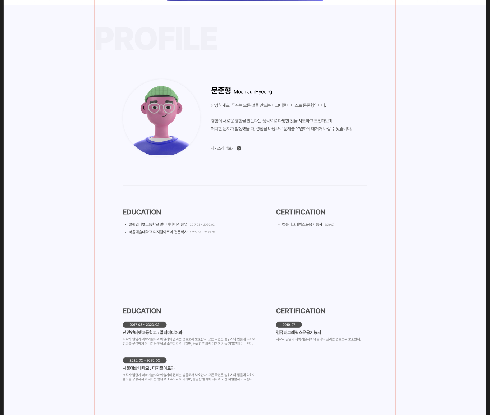
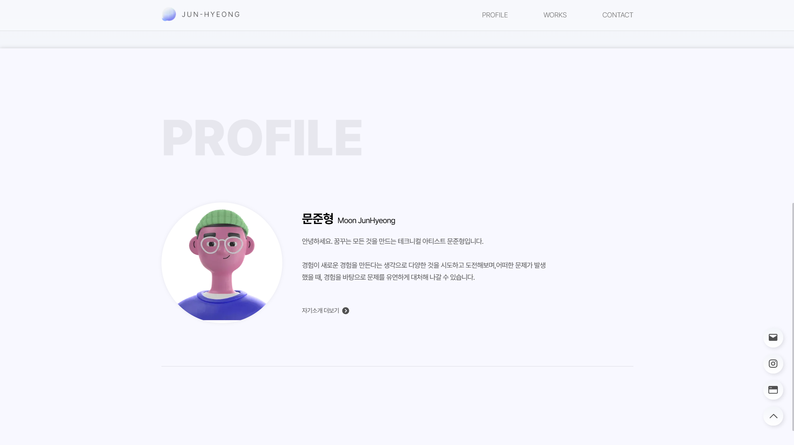

> 프로필 섹션의 디자인과 작업을 진행했습니다.  
> 추가로 버튼을 통한 페이지 내 이동 방식을 수정했습니다.

---

## 스크롤 버튼 문제 수정

현재 페이지 내에서 `<Link href="#id"`> 와 같은 방식으로 이동을 하니, 주소창 뒤에 `/#profile` 과 같이 링크가 붙으면서, 뒤로가기를 누르면 이전 페이지가 아닌 이전 섹션으로 인식이 되는 문제가 있었습니다.

해당 문제는 `<Link>`가 `<a>` 태그 기반으로 작동하는데, `<a>` 앵커 태그로 페이지 내에서 id를 바탕으로 이동 시, 어쩔 수 없이 발생하는 문제인 것으로 확인했습니다.

그래서 스크롤을 해주는 스크립트 기반으로 작동하도록 작성하였습니다.  
해당 관련 내용은 [스택오버플로우 질문](https://stackoverflow.com/questions/68589788/nextjs-link-to-scroll-to-a-section-in-same-page)에서 확인해서 적용시켰습니다.  
해당 스크립트는 클라이언트 기반으로 작동해야하기에 `'use client'`를 최상단에 작성해주었습니다.

추가로 디자인 작업을 원활히 하기 위해 FAB 처럼 `<ul><li>` 구조를 없애고 진행하였습니다.

```jsx
// src/components/navMenu/navMenu.js

'use client'

export default function NavMenu() {
	
	const scrollToID = function(id) {
		const element = document.getElementById(id)
		element?.scrollIntoView({behavior: "smooth", block: "start", inline: "start"})
	}
	
	return (
		<nav className={styles.menu}>
			<div className={styles.memuList}>
			
				<Link className={styles.menuButton} 
				onClick={()=>scrollToId("profile")}>PROFILE</Link>
			
			</div>
		</nav>
	);
}

// Error : <Link> need "href" attribute
```

해당 방식으로 작성하니, `href`가 필요하다는 오류가 발생하였습니다.  
그래서 단순히 `href="#"`으로 작성하니, profile 버튼 클릭 시 제대로 이동하지만, 한번 더 누르니 최상단으로 다시 돌아가는 문제가 생겼습니다.

`<Link>` 태그를 빼고 `<div>`태그로 변경하였습니다.  
`<button>`태그를 사용할까 했지만, 스타일 작업을 다시 진행해야해서 제외하였습니다.  
(폰트가 깨지는 문제가 발생했습니다. `font-family` 설정을 해도 괜찮지만, 
현재 `layout.js`에서 전역으로 설정해서 복잡해질 수 있을 것 같아 하지 않았습니다.)

`<div>`태그에 넣었기에 마우스 커서가 어색한 부분이 있었습니다.  
css에서 `cursor: pointer;` 옵션을 추가해 자연스럽게 바꾸어주었습니다.

```jsx
// src/components/navMenu/navMenu.js

export default function NavMenu() {
  
    const scrollToId = function (id) {
        const element = document.getElementById(id);
        element?.scrollIntoView({behavior: "smooth", block: "start", inline: "start"});
    };
  
    return (
        <nav className={styles.menu}>
            <div className={styles.memuList}>
  
                <div className={styles.menuButton} onClick={() => scrollToId("profile")}>PROFILE</div>

            </div>
        </nav>
    );
}
```


### 위로가기 버튼 수정

위로가기 버튼도 `<Link href="#root">` 같은 형식으로 작성되었습니다.  
해당 부분도 위와 같은 방식으로 수정하였습니다.

다만 기존 `const element = document.getElementById(id);`는 id 기반으로 엘리먼트를 받아와 해당 엘리먼트를 보여주는 `scrollIntoView` 기능이었으나, 최상단 이동이 목표이기에 다른 방법을 사용했습니다.

```jsx
// src/components/floatingButton/floatingButton.js

'use client'

export default function FloatingButton() {
	
	const scrollToTop = function() {
		window.scrollTo({top: 0, left: 0, behavior: "smooth"});
	};
	
	return (
		<button className={styles.button} onClick={() => scrollToTop()}>
			<Image src={"/icons/up.svg"} width={36} height={36} alt="Top" title="Top"/>
		</button>
	)
}
```

기존에는 `<Link> <button/> </Link>` 구조로 감싸져있던 부분에서 `<Link>` 태그를 삭제했습니다.  
링크 연결은 button의 `onClick` 기능에 연결했습니다.  
navMenu와 다르게 button의 스타일링이 이미 진행되어있기에 `onClick` 부분만 이어주었습니다.

#### window.scrollTo 작동 오류

제일 처음 작성했을 때, 제대로 작동하지 않는 문제가 있었습니다.  
에러 메세지가 나오지 않아, 스크립트 자체가 실행되지 않는 문제인가 해서
`console.log("check")`와 같은 방법으로 확인해보았습니다.

로그는 뜨는 것을 보니, 버튼 클릭은 되는데 `scrollTo` 기능이 작동하지 않는 것으로 확인하고, 관련 내용을 찾아보았습니다.  
[스크롤 문제 관련 글](https://weavingcoding.tistory.com/20)

문제는 html, body에 스크롤이 중첩되어있다는 부분이었습니다.  
기존 css에 `html, body { overflow-x: hidden; }`을 작성해두어서 해당 문제가 발생하는 것을 확인했습니다.

혹시 몰라서 html, body 양쪽에 넣어두었지만, 굳이 body에 까지 넣을 필요가 없기에 `overflow-x: hidden;` 옵션은 html에만 적용시켰습니다.

```css
/* src/app/styles/globals.css */

html {
    overflow-x: hidden;
}
```


---

## 프로필 페이지 디자인

현재 프로필 페이지 디자인을 진행 중입니다.  
다만 표시해야할 내용과, 어떻게 정리해야할 지 애매해서 작업 진전이 더딘 상황입니다.



위 이미지처럼 개인 프로필 및 소개말 부분은 어느정도 확정이 되었으나, 아래 Education, Certification, Awards와 같은 부분들은 어떻게 구상해야할지 아직 헤매는 중입니다.

단순 텍스트로 하면 너무 간단해보이진 않을까 걱정이며, 아래처럼 박스를 넣어 디자인하기엔 해당부분이 너무 강조되어 작업물 소개 단계가 약해보일 수 있지 않을까 싶어 고민 중입니다.

일단 개인 프로필 및 소개말 부분부터 작성을 진행하고, 계속해서 진전이 되지 않는다면 프로젝트 및 컨택 등 다른 부분을 작업하고 변경해보겠습니다.


---

## 프로필 페이지 작성

이제는 어느 정도 작업이 익숙해진 부분이 많아서 수월하게 작업을 진행하였습니다.  
일단 아래 학력, 자격증 부분은 제외하고 제작을 진행했습니다.

감으로 느낌가는대로 구조를 짜다보니, 전체적으로 조금 지저분하게 된 것 같지만, 그래도 생각보다 막히는 부분이 없이 잘 된 것 같아서 조금은 뿌듯했습니다.

```jsx
// src/app/profile/profile.js

import styles from "./profile.module.css";
import Image from "next/image";
import Link from "next/link";
  
export default function Profile() {
    return (
        <section id="profile" className={styles.profile}>
            <section className={styles.intro}>
                <div className={styles.bgTitle}>
                    <h1 className={styles.title}>PROFILE</h1>
                </div>
                <div className={styles.aboutMe}>
                    <div className={styles.profileImage}>
                        <Image src={"/images/Profile.png"} width={307} height={307} className={styles.image}></Image>
                    </div>
                    <div className={styles.info}>
                        <div className={styles.name}>
                            <strong className={styles.krName}>문준형</strong>
                            <span className={styles.enName}>Moon JunHyeong</span>
                        </div>
                        <div className={styles.text}>
                            <p>
                                안녕하세요. 꿈꾸는 모든 것을 만드는 테크니컬 아티스트 문준형입니다.<br /> <br />
                                경험이 새로운 경험을 만든다는 생각으로 다양한 것을 시도하고 도전해보며,어떠한 문제가 발생했을 때, 경험을 바탕으로 문제를 유연하게 대처해 나갈 수 있습니다.
                            </p>
                        </div>
                        <Link href="https://junyangyee.notion.site/PORTFOLIO-df12f58d653149bbb386987be24e40a0?pvs=4"
                        className={styles.more} target="_blank">
                            <span className={styles.moreText}>자기소개 더보기</span>
                            <Image src={"/icons/clickButton.svg"} width={19} height={19}></Image>
                        </Link>
                    </div>
                </div>
            </section>
        </section>
    )
}
```

html 구조에서, `intro` 클래스로 묶은 이유는, 해당 부분 다음에 학력 및 자격증 등 다른 부분이 들어가기 때문입니다.  
해당 부분과 구분을 위해 Figma 디자인 내에서도 `border-bottom` 처리를 해두어서, 해당 방식으로 구조를 만들었습니다.

```css
/* src/app/profile/profile.module.css */

.profile {
    width: 100%;
    height: 1080px;
    position: relative;
  
    background: #F8F8FF;
    /* border-top-left-radius: 80px;
    border-top-right-radius: 80px; */
    box-shadow: 0px 0px 10px #0000002a;  
    white-space: pre-wrap;
}
  
.intro {
    max-width: 1200px;
    margin: 0 auto;
  
    padding-bottom: 110px;
    border-bottom: 1px #0000001a solid;
}
  
.bgTitle {
    padding: 150px 0px 90px 0px;
}
  
.title{
    font-size: 8rem;
    font-weight: 900;
    color: #00000011;
}
  
.aboutMe {
    width: 100%;
    display: flex;
    position: relative;
    align-items: center;
}
  
.profileImage {
    width: 307px;
    height: 307px;
  
    justify-content: start;
    background-color: #ffffff;
    border-radius: 999px;
    border: 0;
    box-shadow: 0px 0px 10px #00000011;
}
  
.image {
    width: 307px;
    height: 307px;
    border-radius: 999px;
}
  
.info {
    padding-left: 50px;
    display: flex;
    align-items: center;
    flex-direction: column;
    text-align: left;
}
  
.name {
    width: 100%;
    display: flex;
    align-items: baseline;
}
  
.krName {
    font-size: 2rem;
    font-weight: var(--font-bold);
}
  
.enName {
    margin-left: 10px;
    font-size: 1.25rem;
    font-weight: var(--font-regular);
}
  
.text {
    max-width: 620px;
    margin-top: 24px;
  
    font-size: 1.125rem;
    font-weight: var(--font-regular);
    color: #505050;
    text-align: justify;
  
    line-height: 170%;
}
  
.more {
    width: 100%;
    margin-top: 60px;
    display: flex;
    align-items: center;
}
  
.moreText {
    margin-right: 8px;
  
    font-size: 1rem;
    font-weight: var(--font-regular);
    color: #505050;
}
```

css의 경우도 크게 막히는 부분 없이 잘 진행되었습니다.  
다만 기존에는 프로필 이미지를 원형에 클립마스크를 적용해서 작업했지만, css 내에서 해당 작업은 복잡한 방식이라, 단순 이미지에 `border-radius`를 적용하여 작업했습니다.

전체적으로 폰트 크기 및 margin, padding 작업, 그리고 display 위치 조절 부분이 여전히 복잡하긴 하였으나, 이전보다 수월하게 작업이 진행되었습니다.




---

## 전체 섹션 제작해두기

현재 Profile 부분만 제작이 되어있는 것을, 배경색만 다르게 제작하여 섹션을 미리 만들어두고 상단 navMenu 연결을 해주겠습니다.

```jsx
// src/app/page,js
import Main from "./main/main";
import Profile from "./profile/profile";
import Works from "./works/works";
import Contact from "./contact/contact";
  
export default function Portfolio() {
    return (
        <div id="root">
        
            <Main/>
            <Profile/>
            <Works/>
            <Contact/>
  
        </div>
    );
}

// src/components/navMenu/navMenu.js

'use client';
import styles from "./nav.module.css";
  
export default function NavMenu() {
  
    const scrollToId = function (id) {
        const element = document.getElementById(id);
        element?.scrollIntoView({behavior: "smooth", block: "start", inline: "start"});
    };
  
    return (
        <nav className={styles.menu}>
            <div className={styles.memuList}>
  
                <div className={styles.menuButton} onClick={() => scrollToId("profile")}>PROFILE</div>

                <div className={styles.menuButton} onClick={() => scrollToId("works")}>WORKS</div>
  
                <div className={styles.menuButton} onClick={() => scrollToId("contact")}>CONTACT</div>
  
            </div>
        </nav>
    );
}
```
```css
/* src/app/contact/contact.module.css
   src/app/works/works.module.css */

.contact { /* .works */
    width: 100%;
    height: 400px; /* height: 1080px */
    position: relative;
  
    background: #F8F8FF; /* background: #ffffff; */
    white-space: pre-wrap;
    scroll-margin: 80px;
}
```

추가로 모든 세부탭 최상단 css에 `scroll-margin: 80px;`를 추가해, 상단 GNB가 가리는 부분만큼 마진을 주어 스크롤 화면이 자연스럽게 보이도록 설정하였습니다.  
`height` 옵션의 경우, 추후 세부 내용이 다 완성되면 padding, margin으로 조절하게 하려고 합니다.  
지금은 내용이 없어 px단위로 조절해두었습니다.


---

```toc
```