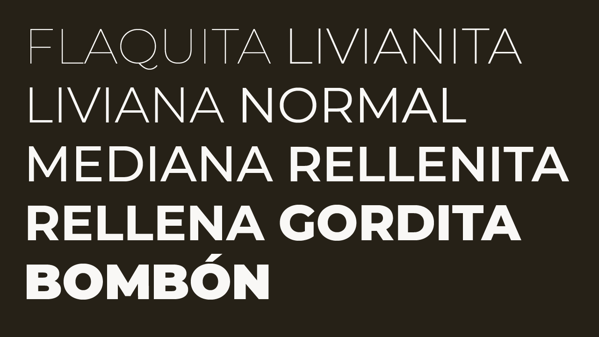
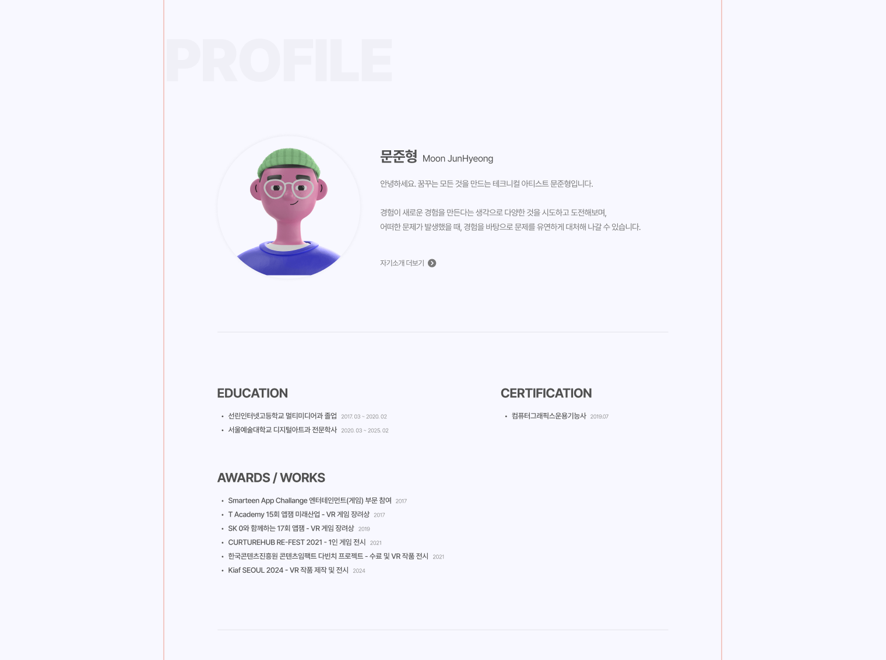
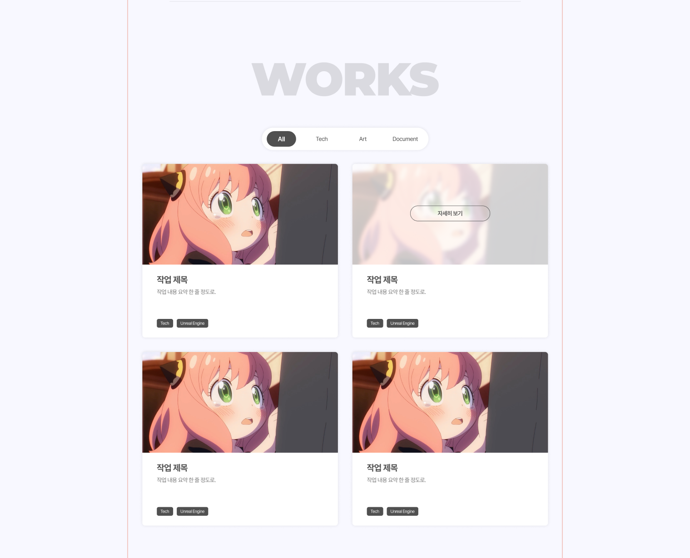
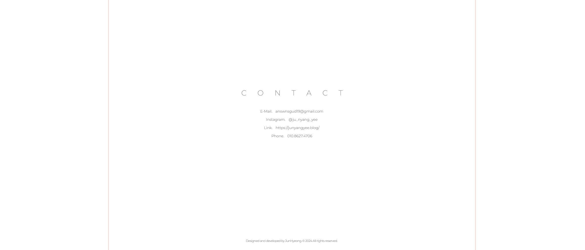
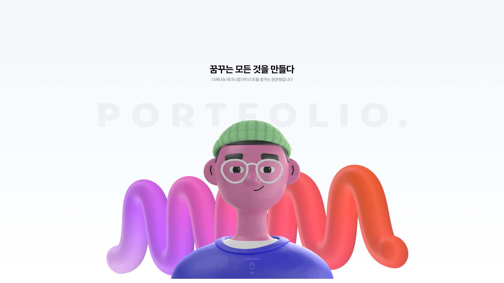
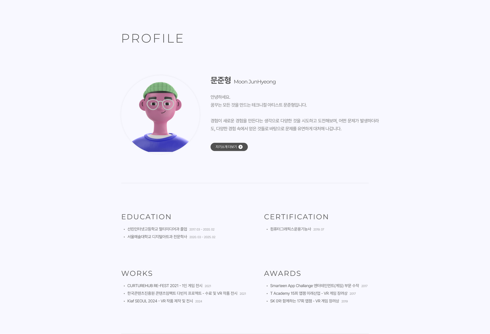
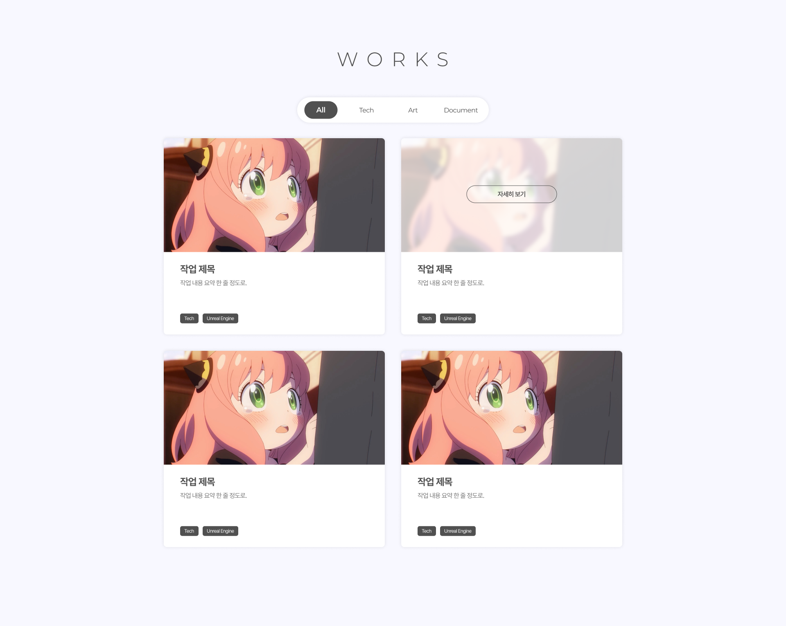
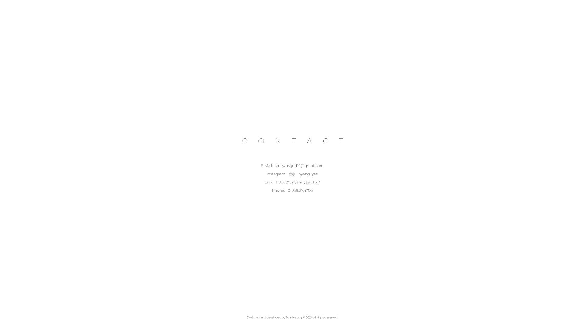
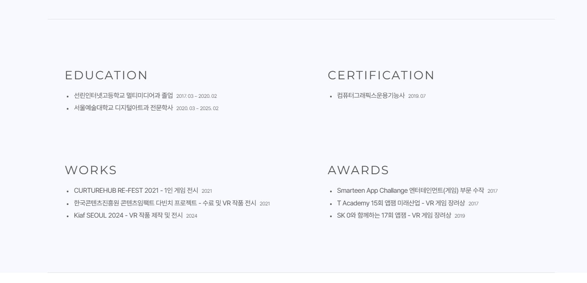

> 전체적인 디자인을 수정하고, 프로필 페이지를 완성하였으며,  
> WORKS 페이지의 태그 작업까지 진행했습니다.

---

## 폰트 추가

페이지 디자인 중, 영문 폰트가 조금 어색해보이는 것 같아 다른 폰트를 추가하려고 합니다.
**Montserrat** 폰트로, 조금 더 영문에 잘어울리는 폰트라고 생각합니다.

해당 폰트는 영문에만 적용하고, 국문은 그대로 Pretendard를 사용하겠습니다.



```jsx
// src/app/page.js

const montserrat = localFont({
	src: "./fonts/Montserrat.woff2",
	variable: "--font-montserrat",
	display: "swap",
	subsets: ["latin"],
});

export default function RootLayout({ children }) {
	return (
		<body className={`${pretendard.className} ${montserrat.variable}`}>
		</body>
	);
}
```
```css
/* 영문 폰트 필요한 부분 */

.className {
	font-family: var(--font-montserrat);
}
```


---

## 디자인 느낌 통일

현재 페이지 디자인은 다음과 같은 느낌으로 진행되었습니다.  
다만 따로따로 천천히 진행하다보니, 전체적으로 디자인이 통일된 느낌이 아닌 것 같습니다.

해당 부분 통일을 위해 디자인 부분을 다시 수정합니다.





### 디자인 수정 完

완전 완벽하진 않지만, 전체적인 느낌을 수정했습니다.  
전체적으로 폰트가 과하게 두꺼워보이는 부분이 어색해, 진하고 얇은 텍스트 바탕으로 작업했습니다.

기존에 고민하던 학력 및 수상경력 부분은 지금처럼 텍스트형태로 가져가는 것이 더 어울릴 것 같아 변경하지 않았습니다.  
해당부분은 추후 폰트 굵기와 위치 등 조절하면서 가장 좋은 세팅을 찾아야할 것 같습니다.







---

## 기존 디자인 수정

기존 부분에서 바꾼 부분들을 수정해주겠습니다.  
지금까지 제작한 부분에서는 폰트 정도 수정이라, 코드블럭은 따로 남기지 않겠습니다.


---

## 프로필 학력 · 자격증 · 수상경럭 부분

기존에 건너뛰었던 해당 부분을 제작하겠습니다.  
익순해진 부분도 있고, 텍스트만 추가하는 거라 크게 어려운 점 없이 작업이 진행되었습니다.

중간에 edu, certification 등 분얄르 나눠놓은 `<div>`태그는 구분용이며, 따로 작업하지 않았습니다.  
텍스트는 `<span>`태그로 줄바꿈 없이 이어지도록 했으며, 연도는 클래스를 따로 적용하였습니다.

```jsx
// src/app/profile/profile.js

import styles from "./profile.module.css";
import Image from "next/image";
import Link from "next/link";
  
export default function Profile() {
    return (

		// 윗 부분분 
	
	     <section className={styles.activity}>
	        <div className={styles.actBox}>
	            <div className={styles.edu}>
	                <h3 className={styles.subTitle}>EDUCATION</h3>
	                <ul className={styles.subText}>
	                    <li>
	                        <span>선린인터넷고등학교 멀티미디어과 졸업</span>
	                        <span className={styles.moreYear}>2017. 03 ~ 2020. 02</span>
	                    </li>
	                    <li>
	                        <span>서울예술대학교 디지털아트과 전문학사</span>
	                        <span className={styles.moreYear}>2020. 03 ~ 2025. 02</span>
	                    </li>
	                </ul>
	            </div>
	            <div className={styles.certication}>
	                <h3 className={styles.subTitle}>CERTIFICATION</h3>
	                <ul className={styles.subText}>
	                    <li>
	                        <span>컴퓨터그래픽스운용기능사</span>
	                        <span className={styles.moreYear}>2019. 07</span>
	                    </li>
	                </ul>
	            </div>
	            <div className={styles.works}>
	                <h3 className={styles.subTitle}>WORKS</h3>
	                <ul className={styles.subText}>
	                    <li>
	                        <span>CURTUREHUB RE-FEST 2021 - 1인 게임 전시</span>
	                        <span className={styles.moreYear}>2021</span>
	                    </li>
	                    <li>
	                        <span>한국콘텐츠진흥원 콘텐츠임팩트 다빈치 프로젝트 - 수료 및 VR 작품 전시</span>
	                        <span className={styles.moreYear}>2021</span>
	                    </li>
	                    <li>
	                        <span>Kiaf SEOUL 2024 - VR 작품 제작 및 전시</span>
	                        <span className={styles.moreYear}>2024</span>
	                    </li>
	                </ul>
	            </div>
	            <div className={styles.awards}>
	                <h3 className={styles.subTitle}>AWARDS</h3>
	                <ul className={styles.subText}>
	                    <li>
	                        <span>Smarteen App Challange 엔터테인먼트(게임) 부문 수작</span>
	                        <span className={styles.moreYear}>2017</span>
	                    </li>
	                    <li>
	                        <span>T Academy 15회 앱잼 미래산업 - VR 게임 장려상</span>
	                        <span className={styles.moreYear}>2017</span>
	                    </li>
	                    <li>
	                        <span>SK 0와 함께하는 17회 앱잼 - VR 게임 장려상</span>
	                        <span className={styles.moreYear}>2019</span>
	                    </li>
	                </ul>
	            </div>
	        </div>
	    </section>
    )
}
```
```css
/* src/app/profile/profile.module.css */

.activity {
    width: 100%;
    padding-top: 115px;
    padding-bottom: 120px;
    border-bottom: 1px #0000001a solid;
}
  
.actBox {
    display: grid;
    padding-left: 40px;
    padding-right: 40px;
  
    grid-template-columns: repeat(2, 1fr);
    row-gap: 115px;
    column-gap: 125px;
}
  
.subTitle {
    color: #505050;
    font-family: var(--font-montserrat);
    font-weight: var(--font-regular);
    font-size: 1.75rem;
    letter-spacing: 0.1em;
    margin-bottom: 18px;
}
 
.subText {
    display: flex;
    justify-content: flex-start;
    flex-direction: column;
  
    color: #606060;
    font-weight: var(--font-regular);
    font-size: 1rem;
    letter-spacing: -0.03em;
    line-height: 170%;
    text-align: left;
}
  
.subText li{
    padding-left: 5px;
    list-style: disc inside;
    align-items: center;
}
  
.subText li::marker {
    font-size: 0.75rem;
}
  
.moreYear {
    margin-left: 8px;
  
    columns: #787878;
    font-weight: var(--font-light);
    font-size: 0.75rem;
}
```




---

## WORKS 태그 버튼 작업

이어서 바로 WORKS 섹션 작업을 진행했습니다.  
메인 타이틀을 만들고 태그를 우선 만들어주겠습니다.

태그 작업 중 문제가 발생했습니다.  
태그 작업 중, 변수를 선언해 다음과 같이 구분했습니다.  
로그로 확인해보니, `now` 변수가 변경이되지만, 스타일 적용은 되지 않았습니다.  
스타일 적용 코드 자체는 `now` 변수 값을 변경하고 새로고침했을 때 잘 바뀌는 것을 보니 코드 문제가 있는 것으로 파악했습니다.

```jsx
// src/app/works/works.js

'use client'
import styles from "./works.module.css";
  
const a = ["all", "tech", "art", "doc"];
let now = a[0];
  
export default function Works() {
    function changeTag(tagNum) {
        now = a[tagNum];
        console.log(now);
    }
  
    return (
        <section id="works" className={styles.works}>
            <div className={styles.innerPadding}>
  
                <h1 className={styles.title}>WORKS</h1>
  
                <div className={styles.tagSelect}>
                    <div onClick={() => changeTag(0)}
                    className={`${styles.button} ${now === "all" ? styles.active : styles.none}`}
                    name="all">All
                    </div>
                    <div onClick={() => changeTag(1)}
                    className={`${styles.button} ${now === "tech" ? styles.active : styles.none}`}
                    name="tech">Tech</div>
                    <div onClick={() => changeTag(2)}
                    className={`${styles.button} ${now === "art" ? styles.active : styles.none}`}
                    name="art">Art</div>
                    <div onClick={() => changeTag(3)}
                    className={`${styles.button} ${now === "doc" ? styles.active : styles.none}`}
                    name="doc">Document</div>
                </div>
  
                <section className={styles.workList}>
  
                </section>
  
            </div>
        </section>
    )
}
```

그러던 중 `useState`를 발견했습니다.

해당 함수는 react에서 사용하는 함수입니다.  
컴포넌트에 상태변수를 추가할 수 있게 해주는 함수로, **상태값 변경시 리렌더링이 발생**합니다.  
즉, 기존 제가 했던 것은 리렌더링이 되지 않아 발생하는 문제였습니다.

```jsx
const [state, setState] = useState(initialState);
```

- `state` : 상태변수
- `setState` : 클릭시 발생할 함수
- `initialState` : 변결될 값

그렇게 해당 함수를 사용해 해결했습니다.  
다만, 기존처럼 배열을 사용해 이름으로 바꾸게 하고 싶었으나, 해당 부분까지는 아직은 복잡하다고 생각하여 지금 정도로 그쳤습니다.

```jsx
// src/app/works/works.js

'use client'
import { useState } from 'react';
import styles from "./works.module.css";
  
export default function Works() {
    const [now, changeTag] = useState(0);
  
    return (
        <section id="works" className={styles.works}>
            <div className={styles.innerPadding}>
  
                <h1 className={styles.title}>WORKS</h1>
  
                <div className={styles.tagSelect}>
                    <div onClick={() => changeTag(0)}
                    className={`${styles.button} ${now === 0 ? styles.active : styles.none}`}
                    name="all">All
                    </div>
                    <div onClick={() => changeTag(1)}
                    className={`${styles.button} ${now === 1 ? styles.active : styles.none}`}
                    name="tech">Tech</div>
                    <div onClick={() => changeTag(2)}
                    className={`${styles.button} ${now === 2 ? styles.active : styles.none}`}
                    name="art">Art</div>
                    <div onClick={() => changeTag(3)}
                    className={`${styles.button} ${now === 3 ? styles.active : styles.none}`}
                    name="doc">Document</div>
                </div>
  
                <section className={styles.workList}>
  
                </section>
  
            </div>
        </section>
    )
}
```
```css
.works {
    width: 100%;
    height: 1080px;
    position: relative;
  
    background: #F8F8FF;
    white-space: pre-wrap;
    scroll-margin: 80px;
}
  
.innerPadding {
    max-width: 1200px;
    margin: 0 auto;
    padding-bottom: 115px;
    border-bottom: 1px #0000001a solid;
}
  
.title {
    padding-top: 110px;
    text-align: center;
  
    font-family: var(--font-montserrat);
    font-weight: var(--font-light);
    font-size: 3rem;
}
  
.tagSelect {
    width: 480px;
    height: 68px;
    margin: 0 auto;
    margin-top: 64px;
  
    display: flex;
    align-items: center;
    justify-content: space-around;
    text-align: center;
  
    border-radius: 999px;
    background-color: #FFFFFF;
    box-shadow: 0px 0px 10px #00000011;
  
    font-family: var(--font-montserrat);
}
  
.button {
    padding: 12px 30px;
    border-radius: 999px;
    cursor: pointer;
}
  
.active {
    background-color: #505050;
    color: #FFFFFF;
  
    font-weight: var(--font-medium);
    font-size: 1.125rem;
  
    transition: 0.5s;
}
  
.none {
    background-color: #FFFFFF;
    color: #505050;
  
    font-weight: var(--font-regular);
    font-size: 1rem;
  
    transition: 0.5s;
}
  
.none[name="art"],
.active[name="art"] {
    padding: 12px 32px;
}
  
.none[name="doc"],
.active[name="doc"] {
    padding: 12px 15px;
}
```


---

```toc
```