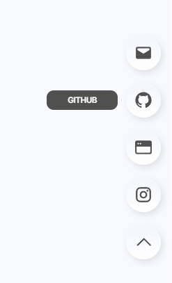
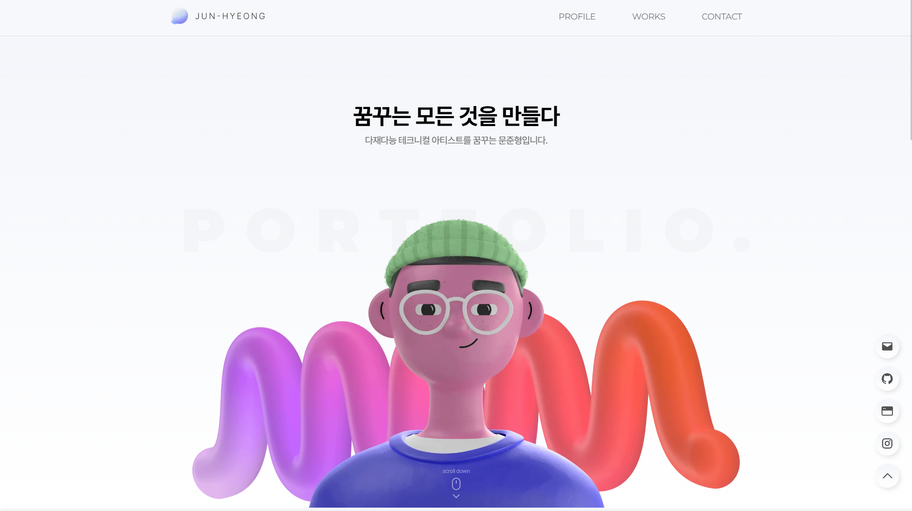
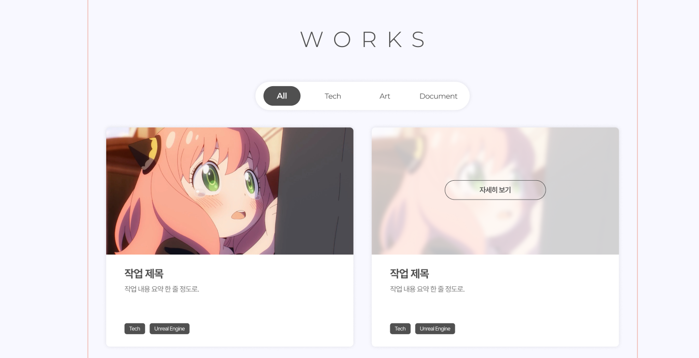
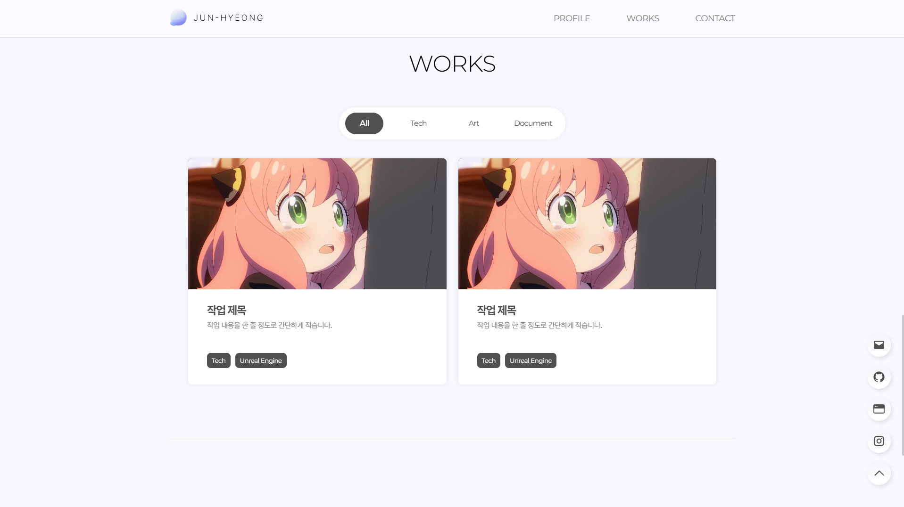

> WORKS 페이지에서 작업물들을 선택할 수 있도록  
> Works List 생성을 진행하였습니다. 

---

## FAB Github 버튼 추가

우하단 FAB에 Github를 추가하겠습니다.  
순서는 **메일 - 깃허브 - 블로그 - 인스타 - 위로가기** 순서로 해두겠습니다.

메일은 제일 우선 연락수단이기에 제일 우선순위로 두었으며, 그 이후로는 포트폴리오를 보는 사람들이 관심있게 이동할만한 링크 순서로 정리했습니다.

css에서 기존에는 `height`를 직접 설정해서 해둔 부분을 `row-gap`으로 설정하였습니다.

```jsx
// src/components/floatingButton/floatingButton.js

export default function FloatingButton() {
	return (
		...
		
		<div className={styles.floatingItem}>
		    <div className={styles.tooltip}>
		        <span>GITHUB</span>
		    </div>
		    <Link href="https://github.com/JuNyangYee" target="_blank">
		        <button className={styles.button}>
		            <Image src={"/icons/github.svg"} width={28} height={28} alt="Github" title="Github"/>
				</button>
		    </Link>
		</div>
	)
}
```
```css
/* src/components/floatingButton/floating.module.css */

.floatingList {
    display: flex;
    flex-direction: column;
    justify-content: space-between;
    row-gap: 18px;
}
```




---

## 메인 배경 텍스트 추가

메인 배경에 `PORTFOLIO.` 텍스트를 추가하겠습니다.

```jsx
// src/app/main/main.js

export default function Main() {
    return (
        <div className={styles.bgTitle}>
            <h1 className={styles.bgTitleText}>PORTFOLIO.</h1>
        </div>
    )
}
```
```css
/* src/app/main/main.module.css */

.bgTitle {
    width: 100%;
    position: absolute;
    top: 38vh;
}

.bgTitleText {
    text-align: center;
    color: #00000005;
    font-family: var(--font-montserrat);
    font-weight: 900;
    font-size: 8rem;
    letter-spacing: 0.31em;
}
```



현재 색상이 좀 연하게 보이기는 하나, 추후 마무리 단계에서 변경하도록 하겠습니다.

---

## Works List 만들기



디자인한 리스트 동작은 다음과 같습니다.

마우스 hover 시, 썸네일 이미지가 블러되며 자세히 보기 버튼이 등장합니다.  
해당 자세히보기 버튼을 누르면 작품 내용 페이지가 등장합니다.

페이지는 화면이 추가로 뜨는 형태로 뜨게 하려고 하며, 각 페이지별로 name 혹은 id 를 tag로 나누어 태그 선택시 `visible` 옵션을 조절하도록 하려합니다.  

작품의 태그는 메인태그 (Tech, Art, Document) 3개로 작성하고, 세부 태그는 작성하면 자동으로 메인 리스트 썸네일에 추가되게 작성하려합니다.

Figma에서 1920px PC기준 한 줄에 2개로 디자인했으나, 추후 너무 크게 보이면 3개로 조절하겠습니다.

### 리스트 요소 제작

가장 먼저, 페이지에 띄울 작업물 칸을 만들겠습니다.

모든 칸은 그리드 기반으로 적용하여, 자동으로 요소들이 정렬되도록 만들었습니다.  
추후 id 기반으로 메인 태그를 적용하여 상단 태그 선택을 했을 때, 자동으로 숨김이 되도록 하려합니다.

전체 구조를 잡은 후, 이미지는 `style={{objectFit: "cover"}}`를 적용해서 자동으로 잘리게 만들었으며, 박스 사이즈에 맞게 보이도록 css에서 `overflow-hidden;`을 적용하였습니다.

```jsx
// src/app/works/works.js

import Image from "next/image";

export default function Works() {
    return (
        <section className={styles.workList}>

            <div className={styles.workItem}>
                <div className={styles.workThumbnail}>
                    <Image 
                        src={"/images/works/test/TestThumbnail.jpg"} 
                        fill
                        alt='test-thumbnail'
                        sizes='width: 100%'
                        style={{objectFit: "cover"}} />
                </div>
                <div className={styles.workText}>
                    <h3 className={styles.workTitle}>작업 제목</h3>
                    <p className={styles.workSub}>작업 내용을 한 줄 정도로 간단하게 적습니다.</p>
                </div>
                <div className={styles.workTags}>
                    <p className={styles.workTagButton}>Tech</p>
                    <p className={styles.workTagButton}>Unreal Engine</p>
                </div>
            </div>

        </section>
    )
}
```
```css
/* src/app/works/works.module.css */

.workList {
    display: grid;
    padding-top: 40px;
    padding-left: 40px;
    padding-right: 40px;
    grid-template-columns: repeat(2, 1fr);
    gap: 25px;
}

.workItem {
    height: 480px;

    position: relative;
    display: flex;
    flex-direction: column;
    justify-content: flex-start;
    gap: 30px;

    border-radius: 8px;
    background-color: #FFFFFF;
    box-shadow: 0 0 10px #0000001a;
    overflow: hidden;
}

.workThumbnail {
    position: relative;
    height: 58%;
    background-color: #505050;
}

.workText {
    padding: 0 40px;
    display: flex;
    flex-direction: column;
    gap: 0.5rem;
}

.workText > .workTitle {
    color: #505050;
    font-weight: var(--font-bold);
    font-size: 1.5rem;
    letter-spacing: -0.05em;
}

.workText > .workSub {
    color: #787878;
    font-weight: var(--font-regular);
    font-size: 1rem;
    letter-spacing: -0.03em;
}

.workTags {
    position: absolute;
    padding: 35px 40px;
    bottom: 0;

    display: flex;
    flex-direction: row;
    gap: 0.625rem;
}

.workTags > .workTagButton {
    padding: 0.5rem 0.625rem;
    
    color: #FFFFFF;
    font-family: var(--font-montserrat);
    font-weight: var(--font-legular);
    font-size: 0.825rem;
    letter-spacing: -0.03em;

    border-radius: 8px;
    background-color: #505050;
}
```




### 마우스 호버 씬

마우스를 올렸을 때 자세히보기 버튼이 나오도록 만들어보겠습니다.  
썸네일 부분에 새로운 `<div>` 섹션을 추가하여 해당 부분에 작업을 진행했습니다.

마우스 hover는 전체가 아닌 썸네일 부분만 하게 했으며, 해당 부분은 추후 UX 측면에서 아쉬울 경우 변경할 예정입니다.

`z-index`의 경우, GNB보다는 아래에 위치해야하기에 25정도로 수정하였습니다.

```jsx
// src/app/works/works.js

<div className={styles.workItem}>
    <div className={styles.workThumbnail}>
        <div className={styles.workHover}>
            <p className={styles.workMore}>자세히보기</p>
        </div>
        ...
    <div>
</div>
```
```css
/* src/app/works/works.module.css */

.workThumbnail:hover .workHover{
    visibility: visible;
}

.workHover {
    display: flex;
    justify-content: center;
    align-items: center;
    position: relative;
    width: 100%;
    height: 100%;
    background-color: #FFFFFFbf;
    backdrop-filter: blur(10px);
    z-index: 25;
    visibility: hidden;
}

.workHover > .workMore {
    padding: 0.75rem 4.75rem;
    border: 1px #505050 solid;
    border-radius: 999px;

    color: #505050;
    font-weight: var(--font-semibold);
    font-size: 1rem;
    letter-spacing: -0.03em;
    text-align: center;
}
```


---

```toc
```