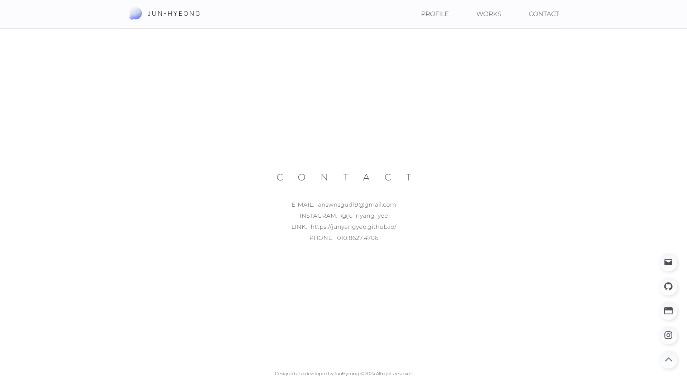
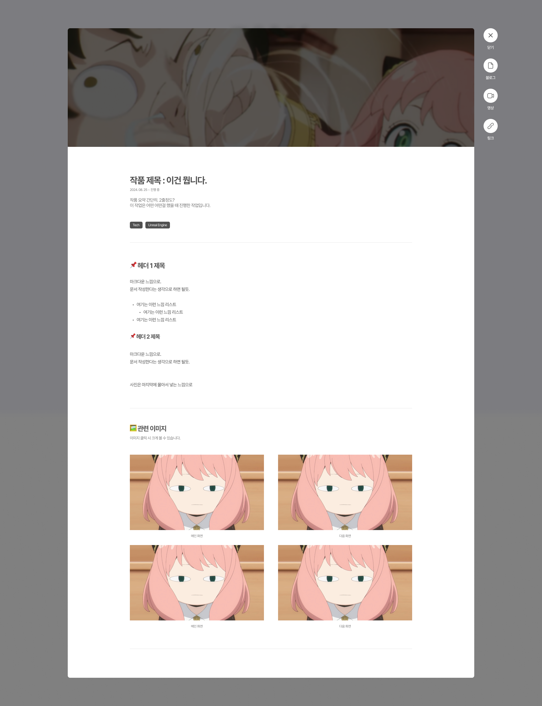

> Contact 페이지를 제작하고, 모달 페이지 작업을 진행했습니다.  
> 다만 파일 관련한 부분에서 동적 라우팅을 시도했으나 실패하여 정적으로 관리하는 것으로 하였습니다.

---

## CONTACT 페이지 제작

모달 페이지 제작 전에 메인 화면 먼저 완성 시켜보겠습니다.  
텍스트로만 이루어져있어서, 큰 어려움 없이 완성할 수 있었습니다.

메인 페이지 화면처럼 화면의 크기에 맞게 높이를 조절해서, 화면을 가득 채울 수 있도록 제작했습니다.  
가장 하단에 저작권 표시를 진행했습니다.

```jsx
// src/app/contact/contact.js

import styles from "./contact.module.css";

export default function Contact() {
    return (
        <section id="contact" className={styles.contact}>
            <div className={styles.innerPadding}>
                <div className={styles.contactArea}>
                    <h1 className={styles.title}>CONTACT</h1>
                    <div className={styles.infoArea}>
                        <div className={styles.info}>
                            <span>E-MAIL.</span>
                            <span>answnsgud19@gmail.com</span>
                        </div>
                        <div className={styles.info}>
                            <span>INSTAGRAM.</span>
                            <span>@ju_nyang_yee</span>
                        </div>
                        <div className={styles.info}>
                            <span>LINK.</span>
                            <span>https://junyangyee.github.io/</span>
                        </div>
                        <div className={styles.info}>
                            <span>PHONE.</span>
                            <span>010.8627.4706</span>
                        </div>
                    </div>
                </div>
                <p className={styles.copyright}>Designed and developed by JunHyeong. © 2024 All rights reserved.</p>
            </div>
        </section>
    )
}
```
```css
/* src/app/contact/contact.js */

.contact {
    width: 100%;
    height: calc(100vh - 80px);
    position: relative;

    background: #FFFFFF;
    white-space: pre-wrap;
    scroll-margin: 80px;
}

.innerPadding {
    max-width: 1200px;
    margin: 0 auto;
    display: flex;
    flex-direction: column;
    justify-content: center;
    align-items: center;
}

.contactArea {
    display: flex;
    flex-direction: column;
    justify-content: center;
    text-align: center;
    align-items: center;
    padding-top: 35vh;
}

.title {
    color: #505050;
    font-family: var(--font-montserrat);
    font-weight: var(--font-light);
    font-size: 1.6125rem;
    letter-spacing: 1.625em;
    text-indent: 1.625em;
}

.infoArea {
    display: flex;
    flex-direction: column;
    justify-content: center;
    align-items: center;
    gap: 0.75rem;
    padding-top: 3.25rem;
}

.info {
    display: flex;
    flex-direction: row;
    gap: 0.625rem;
}

.info > span {
    color: #505050;
    font-family: var(--font-montserrat);
    font-weight: var(--font-light);
    font-size: 1rem;
    letter-spacing: 0.03em;
}

.copyright {
    display: flex;
    position: absolute;
    bottom: 1.75rem;
    margin: 0 auto;
    text-align: center;

    color: #505050;
    font-family: var(--font-montserrat);
    font-weight: var(--font-light);
    font-size: 0.825rem;
}
```




---

## 모달창 디자인

Figma에서 모달창 디자인을 진행했습니다.  
전체적인 디자인은 노트폴리오를 참고하였고, 텍스트 부분은 노션을 참고하였습니다.  
가능하다면 텍스트 부분을 마크다운 문법을 사용해서 작성하고 싶어 전체적인 구조를 저렇게 잡아보았습니다.



### FAB 작업

FAB는 이전과 조금 다른 방식으로 구현하려고합니다.  
메인 화면에 붙어있어야하기에, `position: sticky;`를 활용해서 붙어있을 수 있도록 하겠습니다.

```jsx
// src/app/@modal/(.)portfolio/testPage/page.js

'use client'
import { useRouter } from "next/navigation";
import Image from "next/image";
import Link from "next/link";
import styles from "./page.module.css";

export default function WorkTest() {
    const router = useRouter();

    return (
        <section className={styles.modalPage}>
            <div className={styles.outerContainer}>
                <section className={styles.innerContainer}>
                    ...
                </section>

                <section className={styles.fab}>
                    <div className={styles.fabItem}>
                        <button className={styles.fabButton}
                            onClick={() => router.back()}>
                            <Image src={"/icons/close.svg"} width={24} height={24} alt="Close" title="Close"/>
                        </button>
                        <p className={styles.fabText}>닫기</p>
                    </div>
                    <div className={styles.fabItem}>
                        <button className={styles.fabButton}>
                            <Image src={"/icons/page.svg"} width={24} height={24} alt="Blog" title="Blog"/>
                        </button>
                        <p className={styles.fabText}>블로그</p>
                    </div>
                    <div className={styles.fabItem}>
                        <button className={styles.fabButton}>
                            <Image src={"/icons/video.svg"} width={28} height={32} alt="Video" title="Video"/>
                        </button>
                        <p className={styles.fabText}>영상</p>
                    </div>
                    <div className={styles.fabItem}>
                        <button className={styles.fabButton}>
                            <Image src={"/icons/link.svg"} width={24} height={24} alt="Link" title="Link"/>
                        </button>
                        <p className={styles.fabText}>링크</p>
                    </div>
                </section>
                
            </div>

            <section className={styles.modalBack} onClick={() => router.back()}>
            </section>

        </section>

    );
}
```
```css
/* src/app/@modal/(.)portfolio/testPage/page.module.css */

.modalPage {
    width: 100%;
    height: 100%;

    display: flex;
    position: fixed;
    top: 0;
    left: 0;
    z-index: 999;

    overflow-y: auto;
    box-sizing: border-box;
}

.outerContainer {
    position: relative;
    display: flex;
    flex-direction: row;
    align-items: flex-start;
    justify-content: center;
    margin: 100px auto;
    height: min-content;
}

.innerContainer {
    width: 100%;
    max-width: 1440px;

    background-color: #FFFFFF;
    border-radius: 8px;
    border: 0;

    padding-bottom: 100px;
    overflow: hidden;
}

.fab {
    position: sticky;
    width: 50px;
    top: 100px;
    margin-left: 40px;

    display: flex;
    flex-direction: column;
    justify-content: center;
    align-items: center;
    gap: 30px;
}

.fabItem {
    display: flex;
    flex-direction: column;
    justify-content: center;
    align-items: center;
    text-align: center;
    gap: 10px;
}

.fabButton {
    width: 50px;
    height: 50px;
    display: flex;
    justify-content: center;
    align-items: center;
    text-align: center;
    
    background: linear-gradient(to bottom, #F3F5FA, #ffffff);
    border-radius: 99999px;
    border: 0;

    cursor: pointer;
}

.fabText {
    color: #FFFFFF;
    font-weight: var(--font-medium);
    font-size: 0.875rem;
    letter-spacing: -0.05em;
    text-indent: -0.05em;
}
```


### 모달창 디자인

추후 컴포넌트화 및 내용 관리를 진행하겠으나, 일단 지금은 전체적인 디자인을 우선적으로 진행해보도록 하겠습니다.

제목 부분에 사용한 태그는 `workItem.js`에서 사용하는 코드 및 css를 그대로 가져왔습니다.  
이미지는 라우팅 기반 모달창이 아닌, 그냥 css 창으로 visiblity 설정으로 하는 게 더 효율적을 것이라 생각합니다.

```jsx
// src/app/@modal/(.)portfolio/testPage/page.js

'use client'
import { useRouter } from "next/navigation";
import Image from "next/image";
import Link from "next/link";
import styles from "./page.module.css";

export default function WorkTest() {
    const router = useRouter();

    return (
        <section className={styles.modalPage}>
            <div className={styles.outerContainer}>

                <section className={styles.innerContainer}>

                    <div className={styles.thumbnail}>
                        <div className={styles.blur} />
                        <Image 
                            src={"/images/works/test/TestTitleImg.jpg"} 
                            fill 
                            alt="thumbnail"
                            sizes="width: 100%"
                            style={{objectFit: "cover"}}
                        />
                    </div>

                    <section className={styles.innerPadding}>
                        <div className={styles.header}>
                            <h1 className={styles.title}>작품 제목 : 이것이 작품이다.</h1>
                            <p className={styles.date}>2024. 08. 25 ~ 진행 중</p>
                            <p className={styles.about}>
                                작품설명 두 줄 정도 <br />
                                이 작업은 어떤 어떤 걸 진행한 작업입니다.
                            </p>
                            <div className={styles.workTags}>
                                <p className={styles.workTagButton}>Tech</p>
                                <p className={styles.workTagButton}>Unreal Engine</p>
                            </div>
                        </div>

                        <div className={styles.contents}>
                            <section className={styles.contentsSection}>
                                <h1>📌 헤더 제목 1</h1>
                                <p>
                                    이건 좀... <br />
                                    아무래도 이건 행간을 보기위해 만든...
                                </p>
                                <ul>
                                    <li>이건 뭐지</li>
                                    <li>리스트구나!</li>
                                    <ol>
                                        <li>근데 되게 복잡스럽네.</li>
                                    </ol>
                                </ul>
                                <h2>📌 헤더 제목 2</h2>
                                <p>
                                    이건 좀... <br />
                                    아무래도 이건 행간을 보기위해 만든...
                                </p>
                            </section>
                            <section className={styles.contentsSection}>
                                <h1>🖼️ 이미지</h1>
                                <p>이미지 클릭 시 크게 볼 수 있습니다.</p>
                                <section className={styles.imgSection}>

                                    <div className={styles.contentsImage}>
                                        <div className={styles.img}>
                                            <Image 
                                                src={"/images/works/test/TestImage.jpg"}
                                                fill
                                                alt="test"
                                                sizes="width: 100%" 
                                                style={{objectFit: "cover"}}
                                            />
                                        </div>
                                        <p>메인화면</p>
                                    </div>

                                </section>
                            </section> 
                        </div>
                    </section>

                </section>

                <section className={styles.fab}>
                    ...
                </section>
                
            </div>

            <section className={styles.modalBack} onClick={() => router.back()}>
            </section>

        </section>

    );
}
```
```css
/* src/app/@modal/(.)portfolio/testPage/page.module.css */

.modalPage {
    width: 100%;
    height: 100%;

    display: flex;
    position: fixed;
    top: 0;
    left: 0;
    z-index: 999;

    overflow-y: auto;
    box-sizing: border-box;
}

.outerContainer {
    position: relative;
    display: flex;
    flex-direction: row;
    align-items: flex-start;
    justify-content: center;
    margin: 100px auto;
    height: min-content;
}

.innerContainer {
    width: 100%;
    max-width: 1440px;

    background-color: #FFFFFF;
    border-radius: 8px;
    border: 0;

    padding-bottom: 100px;
    overflow: hidden;
}

.thumbnail {
    position: relative;
    width: 100%;
    height: 420px;
}

.blur {
    position: relative;
    width: 100%;
    height: 100%;
    z-index: 99;
    background-color: #000000a6;
    backdrop-filter: blur(3px);
}

.innerPadding {
    width: 100%;
    max-width: 1000px;
    padding-left: 11.5em;
    padding-right: 11.5em;
    margin: 0 auto;
}

.header {
    width: 100%;
    padding-top: 6.25rem;

    display: flex;
    flex-direction: column;

    text-align: start;

    padding-bottom: 3.5rem;
    border-bottom: 1px #0000001a solid;
}

.header > .title {
    color: #505050;
    font-size: 2rem;
    font-weight: var(--font-bold);
    letter-spacing: -0.05em;
}

.header > .date {
    padding-top: 0.5rem;

    color: #787878;
    font-size: 0.825rem;
    font-weight: var(--font-regular);
    letter-spacing: -0.05em;
}

.header > .about {
    padding-top: 1.25rem;

    color: #505050;
    font-size: 1rem;
    font-weight: var(--font-light);
    letter-spacing: -0.03em;
    line-height: 140%;
}

.workTags {
    padding-top: 3rem;

    display: flex;
    flex-direction: row;
    gap: 0.5rem;

    flex-wrap: wrap;
    white-space: nowrap;
}

.workTags > .workTagButton {
    padding: 0.5rem 0.625rem;
    
    color: #FFFFFF;
    font-family: var(--font-montserrat);
    font-weight: var(--font-medium);
    font-size: 0.75rem;
    letter-spacing: -0.03em;

    border-radius: 8px;
    background-color: #505050;
}


.contents {
    width: 100%;

    color: #505050;
    text-align: start;
    font-size: 1rem;
    font-weight: var(--font-regular);
    letter-spacing: -0.03em;
    line-height: 170%;
}

.contentsSection {
    width: 100%;
    padding-top: 3.5rem;
    padding-bottom: 3.5rem;
    border-bottom: 1px #0000001a solid;
}

.contents h1 {
    font-weight: var(--font-bold);
    font-size: 1.5rem;
    margin-bottom: 1.25rem;
}

.contents h2 {
    font-weight: var(--font-bold);
    font-size: 1.25rem;
    margin-top: 2rem;
    margin-bottom: 1.25rem;
}


.contents li,
.contents ul {
    list-style: disc inside;
}

.contents ol {
    padding-inline-start: 2rem;
}

.imgSection {
    width: 100%;
    padding-top: 2rem;
    position: relative;
    display: grid;
    grid-template-columns: repeat(2, 480px);
    row-gap: 1.25rem;
    justify-content: space-between;
}

.img {
    position: relative;
    width: 100%;
    height: 280px;
}

.contentsImage {
    display: flex;
    flex-direction: column;
    justify-content: center;
    align-items: center;
    text-align: center;
}

.contentsImage p {
    margin-top: 0.625rem;
    color: #787878;
    font-size: 0.825rem;
    font-weight: var(--font-medium);
}

.modalBack {
    position: fixed;
    width: 100%;
    height: 100%;
    top: 0;
    left: 0;
    z-index: -1;
    background-color: #00000080;
    backdrop-filter: blur(20px);
}
```


---

## 작업물 관련 폴더 및 파일 구조 정리

현재 `works/works.json` 파일에 썸네일 관련 내용이 들어있고,  
포트폴리오 모달페이지는 `@modal/(.)portfolio/pageName/page.js` 에 존재합니다.

원하는 방향은, 폴더 하나에 게시글 파일 한 개를 작성하면 자동으로 작업물 리스트와 모달페이지에 적용되도록 하는 방향을 구상 중입니다.

### FAB 버튼 컴포넌트

모달 FAB 버튼의 경우 닫기를 제외한 다른  
**"블로그", "영상", "링크"** 의 경우 필요가 없는 작업물일 가능성이 있습니다.

해당 부분을 위해서, 컴포넌트의 `props`로 사용할 버튼을 전달해주는 것 까지 해보겠습니다.

```jsx
// src/app/@modal/(.)portfolio/testPage/page.js

...
<FAB 
    blog={true}
    video={false}
    link={true}
/>
...

// src/components/modalFab/modalFab.js

'useClient'
import { useRouter } from "next/navigation";
import Image from "next/image";
import Link from "next/link";
import styles from "./modalFab.module.css";

export default function WorkFAB(props) {
	const router = useRouter();
	
    return (
        <section className={styles.fab}>
            <div className={styles.fabItem}>
                <button className={styles.fabButton} onClick={() => router.back()}>
                    <Image src={"/icons/close.svg"} width={24} height={24} alt="Close" title="Close"/>
                </button>
                <p className={styles.fabText}>닫기</p>
            </div>
            <div className={props.blog ? styles.fabItem : styles.hide}>
                <Link href={""} className={styles.fabButton}>
                    <Image src={"/icons/page.svg"} width={24} height={24} alt="Blog" title="Blog"/>
                </Link>
                <p className={styles.fabText}>블로그</p>
            </div>
            <div className={props.video ? styles.fabItem : styles.hide}>
                <Link href={""} className={styles.fabButton}>
                    <Image src={"/icons/video.svg"} width={28} height={32} alt="Video" title="Video"/>
                </Link>
                <p className={styles.fabText}>영상</p>
            </div>
            <div className={props.link ? styles.fabItem : styles.hide}>
                <Link href={""} className={styles.fabButton}>
                    <Image src={"/icons/link.svg"} width={24} height={24} alt="Link" title="Link"/>
                </Link>
                <p className={styles.fabText}>링크</p>
            </div>
        </section>
    )
}
```
```css
/* src/components/modalFab/modalFab.module.css */

.fab {
}

.fabItem {
}

.fabButton {
}

.fabText {
}

.hide {
    display: none;
}
```


### 모달 페이지 컴포넌트

세부 페이지 내용을 컨트롤할 수 있게, 모달을 컴포넌트화 하겠습니다.  
기존에 있던 내용은 전부 지우고, 이 역시 `props` 로 받아온다고 생각하고 작업을 진행하겠습니다.

전체 내용은 일단 json 기반으로 작성한다고 생각하고 각 내용들을 설정해주었습니다.  
그 후 모달 + FAB 전체를 컴포넌트로 빼주었습니다.

```jsx
// src/app/@modal/(.)portfolio/testPage/page.js

import Modal from "@/components/modal/modal";

const info = {
    info: {
        title: "제목",
        date: "2024. 08. 25 ~ 진행중",
        about: "작품설명 두 줄 정도 \n이 작업은 어떤 어떤 걸 진행한 작업입니다.",
        thumbnail: "/images/works/test/TestTitleImg.jpg",
        tags: ["Tech", "Art", "Unreal Engine"],
        fab_blog: false,
        fab_video: false,
        fab_link: true
    },

    imgData: [
        {
            index: 1,
            title: "배경화면",
            url: "/images/works/test/TestImage.jpg",
            alt: "test"
        },
        {
            index: 2,
            title: "다른화면",
            url: "/images/works/test/TestImage.jpg",
            alt: "test"
        },
    ],

    contents: (
        <div>
            <h1>📌 헤더 제목 1</h1>
            <p>
                이건 좀... <br />
                아무래도 이건 행간을 보기위해 만든...
            </p>
            <ul>
                <li>이건 뭐지</li>
                <li>리스트구나!</li>
                <ol>
                    <li>근데 되게 복잡스럽네.</li>
                </ol>
            </ul>
            <h2>📌 헤더 제목 2</h2>
            <p>
                이건 좀... <br />
                아무래도 이건 행간을 보기위해 만든...
            </p>
        </div>
    )
}

export default function WorkTest() {
    return (
        <Modal
            info={info.info}
            contents={info.contents}
            imgData={info.imgData}
        />
    );
}


// src/components/modal/modal.js

'use client'
import { useRouter } from "next/navigation";
import Image from "next/image";
import styles from "./modal.module.css";
import FAB from "@/components/modalFab/modalFab";

export default function Modal(props) {

    const postInfo = props.info;
    const postContents = props.contents;
    const imgData = props.imgData;

    const router = useRouter();

    function tagSetting(tags) {
        return (
            tags.map((tag, index) => 
                <p key={index} className={styles.workTagButton}>{tag}</p>
            )
        )
    }

    function imgSetting(imgs) {
        return (
            imgs.map((img, index) =>
                <div key={index} className={styles.contentsImage}>
                    <div className={styles.img}>
                        <Image
                            src={img.url}
                            fill
                            alt={img.alt}
                            sizes="width: 100%" 
                            style={{objectFit: "cover"}}
                        />
                    </div>
                    <p>{img.title}</p>
                </div>
            )
        )
    }

    return (
        <section className={styles.modalPage}>
            <div className={styles.outerContainer}>
                <section className={styles.innerContainer}>

                    <div className={styles.thumbnail}>
                        <div className={styles.blur} />
                        <Image 
                            src={postInfo.thumbnail} 
                            fill 
                            alt="thumbnail"
                            sizes="width: 100%"
                            style={{objectFit: "cover"}}
                        />
                    </div>

                    <section className={styles.innerPadding}>
                        <div className={styles.header}>
                            <h1 className={styles.title}>{postInfo.title}</h1>
                            <p className={styles.date}>{postInfo.date}</p>
                            <p className={styles.about}>
                                {postInfo.about}
                            </p>
                            <div className={styles.workTags}>
                                {tagSetting(postInfo.tags)}
                            </div>
                        </div>

                        <div className={styles.contents}>
                            <section className={styles.contentsSection}>
                                {postContents}
                            </section>
                            <section className={styles.contentsSection}>
                                <h1>🖼️ 이미지</h1>
                                <p>이미지 클릭 시 크게 볼 수 있습니다.</p>
                                <section className={styles.imgSection}>

                                    {imgSetting(imgData)}

                                </section>
                            </section>
                            
                        </div>
                    </section>

                </section>

                <FAB 
                    blog={postInfo.fab_blog}
                    video={postInfo.fab_video}
                    link={postInfo.fab_link}
                />
            </div>

            <section className={styles.modalBack} onClick={() => router.back()}>
            </section>

        </section>
    );
}

```

이제 json 형태의 정보로 모달 페이지 하나를 띄울 수 있게 되었습니다.

---

## 포트폴리오 내용들 저장하기

포트폴리오 관련 정보들을 한 곳에 모아 json 파일로 저장하겠습니다.  
위치는 `src/app/posts`로 하겠습니다.

### JSON 문제 발생.

js 파일 내에서는 아래 부분이 문제가 없었습니다.

```jsx
const info = {
	contents: (
        <div>
            <h1>📌 헤더 제목 1</h1>
            <p>
                이건 좀... <br />
                아무래도 이건 행간을 보기위해 만든...
            </p>
            <ul>
                <li>이건 뭐지</li>
                <li>리스트구나!</li>
                <ol>
                    <li>근데 되게 복잡스럽네.</li>
                </ol>
            </ul>
            <h2>📌 헤더 제목 2</h2>
            <p>
                이건 좀... <br />
                아무래도 이건 행간을 보기위해 만든...
            </p>
        </div>
    )
}
```

허나 `.json` 파일에서는 해당 부분이 되지 않았습니다.  
아무래도 `.json` 의 개념이 없는 상태에서 진행하다보니 이렇게 된 것 같습니다.  
일단 `.js`형태로 변경해서 진행해보겠습니다.

```jsx
// src/app/posts/test.js

const Page = {
    info: {
        title: "제목",
        date: "2024. 08. 25 ~ 진행중",
        about: "작품설명 두 줄 정도 \n이 작업은 어떤 어떤 걸 진행한 작업입니다.",
        thumbnail: "/images/works/test/TestTitleImg.jpg",
        tags: ["Tech", "Art", "Unreal Engine"],
        fab_blog: false,
        fab_video: false,
        fab_link: true
    },

    imgData: [
        {
            index: 1,
            title: "배경화면",
            url: "/images/works/test/TestImage.jpg",
            alt: "test"
        },
        {
            index: 2,
            title: "다른화면",
            url: "/images/works/test/TestImage.jpg",
            alt: "test"
        },
    ],

    contents: (
        <div>
            <h1>📌 헤더 제목 1</h1>
            <p>
                이건 좀... <br />
                아무래도 이건 행간을 보기위해 만든...
            </p>
            <ul>
                <li>이건 뭐지</li>
                <li>리스트구나!</li>
                <ol>
                    <li>근데 되게 복잡스럽네.</li>
                </ol>
            </ul>
            <h2>📌 헤더 제목 2</h2>
            <p>
                이건 좀... <br />
                아무래도 이건 행간을 보기위해 만든...
            </p>
        </div>
    )
}

export default Page;
```


### 뻘짓의 과정. : Dynamic Routing (동적 라우팅)

이 부분에서 약 4~5시간을 뻘짓만 하고 아무것도 못하고 넘어가게 되어 관련해서 기록해둡니다.  

기존에 생각했던 구조는 다음과 같습니다.  

- 모달 컴포넌트를 뿌려주는 `src/app/@modal/(.)portfolio/[workTitle]/page.js`
- 페이지 내용을 담고있는 `src/app/posts/workTitle.json` 혹은 `.mdx`

해당 방법이 제대로 된다면, 추후 페이지 내용을 담고있는 파일 하나로 `workItem.js`까지 한 번에 관리하도록 하려고 했습니다.

일단 `.json`내에서 `.html` 문법이 사용이 불가하다는 것을 확인 후, `.mdx`로, 마크다운형태로 글을 작성하는 것 역시 확인해보았습니다.

다만 마크다운 문법을 굳이 사용해야할지 의문이 들어, 해당 부분은 잠시 보류하고, `.json`을 `.js`로 변경한 후, 해당 정보를 가져올 수 있도록 생각해보았습니다.

- Link 로 `/portfolio/workTitle` 링크로 연결된다. (모달창을 연결한다.)
- 모달 컴포넌트에서 `post/`파일 내에서 url id에 맞는 `workTitle.js` 를 불러온다.
- 해당 파일에서 `export` 해주는 정보를 불러와 페이지에 띄운다.

해당 방식으로 하려했으나, id와 파일명을 일치시키는 것 까지는 가능했으나, 해당 `.js`파일의 데이터를 불러오는 데에는 실패했습니다.

아무래도 import의 경우, 가장 top level에서만 진행되어야하기에 이런 문제가 발생하지 않았나 싶습니다.

**그래서 동적 라우팅을 포기하고 일반 폴더들로 정리해서 진행합니다.** 


### 다시 찾아보기

한 숨 자고 일어나서 진행하다보니, 왜 굳이 동적라우팅에 이렇게 신경을 썼나 생각해봤습니다.
- 폴더 수 관리
- 파일 관리 생성 및 유지보수
- URL 관리

이게 블로그라면, 글을 계속해서 작성하고 해야하기에 파일 생성 및 관리까지 자동으로 되도록 진행해야할겁니다.

다만 포트폴리오 사이트의 특성 상, 가끔씩 작업물 업로드 정도로 끝나는 수준이기에 굳이 생성하는 부분도 노력할 필요가 많이 없어,
그래서 마크다운도 사용하지 않는 쪽으로 생각하고 있었습니다.

...

자료를 찾으면서 시도했던 내용은 다음과 같습니다.
- 다시 정적 라우팅으로...
- `dynamic import` 를 사용해 `<Modal />`을 페이지 js 파일에 넣어서 `export` 하기
- `await import` 사용해보기
- 마크다운 사용해보기..?


### 그러던 중 ..?

그러던 중, `dataFetching` 관련해서 블로그를 찾았습니다.  
[해당 블로그](https://mingeesuh.tistory.com/entry/Next-JS-13-%EC%A0%81%EC%9A%A9%ED%95%B4%EB%B3%B4%EA%B8%B0-%EB%8D%B0%EC%9D%B4%ED%84%B0-%EB%B6%88%EB%9F%AC%EC%98%A4%EA%B8%B0-Data-Fetching-%ED%8E%B8)

왜인지 그동안 `fetch()` 함수를 못 보고 있다가 해당 블로그에서 발견하고 사용해보았습니다.  
결과적으로, 생각했던대로 구현이 가능 했습니다.

테스트 페이지 js를 가져와 해당 정보를 사용할 수 있었습니다.

... 있었습니다..

문구를 수정하고 로컬호스트를 새롭게 재시작했습니다.  
그런데 갑자기 되지 않습니다.... 일단 코드를 올리겠습니다.

```jsx
// src/app/@modla/(.)portfolio/[id]/page.js

import Modal from "@/components/modal/modal";

const fetchWorks = (async (params) => {
    const res = await fetch(
        "http://localhost:3000/app/api/posts/"+params.id,
        { cache: "force-cache" }
        // { cache: "no-store" }
    );

    return res;
});

export default async function WorkTest({params}) {
    const data = await fetchWorks(params);

    return (
        <Modal
            info={data.info}
            contents={data.contents}
            imgData={data.imgData}
        />
    );
}
```

처음 수정했을 때는 잘 적용되어서 잘 되는 줄 알았는데, 그 이후로 아무리 정보를 찾고 수정해도 되지 않습니다.  
링크가 잘못된 것 같아서 하면 URL 오류가 뜨고, 링크를 제대로 한 것 같으면 undefined 오류가 발생합니다.

개인적인 느낌은 페이지 로딩이 된 후에 정보를 가져와서 문제가 되는 것이 아닐까.  
즉 렌더링 전에 데이터를 받아와야 하는데, 렌더링이 먼저 되는 문제이지 않을까 생각하지만...

### 파일 관리는 일단 포기

지금 이걸로 시간이 너무 끌리는 것 같아서, 일단 작업을 빨리 진행해서, 포트폴리오를 만들어야하기에  
파일 관리는 포기하고, 단순 정적 라우팅으로 해결하는 걸로 했습니다.

---


```toc
```