> 전체 작업이 마무리 단계에 접어들어,  
> PC, 모바일 등 디바이스에 대응할 수 있도록 작업을 진행하였습니다.  
> 
> ***배포 중인 포트폴리오 링크입니다.***  
> [**😀최종 포트폴리오 링크**](https://junyangyee.vercel.app/)

---

## 디스플레이 사이즈 대응

현재 최대 1920px 기준으로 페이지가 제작이 되어있습니다.  
1920px 이상은 문제 없지만, 줄어들었을 때가 문제가 발생하기에 작업을 진행합니다.

기준은 기존에 작성했듯
- ~ 1280px
- 1279px ~ 768px
- 767px ~ 480px
- 479px ~

이렇게 구분할 예정입니다.  
다만 479px~ 부분은 단순 축소로 지원하지 않는 해상도 느낌으로 할 예정이기에, 사실상 쿼리로 구분하는 것은 2단계정도 될 것 같습니다.

### ~ 1280px

현재 1280px 기준으로 확인했을 때, 메인 페이지 이미지가 잘리는 문제 및 모달창 여백 문제가 있습니다.  
해당 부분만 해결하면 1280px 대응은 완료될 것 같습니다.

메인 이미지는 뷰포트 비율에 맞게 조절되도록 수정하였으며, 모달창의 경우 기존 `max-width` 설정이 되어있지 않았기에, 최대 너비를 기존 패딩 영역이었던 1200px로 설정해주었습니다.

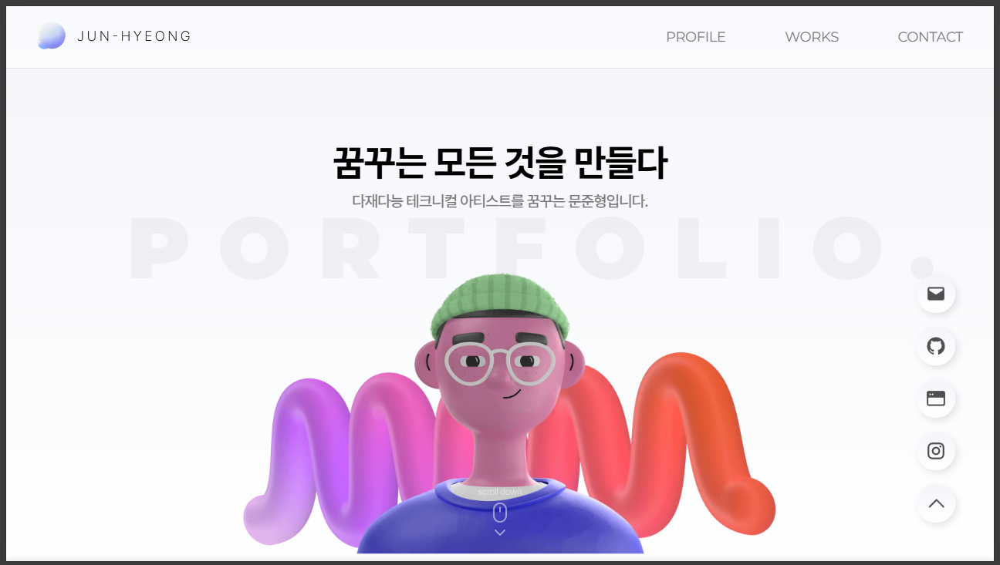
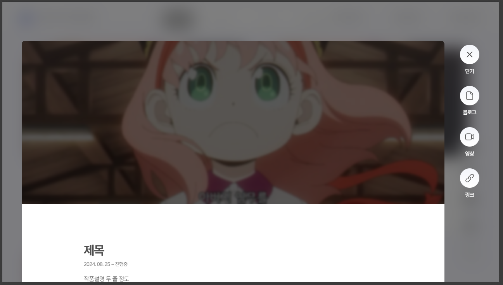


### 1279px ~ 768px

768px 기준으로 작업을 진행합니다.  
기존 해상도에서 1200px에 좌우 40px씩 padding을 넣었던것처럼 960px 기준에서 좌우는 40px 여백 동일하게 유지합니다.

```css
@media screen and (min-width:768px) and (max-width:1279px) {
}
```

#### Layout - GNB
우선, GNB의 좌우 여백 및 로고와 전체 폰트 크기를 조절해주었습니다.  
너무 작아지면 클릭이 어려워질 수 있기에, 가독성을 고려한 크기로 조절하였습니다.

#### Main Page
이미지의 `objectFit, objectPosition` 를 조절해 바닥에 붙어있을 수 있게 조절하였으며,  
배경 Portfolio 텍스트의 크기를 줄였습니다.

#### Profile Page
폰트 사이즈에는 문제가 없으나, 줄 넘김이 살짝 어색한 부분이 있었습니다.  
다만 이 부분은 디바이스 상에서 어쩔 수 없다고 판단하는 부분이라, 유지한채 좌우 innerPadding과 내용 그리드 Gap만 조절해 가독성 관련 수정을 진행하였습니다.

#### Works Page
이부분 역시 좌우 여백을 설정해주었습니다.  
추가적으로 기존 사이즈인 `height: 480px; / height: 58%`는 너무 커보이는 문제가 있어, `height: 360px / height: 46%`로 작업 블럭 및 썸네일 크기를 조절하였습니다.

태그 버튼이 너무 커보이는 것 같아, 폰트 사이즈 및 여백을 조절해 버튼 크기를 조금 줄였습니다.

블럭 여백은 적절해서 수정하지 않았으며, 안쪽 내용의 여백이 문제가 있어 전체적으로 폰트 크기를 조절하고, 태그 블럭의 크기와 폰트사이즈도 대폭 축소하였습니다.

#### Contact Page
해당 부분은 문제가 없어 수정을 진행하지 않았습니다.

#### Modal Page
기존에는 전체적으로 여백이 커보이는 상황에서, 화면 해상도가 작아졌을때 역시 여백이 많아지면 가독성이 떨어지는 문제가 있어 좌우 Padding 영역을 기존 `10em`에서 `6em`으로 축소하였습니다.  
상단 여백도 축소하였으며, 우측 FAB와의 간격 기존 `40px`에서 `25px`정도로 조절하였습니다.


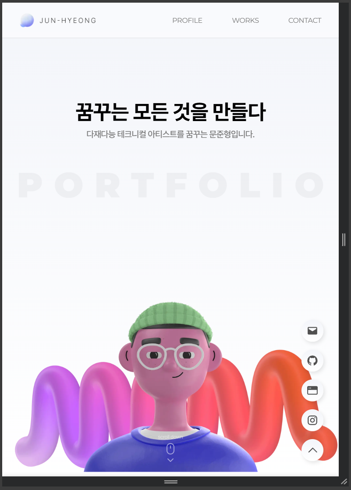 | 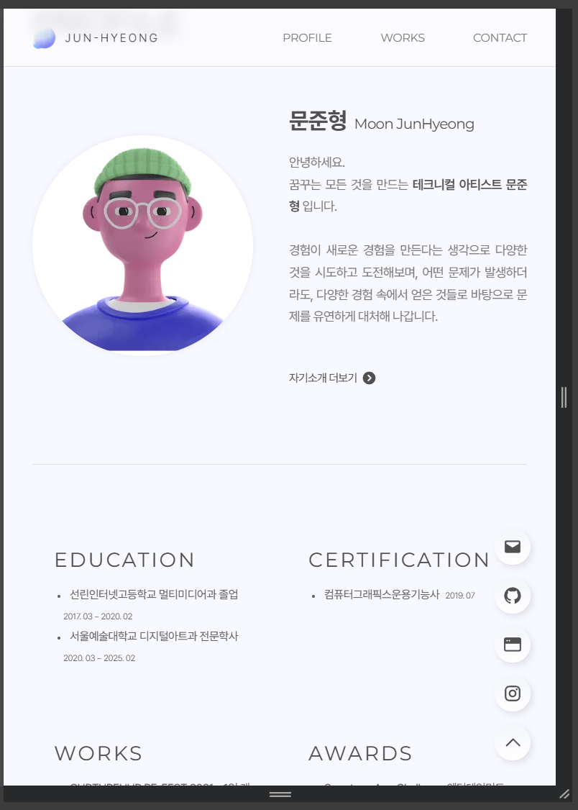
--- | --- |
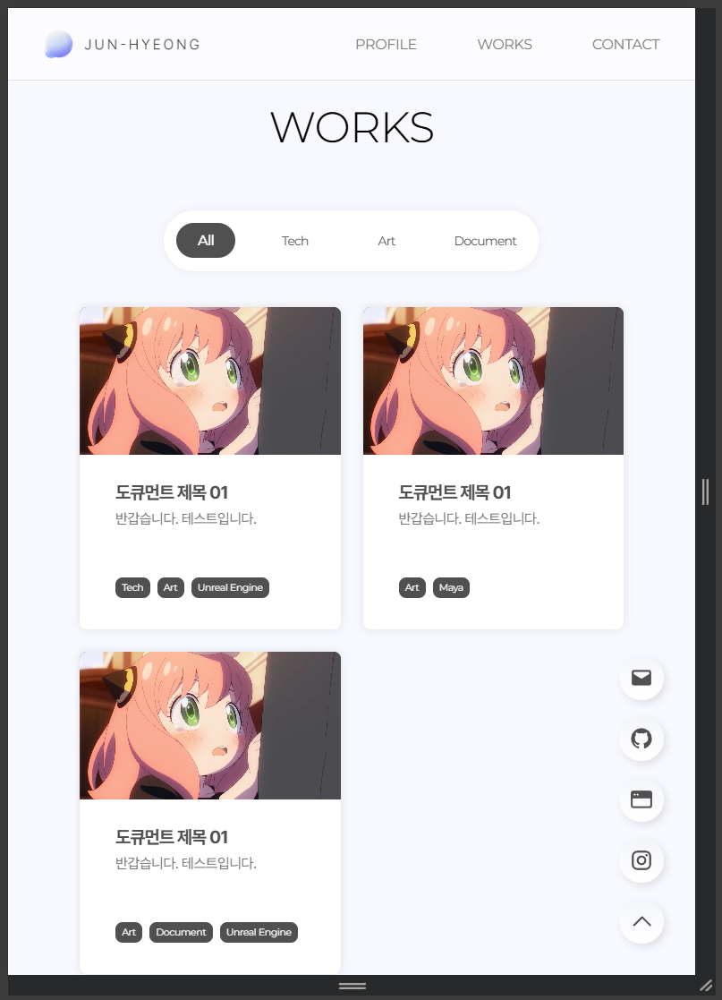 | 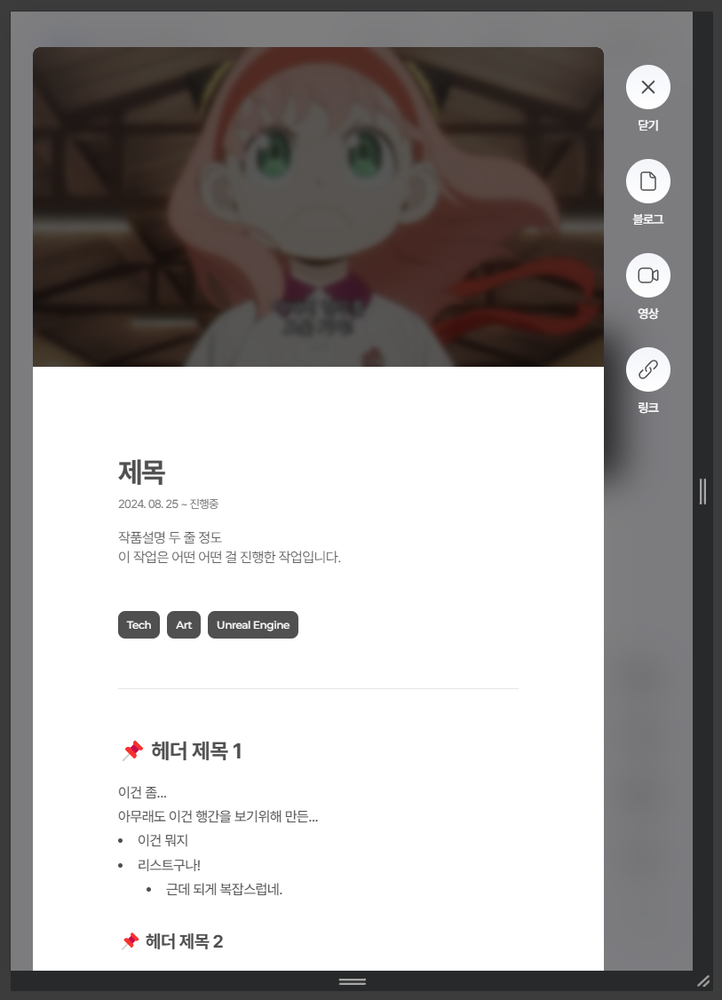


### 767px ~ 480px

480px 모바일 해상도 대응 작업으로 진행합니다.  
이 해상도부터 레이아웃을 변경합니다.

기존 좌우 2블럭으로 배열되었던 아이템들은 세로 1블럭씩 배열하는 레이아웃 등 전체적으로 수정을 진행합니다.

위에서 진행했던 것처럼 약 560px에 좌우 20px 패딩을 기준으로 작업 진행합니다.

적용한 후, 360px 기준 해상도에서 부족한 부분들은 추가로 제작하려고 하며, 문제없이 작동되는 부분들은 여기서 마무리하는 것으로 구상했습니다.

```css
@media screen and (max-width:767px) { 
} 
```

#### Layout - GNB
기존 코드대로 축소하면 GNB가 넘어가 깨지는 문제가 발생합니다.  
전체적인 폰트 크기 조절, 여백 조절 등을 진행하여 모바일기기에 대응하였습니다.  
높이도 기존 `80px`에서 `60px`로 줄인 후, 기존 링크들에 설정되어있던 스크롤마진도 조절해주었습니다.

#### Main Page
이미지의 경우 상단에서 조절이 완료되어, 텍스트 조절만 진행하였습니다.

#### Profile Page
기존 가로로 나열되어있던 프로필 이미지 - 자기소개 부분을 위 아래 세로로 정렬하였으며,  
학력 - 수상경력등 세부 내용들도 2x2 블럭에서 세로로 1x4 구조로 정리하였습니다.  
전체적인 여백도 조절했습니다.

#### Works Page
아이템들을 세로로 정렬한 후, 좌우 여백을 조금 좁게 설정하였습니다.  
블럭 내용은 기존과 동일하나, 텍스트의 여백을 조금 더 줄였습니다.

#### Contact Page
해당 부분은 수정없이 잘 보여지는 부분이기에, 상단 스크롤마진만 조절하는 것으로 마무리하였습니다.  
-> 스크롤 마진이 굳이 필요 없는 것 같아 `height: 100dvh;` 만 사용합니다.

#### Modal Page
가장 많은 수정이 필요합니다.  
일단 기존 FAB를 메인페이지 FAB처럼 우측하단에 배치시키는 것으로 변경하였으며, 작업을 진행하면서, 닫기 버튼의 가독성이 떨어져, 기존 Modal창 css까지 수정해서 닫기버튼의 색을 변경하였습니다.  
이 레이아웃부터 뒷 배경 블러가 사라지고 전체페이지 모드로 작동합니다.  
내용 패딩은 `3.25em`으로 줄였으며, 하단 이미지도 세로 정렬로 변경하였습니다.

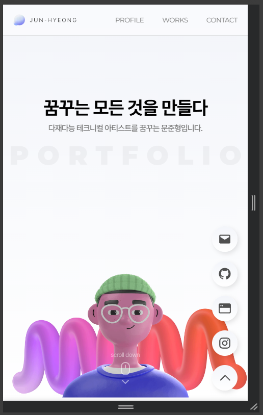 | 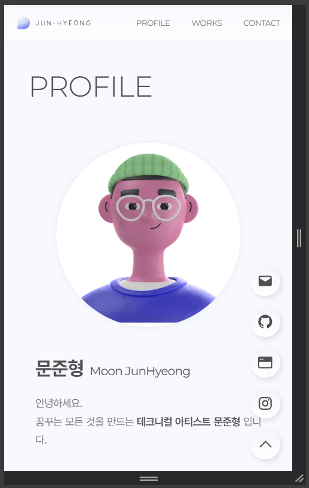
--- | --- |
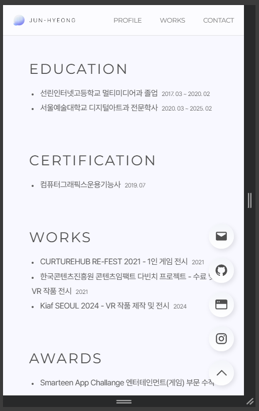 | 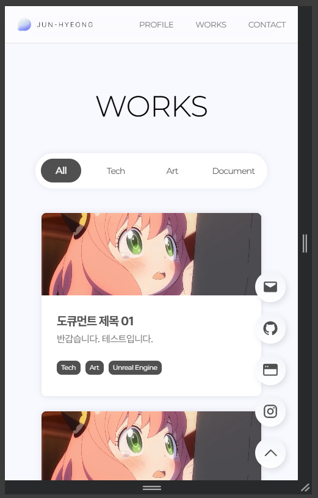
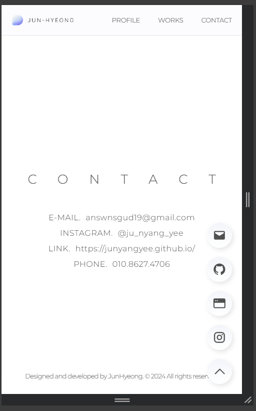 | 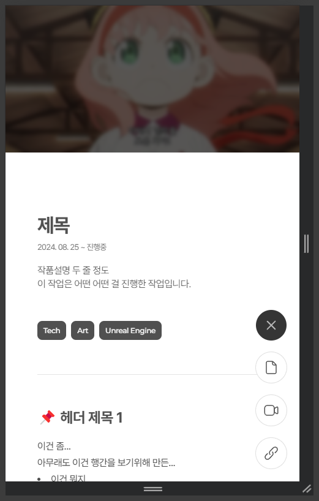


### 479px ~

위에 작업까지 진행한 후, 부족한 부분들을 최소 360px까지 대응하게 하려합니다.  
이 이하는 현재 기기의 보급도 적을뿐더러, 더 작더라도 스케일링이 되는 것으로 알고있기에 최소 마지노선으로 잡았습니다.

```css
@media screen and (max-width:479px) { 
} 
```

#### Layout - GNB
360px까지 가면 로고와 버튼이 부딫히는 문제가 발생했습니다.  
아직 휴대폰에서 터치 테스트를 진행하지 않아서, 일단 사이즈를 줄이는 것으로 작업했습니다.

#### Main Page
타이틀 텍스트가 줄바꿈이 되어 폰트 사이즈를 살짝 줄였습니다.

#### Profile Page
이름이 줄바꿈이 되어 폰트 사이즈를 살짝 줄였습니다.

#### Works Page
태그 선택창이 화면 밖으로 넘어갔습니다.  
또한 썸네일이 조금 작아보이는 것 같아 옆으로 확장시켜주었습니다.

#### Contact Page
텍스트가 넘어가는 현상이 있어 폰트 사이즈를 살짝 줄였습니다.

#### Modal Page
별다른 문제가 없어서 넘어갑니다.


---

## 추후 작업

추후 작업은 세부 내용들을 설정하는 내용일 것 같습니다.  
현재 모달창 내부 텍스트 CSS가 제대로 설정되지 않았기에, 해당 부분은 추후 내용 작성을 진행하면서 수정하도록 하겠습니다.


---

## 포트폴리오 작업 완료

이로써 전체적인 포트폴리오 페이지 작업은 완료되었습니다.  
추후 작업물을 업로드하고, 작업을 진행하면서 문제가 생기는 부분들을 파악 후 수정하는, 유지 보수만 잘 진행하면 될 듯 싶습니다.

***아래는 최종 링크입니다.***  
**[😀최종 포트폴리오 링크](https://junyangyee.vercel.app/)**


---


```toc
```