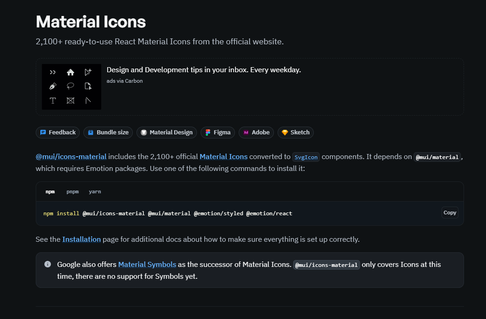
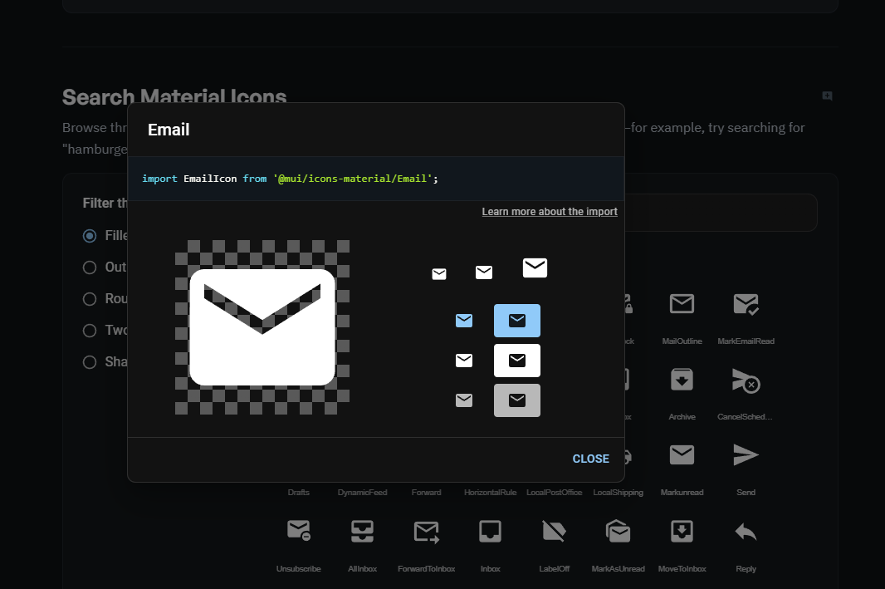
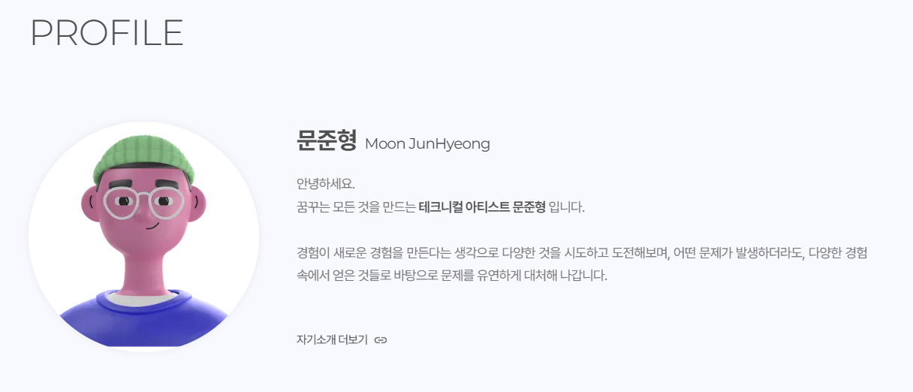
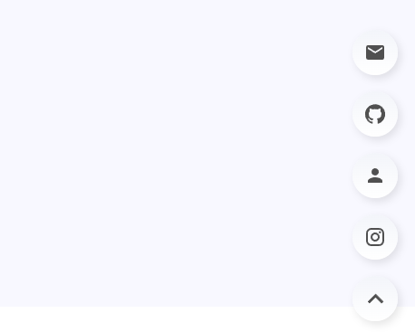
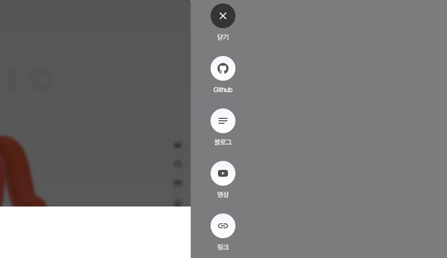

> 기존 svg 파일을 통해 관리하던 아이콘들을  
> mui를 통해 조금 더 수월하게 수정/관리 할 수 있도록 변경합니다.

---

## mui

기존 사용하던 아이콘들은 직접 svg 파일을 이용하여 사용했습니다.  
다만 그 부분에서 아이콘들이 통일되지 않은 느낌도 있었고, 색상 전환이 필요한 경우와 크기 조절이 필요한 경우에 귀찮게 된다는 단점이 있었습니다.

그러던 중, 블로그 디자인을 수정하다가 블로그 템플릿에 사용된 mui를 발견했습니다.  
mui는 구글의 머티리얼 디자인을 기반으로 한 리액트 UI 컴포넌트 라이브러리로, 일관된 디자인과 사용성을 보장한다고 합니다. [(정보 사이트)](https://f-lab.kr/insight/starting-frontend-development-with-nextjs-and-mui)  
특히 아이콘에서 [이렇게 찾을 수 있게 정리 된 도큐멘트](https://mui.com/material-ui/material-icons/)가 있어서 꽤나 유용하게 쓸 수 있을 것 같습니다.

아이콘 이외에도 다양한 부분들이 템플릿처럼 라이브러리화되어있어 조금 살펴보니, 아이콘 이외에도 툴팁, 슬라이더등 수많은 부분에 대한 내용들이 담겨있었습니다.  
사용도 꽤 간편하고, 디자인도 깔끔하고, 문서화도 잘되어있어서인지 이렇게 라이브러리를 많이 사용하는 것 같습니다.

그럼 얼른 써봐야겠죠.  
일단 저는 아이콘에만 사용해보도록 하겠습니다.

---

## mui 설치

공식 문서에서 icons 사용에 대한 설치 방법부터 사용법까지 안내해주고 있습니다.  
해당 내용을 바탕으로 설치를 진행했습니다.  

```git
npm install @mui/icons-material @mui/material @emotion/styled @emotion/react
```



---

## 아이콘 수정

[공식 문서](https://mui.com/material-ui/material-icons/) 에서 사용할 아이콘을 찾으면 아래 이미지와 같이 `import` 코드가 함께 보여집니다.  
해당 코드를 복붙하여 사용해주겠습니다.

*FAB 메일 아이콘 수정을 바탕으로 작성합니다.*



해당 코드를 `floatingBUtton.js` 컴포넌트 최상단에 작성해주겠습니다.

```jsx
// src/components/floatingButton/floatingButton.js

import EmailIcon from '@mui/icons-material/Email';

export default function FloatingButton() { ...
}
```

기존 이미지를 이용해서 작성하던 부분을 임포트한 `<EmailIcon />`을 활용하는 것으로 바꾸겠습니다.  
아이콘 스타일의 경우 `font-size`와 `color` 기반으로 수정이 가능하여, 모듈 css에서 수정할 수 있도록 스타일 클래스를 지정해주었습니다. `font-size`의 경우 인라인으로 설정하였습니다.  
추가로 label까지 작성하였습니다.

```jsx
// src/components/floatingButton/floatingButton.js

import EmailIcon from '@mui/icons-material/Email';

// before
<Image src={"/icons/Mail.svg"} width={26} height={26} alt="Mail" title="Mail"/>

// after
<EmailIcon className={styles.icon} label="Mail" fontSzie="medium"/>

```
```css
/* src/components/floatingButton/floating.module.css */

.icon {
    color: #505050;
}
```

이와 같은 방식으로 수정을 진행합니다.  
FAB, modalFAB, 프로필 "자기소개 더보기" 아이콘 모두 수정을 진행하였습니다.

아래는 수정 완료된 모습입니다.







---

## 여담

사용하기 간편하고 좋은 아이콘들이 있어서, 추후 아이콘 수정이 필요하거나 새로운 것을 만들어야할 때, 기존처럼 svg 파일을 생성하는 수고 없이 간편하게 할 수 있어서 좋은 것 같습니다.  

---

```toc
```