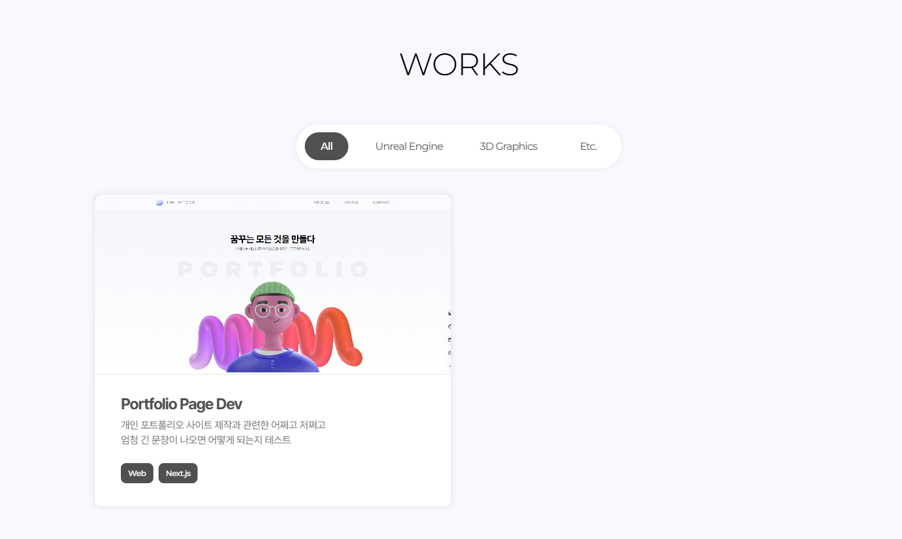

> 포트폴리오 작업물 분류 태그를 수정합니다.  
> 기존에 작업물들을 분류하기 애매했던 부분을 조금 더 **명확히** 수정했습니다.

---

## 기존 분류

기존에는 "Tech - Art - Documents" 로 나누어져있는 상황이었습니다.
허나 취업을 메인으로 생각했을 때, 분류를 "게임과 다른 분야" 로 나누는 것이 맞다고 생각합니다.

다만, 작업물들이 전체적으로 게임 쪽이 아닌 미디어아트와 같은 분야.
혹은 그냥 게임 엔진을 사용한 분야이기에 분류하기 애매했습니다.

게임으로 분야를 한정한다면, 20년 1인 개발 게임이 가장 마지막이기에 약간 애매한 상황입니다.
개인 작업물들, 토이 프로젝트(라고 할 것도 없는 진짜 연습한 것들...)을 넣는다고 해도 분량이 애매합니다.

---

## 분류 변경

상기한 이유로 작업물 분류를 다음과 같이 재설정합니다.

- **ALL**
- **Unreal Engine**
- **3D Graphics**
- **ETC**

기존과 사실 상 크게 다른 점은 없습니다.
작업물들의 특성상 기존 Tech 분류를 Unreal engine으로 분야를 한정하였으며, Art 분야를 3D Graphics로 한정하였습니다.
기존 Document 분류에는 문서화 관련 작업을 정리해두려 했으나, 굳이 문서화 작업이 필요없고 오히려 웹 개발이나 터치디자이너와 같이 메인 분야와는 관련없는 작업들을 정리해 둘 곳이 필요하여 위와 같은 분류로 재설정하였습니다.

그와 함께 기존 보이던 태그 선택 버튼과 태그 아이콘들의 디자인이 어색한 느낌이 있어, 전체적인 디자인 역시 수정하였습니다.

### 코드 수정

```jsx
// src/app/works/works.js

...
'use client'
import { useState } from 'react';
import styles from "./works.module.css";
import WorkItem from "@/components/workItem/workItem";
import workData from "./works.json";

export default function Works() {
    const [now, changeTag] = useState("all");

    function dataDraw(workData, now) {
        return (
            workData.works.map((work) => 
                <WorkItem 
                    key={work.index}
                    info={work}
                    now={now}
                />
            )
        )
    }

    return (
        <section id="works" className={styles.works}>
            <div className={styles.innerPadding}>

                <h1 className={styles.title}>WORKS</h1>

                <div className={styles.tagSelect}>
                    <div onClick={() => changeTag("all")}
                        className={`${styles.button} ${now === "all" ? styles.active : styles.none}`} 
                        name="all">
                        All
                    </div>
                    <div onClick={() => changeTag("Unreal")} 
                        className={`${styles.button} ${now === "Unreal" ? styles.active : styles.none}`} 
                        name="unreal">
                        Unreal Engine
                    </div>
                    <div onClick={() => changeTag("3D")} 
                        className={`${styles.button} ${now === "3D" ? styles.active : styles.none}`} 
                        name="3D">
                        3D Graphics
                    </div>
                    <div onClick={() => changeTag("etc")} 
                        className={`${styles.button} ${now === "etc" ? styles.active : styles.none}`} 
                        name="etc">
                        Etc.
                    </div>
                </div>

                <section className={styles.workList}>
                    {dataDraw(workData, now)}
                </section>

            </div>
        </section>
    )
}
```



---

```toc
```