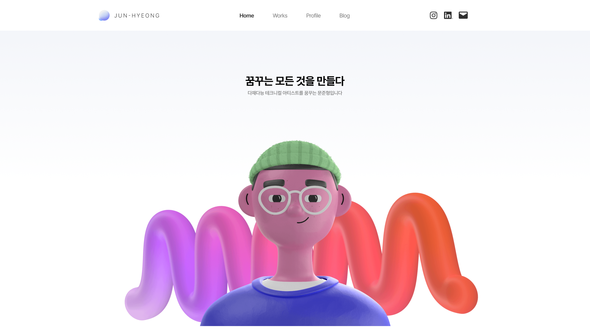

> **포트폴리오 작업 시작**
> 
> 그동안 머릿속으로만 생각하던 포트폴리오를  
> 직접 만들기 위한 첫 걸음입니다.

---

## 포트폴리오 형태

포트폴리오를 **홈페이지 형태**로 제작할 예정입니다.  
홈페이지 링크를 통해 다양한 사람들에게 간편하게 제 포트폴리오를 공유할 수 있기에 이런 형태로 정했습니다.


---

## 홈페이지 제작

홈페이지를 제작할 수 있는 방법은 매우 다양하게 있습니다.  
그 중 제가 선택을 고민했던 다양한 방법들을 소개합니다.


### Notion Page (노션 페이지)

가장 먼저 떠오른 형식이 노션페이지입니다.  
많은 사람들이 사용하고, 가장 편리한 방법이라고 생각합니다.

온라인 상에서 바로바로 수정이 가능하고,  
이미 익숙한 툴이고 간편하기에 가장 빠르게 만들 수 있다는 장점이 있습니다.

다만 커스텀시킬 수 있는 부분이 적다는 것이 단점입니다.  
특히 레이아웃 변경이 자유롭지 않은 것이 많이 아쉽습니다.

제가 원하는 디자인을 구성할 수 없다는 점 때문에 노션페이지는 선택하지 않았습니다.


### Cargo / Wix 등 다양한 포트폴리오 제작 사이트

다양한 템플릿과 함께 포트폴리오 홈페이지를 제작할 수 있는 사이트입니다.

다양한 템플릿을 바탕으로 노션페이지보다는 조금 더 자유롭게 수정할 수 있다는 장점이 있지만,  
대부분의 사이트들은 유료결제를 해야 레이아웃 등 수정이 가능하며,  
무료플랜의 경우 일정 페이지 이상 넘어가면 용량 초과가 일어나는 경우도 있었습니다.

유료플랜의 경우 블로그는 몰라도,  
포트폴리오 홈페이지의 경우, 업데이트 주기가 짧기에 금액적인 부담이 커진다는 단점이 있어 선택하지 않았습니다.


### Next.js

예전에 Gatsby를 활용한 개인 블로그를 제작한 적 있습니다.  
물론 템플릿을 활용한 블로그였지만, 거의 모든부분을 직접 조절할 수 있다는 점이 장점이었습니다.

단점이라면, 역시 HTML/CSS를 제외한 웹 개발 경험이 없기에  
홈페이지를 배우면서 제작해나가야 한다는 점 때문에 홈페이지 제작이 오래걸린다는 부분일 것 같습니다.

그치만, 현재 궁극적으로 모든 부분을 직접 디자인하고 만들면서 업데이트 해가는 것이 목표이기에,  
가장 많이 사용하는 **Next.js**를 사용하는 방법을 선택하였습니다.


#### 왜 Next.js인지
인터넷을 찾아보면 Next.js 이외에도 Hugo, Gatsby, Jekyll 등 다양한 가 존재합니다.  
특히 Gatsby는 예전에 사용했던 방식이기에 더 끌리기도 합니다.

Next.js 와 Gatsby는 둘다 React 기반이기에 큰 차이가 없어 기존에 사용하던 Gatsby를 사용하려고 했지만,  
현재 웹 개발 부분에서 Next.js를 가장 많이 사용한다는 점과  
기존에는 템플릿을 사용했지만 지금은 템플릿 사용없이 처음부터 제작하려고 한다는 점.   

이러한 부분때문에 Next.js를 선택했습니다.  
물론 Gatsby의 장점(정적웹의 장점)이 계속 생각나긴하지만, 그건 추후에 생각해보도록 하겠습니다.


---


## 내용 구성

현재 테스트로 구성한 페이지 이미지입니다.
해당 이미지는 작업이 진행되면서 변경될 예정입니다.



### Home (홈)

가장 메인 화면에는 **"나를 소개하는 한마디"** 와 함께 
작업했던 작품들 중 몇개를 골라 썸네일이 슬라이드 형식으로 지나가게 만들어볼 생각입니다.

### Profile (프로필)

프로필을 볼 수 있는 공간을 제작합니다.
**"한 눈에 볼 수 있는 자기소개서"** 로 보이는 것이 목표입니다.

하나의 포트폴리오 페이지와 같은 디자인을 통해
개인 프로필 사진과 함께, 경력 - 자격증 - 기술 등을 작성하고, 추가로 MBTI 등 다양한 정보를 작성해볼 예정입니다.

### Works (작업)

그동안의 작업물을 볼 수 있는 페이지입니다.
**"어떤 기준으로 구분이 되었는지 확실히 알 수 있는 작업 페이지"** 가 목표입니다.
작품들을 특정 카테고리로 구분할 예정이나, 정확히 어떠한 카테고리로 나눌지는 고민 중입니다.
혹은 작품의 설명 태그를 통해 정리하는 것도 방법일 것 같습니다.


---

```toc
```