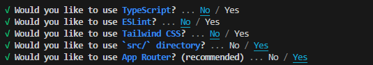
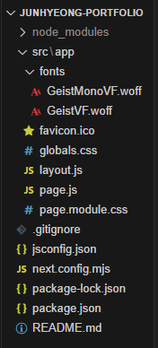
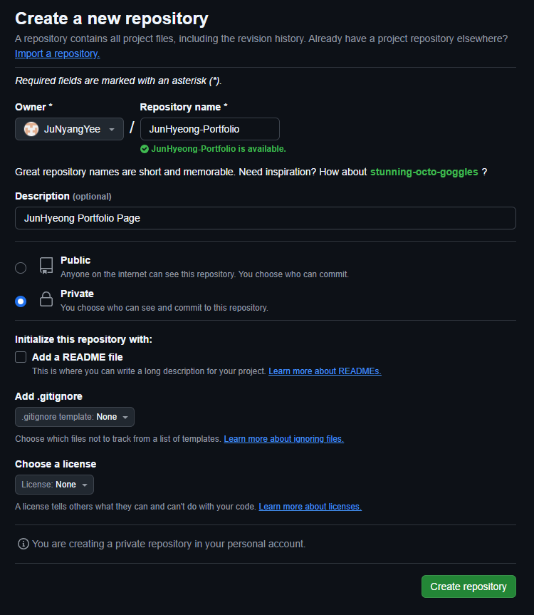
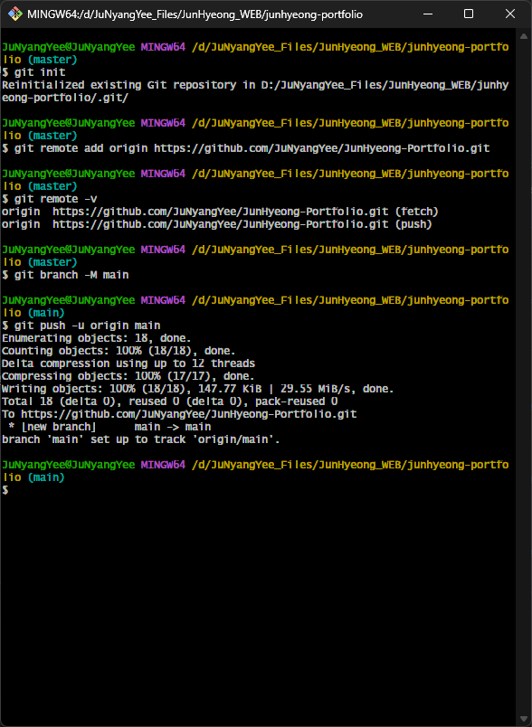
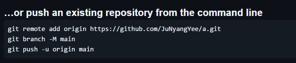
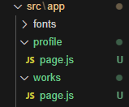
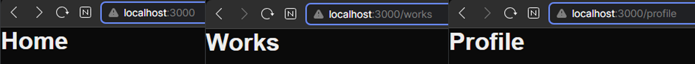
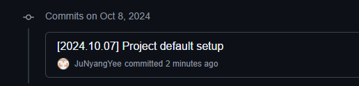

> **포트폴리오 작업 시작**
> 
> 그동안 머릿속으로만 생각하던 포트폴리오를  
> 직접 만들기 위한 첫 걸음입니다.

---

## Next.js 설치

Next.js 는 가장 최신 버전 (@14.2.14)으로 설치하며  
**`junhyeong-portfolio`** 이름의 프로젝트를 생성합니다.

``` sh
npx create-next-app@latest junhyeong-portfolio
```

그와 함께 세부 세팅을 설정했습니다.

- use TypeScript : **No**
	- 타입스크립트는 사용하지 않습니다.  
	- 자료형 관리측면에선 편할 수 있지만, 타입스크립트까지 배우면서 하기에는 너무 복잡할 것 같습니다.

- use ESLint : **No**
	- 자바스크립트 에러 관련 도구인 걸로 알고있습니다.
	- 굳이 필요하지 않을 것 같기에 사용하지 않습니다.

- use TailwindCSS : **No**
	- 태일윈드css는 사용하지 않습니다.
	- 편리함은 이해하나, 모든 것을 배우면서 진행해야하는 상황에서는 코드가 깔끔하게 보이는 것이 더 중요할 것 같습니다.

- use 'src/' directory : **Yes**
	- src 폴더는 사용합니다.
	- 폴더정리가 깔끔한게 작업하기 좋기도 하고, 추후 라우팅에서 편리하지 않을까 싶어서 사용합니다.

- use App Router : **Yes**
	- 앱 라우터는 사용합니다.
	- recommended인 것도 있지만, 앱 라우터를 사용해야 편리하게 라우팅이 되기에 사용합니다.





---

## Github 연동

> [Gitub 링크 - Private Repo입니다.](https://github.com/JuNyangYee/JunHyeong-Portfolio)

Git - Github 역시 익숙하게 사용하는 편은 아닌지라 차근차근 진행해 보았습니다.

Github에서 새로운 리포지토리를 만들었습니다.  
그리고 페이지에서 나오는 설명대로 git bash에 작성하여 폴더를 Push 해주었습니다.



```git
// git 초기화
$ git init

// Repo 연결
$ git remote add origin https://github.com/JuNyangYee/JunHyeong-Portfolio.git

// main Branch 생성
$ git branch -M main

// 폴더 push
$ git push -u origin main
```



### 오류 발생 및 해결

- **오류**  
	인터넷을 보고 따라하던 중 `$ git pull origin master` 이라는 부분이 있었습니다.  
	해당 명령어를 실행하니 `couldn't find remote ref master` 라는 오류가 떴었습니다.  
	`$ git pull origin main` 으로 해도 여전히 같았습니다.
  
- **해결**  
	Github 저장소를 생성하면서 `.gitignore` 생성을 안해 내부에 아무런 파일이 없는 상황이었습니다.  
	즉, **master 혹은 main branch가 생성되지 않은 상황**이었습니다.  
	인터넷을 따라하기보다는 Github **첫 페이지에 나오는 내용을 따라하는 것**이 훨씬 좋은 방법이었습니다.




---

## 구조 이해

전체 프로젝트 파일의 구조를 이해해보려합니다.  
이해를 하고 진행해야 추후 필요한 내용이 생길 때 수정이 원활할 것 같습니다.

아래 유튜브 영상을 참고하여 구조를 이해하였습니다.  
(버전이 13으로 다르지만, 전체적인 구조 이해 및 문법 사용은 이해에 도움되는 내용이 많아 참고하였습니다.)  
[코딩애플 : Next.js 13 강의 달린다 (1강~6강)](https://www.youtube.com/watch?v=PCkiz2GUFg8)

- **/node_modules**  
	해당 폴더는 현재 설치한 프로젝트에서 사용하는 라이브러리들이 보관된 폴더입니다.
	기본 폴더이므로 만질 일은 크게 없습니다.

- **/src/app**  
	메인으로 코드를 작성하는 폴더입니다.  
	주로 해당 폴더 내에서 작업이 진행됩니다.
	  
	-  **/fonts**  
		웹폰트가 담긴 폴더입니다.  
		이 곳에 `.woff` 형식의 폰트를 넣어 사용하는 것 같습니다.
	
	- **globals.css**  
		해당 폴더 전역에서 기본이 되는 css입니다.
	
	- **layout.js**  
		page.js 파일을 감싸는, 레이아웃이 되는 자바스크립트 파일입니다.   
		페이지가 넘어가도 변하지 않는 부분들에 사용됩니다. ex) GNB
	
	- **page.js**  
		메인으로 작성하는 파일입니다.  
		해당 파일에 작성된 내용이 페이지의 내용입니다.
	
	-  **page.module.css**  
		`globals.css`를 덮어서 해당 css가 있는 page에만 특정하여 적용되는 css입니다.
	
	-  **/folder name**  
		이 폴더에 새로운 폴더를 추가하면 폴더명으로 자동으로 라우팅됩니다.  
		즉, `/about` 폴더를 만들고 내부에 `page.js`등 페이지 설정을 해주면 
		`url/about` 링크로 자동 라우팅됩니다.

- **package.json**  
	설치한 라이브러리의 내용들이 자동으로 기록되어있습니다.  
	그와 함께 터미널에서 쓸 수 있는 명령어도 작성되어있습니다.
	건드릴 일은 딱히 없습니다.


---

## 기초 파일 세팅

실시간으로 테스트를 하기 위하여 로컬호스트창을 띄우고 진행하겠습니다.

```sh
npm run dev

// http://localhost:3000
```

### 파일 초기화

> 기존에 있던 `globals.css` / `page.module.css` 파일은 백업해두었습니다.  
> 추후 해당 css 파일에서 사용할 부분이 있으면 긁어오기 위함입니다.

기존 `page.js`에 작성되어있던 내용들 중 수정할 부분을 모두 지우겠습니다.  
그와 함께 `page.module.css` 파일을 삭제합니다.

``` jsx
// app/page.js

export default function Home() {
	return (
		<div>
		</div>
	);
}
```

### 라우팅 셋업

기존 계획했던대로 페이지를 생성하려합니다.  
Home(홈)은 굳이 라우팅이 필요없는 메인화면이니
- Works(작업)
- Profile(프로필)

이 두개의 폴더를 생성하고 `page.js` 파일을 생성해주겠습니다.  
그리고 함수명을 페이지명과 같게 설정합니다.
`Profile()` / `Works()`



```jsx
// app/profile/page.js

export default function Profile() {
	return (
		<div>
		</div>
	);
}

// app/works/page.js

export default function Works() {
	return (
		<div>
		</div>
	);
}
```

페이지 구분을 위해 페이지 이름을 헤더로 하나 띄워두겠습니다.

```jsx
// app/page.js
.
.
return(
	<div>
		<h1> Home </h1>
		<!-- <h1> Works </h1> -->
		<!-- <h1> Profile </h1> -->
	</div>
)
```



### metadata 및 html lang 설정

metadata의 경우 `layout.js` 의 `const metadata ={}` 부분에 작성할 수 있습니다.  
아래 내용으로 변경해주었습니다.
- title : 주냥이 포트폴리오
- description : 문준형의 포트폴리오 페이지입니다.

```jsx
// app/layout.js

...
export const metadata = {
	title: "주냥이 포트폴리오",
	description: "문준형의 포트폴리오 페이지입니다.",
};
```

html lang의 경우도 `layout.js`의 `RootLayout({})` 부분에서 수정이 가능합니다.  
한글 기반 페이지이기에 kr로 바꾸겠습니다.

```jsx
// app/layout.js

...
return(
	<html lang="kr">
	...
	</html>
)
```


---

## Github 저장

vscode의 git 자동툴을 사용해도 좋지만,
git bash 사용에 익숙해지고자 초반에는 git bash를 사용하겠습니다.

```git
$ git add .

$ git commit -m "[2024.10.07] Project Default setup"

$ git push origin main
```



### 오류 발생 및 해결

- **오류**  
	`$ git add .` 을 실행하니  
    `warning: in the working copy of 'src/app/layout.js', LF will be replaced by CRLF the next time Git touches it`   
    오류가 발생했습니다.  
	인터넷을 찾아보니 다음과 같은 문제라고합니다.
	
	*유닉스 시스템에서는 한 줄의 끝이 **LF(Line Feed)** 로 이루어지는 반면, 윈도우에서는 줄 하나가 **CR(Carriage Return)** 와 **LF(Line Feed)**   
	즉, **CRLF** 로 이루어지기 때문이다. 따라서 어느 한 쪽을 선택할지 Git에게 혼란이 온 것이다.*


- **해결**  
	간단히 해결이 가능하다.  
	Git에서 지원하는 자동변환기능 `core.autocrlf` 기능을 켜주면 된다고 한다.  
	`$ git config --global core.autocrlf true`


---

## Todo

> 추후 작업할 내용입니다.  
> 순서대로 작성한 것이 아니며,  
> 확정이 아니기에 추후 작업하면서 변경될 수 있습니다.

- **css 수정**
	- 폰트 : Pretendard 기본

- **라이트 모드 기본으로 변경하기**

- **메인페이지 디자인하기**
	- GNB부터 제작하기
	- 기존 figma 프로젝트 수정
	- 디자인 한 내용 css 변환


---

```toc
```