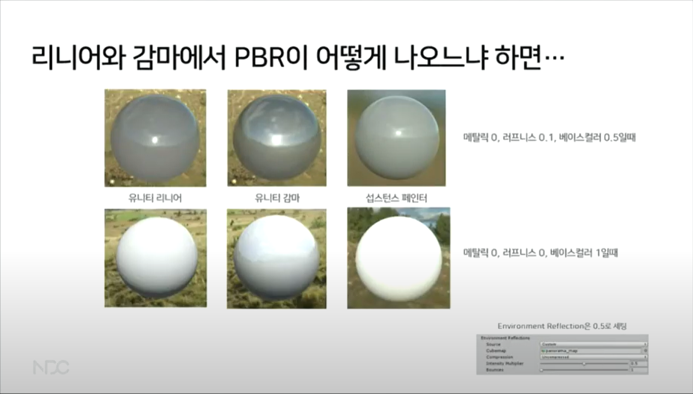
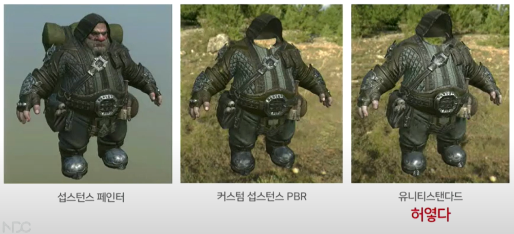

**모바일에서 사용 가능한 유니티 커스텀 섭스턴스 PBR 쉐이더 만들기**  
> NDC 2019 발표를 보면서 단순 정리한 내용입니다.  
> 노션에 작성했던 내용을 블로그로 옮겨 작성해, 가독성에 문제가 있을 수 있습니다.
>  
> *※주의 : 본 내용은 아주 기술적인 이야기는 아니며, 기술보다는 꼼수를 이용한 문제해결 이야기입니다.*

<div style="position: relative; width: 100%; padding-bottom: 56.25%">
<iframe width="560" height="315" src="https://www.youtube.com/embed/hC62O9NGXEw?si=-eYCun2EHZMbX3gR" title="YouTube video player" frameborder="0" allow="accelerometer; autoplay; clipboard-write; encrypted-media; gyroscope; picture-in-picture; web-share" referrerpolicy="strict-origin-when-cross-origin" allowfullscreen style="position: absolute; width:100%; height: 100%;"></iframe>
</div>

*[▶ NDC Replay - 발표 자료 링크](http://ndcreplay.nexon.com/NDC2019/sessions/NDC2019_0006.html#k%5B%5D=pbr)*

---

### 유니티 PBR

- **리니어 스페이스와 감마 스페이스**
    - 사실 리니어 스페이스가 맞는 값
    - 하지만 어두운 곳에 민감한 사람 눈은 이것을 선형적으로 인지하지 않는다.
    - 이것을 감마 코렉션 (2.2제곱)하여 선형적으로 보이게끔 한 것
    - Unity ColorSpace Default Setting : **Gamma**



  

- **유니티와 섭페를 비교해보며 알 수 있었던 것**
    - 유니티 감마는 물론이고 리니어도 섭스턴스 페인터와 동일하지 않다.
    - 결과값이 다르게 나오는 걸 보면 서로서로 구현도 다르다는 것을 알 수 있다.
        - 즉, 물리기반 쉐이더가 사실은 물리적으로 완벽하게 옳은 것은 아니라는 것,
        - Physically **“Based”** Shader
    - 물리적인 이론과 라이트모델을 고려했을 뿐, 사실은 근사값 대잔치.
        - 근사값 : 정확한 건 아니지만 대충 이정도로 하니까 비슷해보이는데?

- **PBR은 리니어에서 하는게 상식이다. 그러나…**
    - 감마 상태로 아주 오래 이어져 와서 리소스가 너무 많이 쌓여 컬러 스페이스를 바꾸는 것이 부담스럽거나
    - 이미 출시가 된 상태 (라이브 중)라 컬러 스페이스를 바꿀 수 없거나
    - 컬러 스페이스를 어떻게 바꾸는지 모르거나
    - 중도 입사했는데 이미 감마상태거나
    - 등등등 "**리니어로 바꾸세요**"가 안되는 상황


- **감마에서 PBR로 퀄리티를 올리기란…**
    - Standard 는 수많은 include로 인해 코드보기 및 변경이 힘듦
    - 수정하려면 GI 함수를 건드려야하는데 난이도가 높음
    - 또한 아티스트가 의도한 대로 아웃풋 표현이 잘 안되니 어려움
    - 그래서 Standard PBR은 과감히 포기하고 **’수동으로라도 PBR 비슷하게 느낌을 내보면 어떨까’**

- **PBR에서 3D 아티스트는 섭스턴스 사용**
    - 섭스턴스에 Specular / Glossiness 워크플로우가 있긴 하다.
    - 하지만 **Roughness / Metallic 워크플로우가 표준이자 대세**. 모두 이것으로 작업.

- **섭스턴스에서 값을 바꿔가며 변화를 체크해보니…**
    - *Albedo / Roughness / Metallic* 값 변화에 따라 변하는 값이 생각보다 몇 개 없다.
        - *Specular*
        - *Cubemap*
        - *Fresnel*

- **나는 아티스트니까 눈을 믿자**
    - 어차피 PBR도 진짜 물리적으로 계산하는 것도 아닌데 (근사값)
    - *Albedo*는 `float3`니까 Luminance를 구하여 `float`로 치환하면  
        *Albedo / Metallic / Roughness*를 보간의 3항으로 사용 가능  
        ```hlsl
        ex) Specular = NdotH * lerp(0.5, 2, Luminance(Albedo));
        ex) Fresnel = (1-NdotV) * lerp(1, 0.2, Roughness);
        ```  
    - 이런 느낌으로 *Albedo*가 밝을때는 빛을 반사하므로 *Specular*를 더 세게 해준다거나 표면이 거칠때는 프레넬 값을 감쇠시킨다던지 계산하면 되지 않을까?

- **아티스트가 문제를 해결하는 두 가지 길**
    1. 기술적으로 해결하거나 (머리가 고생)
    2. 노가다로 해결하거나 (몸이 고생)
        - 이번 경우 (감마 PBR)는 기술적으로 답이 안나와서 스스로 생각하기에도 조금 미친 짓을 해보기로 함
        - 물리기반 셰이더와 똑같이 보이지만 전혀 안물리기반 셰이더를 만들어보기로
        - 회사에서 내내 물리/수학 공부만 할 수 있는 상황도 아님.
        - 결과와 과정이 둘 다 중요하지만, **급하면 그런거 없다.**

- **눈으로 보고 똑같이 만드는 것의 장점**
    - 복잡한 물리 / 수학 계산을 안해도 된다.
    - 감마든 리니어든 새로운 제3세계의 컬러스페이스든 **눈으로 보고 맞추면 됨**
    - HDR, 톤매핑 설정이 뭐든 간에 **눈으로 맞추면 됨**
    - 독특한 라이팅 환경? **눈으로 맞추면 됨**

- **일단 섭스턴스에서 모든 값을 캡쳐**
    - *Metallic*은 0과 1만 쓰는 것이 룰이지만, 혹시나 중간값을 쓰는 경우가 있을지도 모르니 보간으로 처리 (중간 값은 갭쳐에서 뺀다)
    - *BaseColor*가 0, 0.5, 1일때의 *Metallic*과 *Roughness* 값 변화에 따른  
        ***Specualr, Fresnel, Cubemap Reflection*** 값의 변화를 체크한다.
        - 사실 PBR에서 이 세가지 리플렉션을 이렇게 따로 떨어뜨려 놓기는 애매하지만 셰이더에선 구현 편희상 따로 나눌 것이기 때문에 미리 따로 체크
  
- **섭스턴스에서 각 패러미터 변화별로 이미지 캡쳐**
    - *BaseColor* 가 0.5 (Gray)일 때
        - 금속은 반사가 강하고 비금속은 약하다.
        - 비금속은 명암이 있지만 금속은 없다.
        - 표면이 거칠수록 반사는 흐려지고 약해진다.
        - 표면이 매끈할수록 스펙큘러가 좁아지며 밝기는 증가한다.
        - 그래프는 정확한 수치가 아니라 의식의 흐름대로…
    - *BaseColor* 가 1 (White)일 때
        - 비금속일 때 반사의 영향이 거의 없다.
        - 금속일때는 Diffuse가 없어서 그만큼 어두워지지만, 반사율이 높아 반사가 더 잘보인다.
        - 금속 스펙큘러는 표면의 색에 영향을 받아서 흰색일 때 굉장이 강하다.
    - *BaseColor* 가 0 (Black)일 때
        - 표면이 거칠면 금속은 완전 흑색이 되지만, 비금속은 완전 흑색이 되지 않는다.
        - 비금속에서는 스펙큘러가 상당히 약해진다.
        - 금속에서는 스펙큘러가 나타나지 않는다.

- **정리 - DIFFUSE**
    - 비금속에는 *Diffuse (Lambert)* 로 인한 명암이 생기지만 금속에는 없다.
    - 금속일때는 *Diffuse*가 없으므로 *BaseColor*는 그만큼 어두워지고 대신 반사율이 높아진다.
    - *BaseColor*가 어둡고 *Roughness*가 높아지면 금속은 *Diffuse*와 *Reflection*이 없어서 완전 흑색이 되지만, 비금속은 *Diffuse*가 있어 살짝 밝다.

- **정리 - SPECULAR**
    - *BaseColor* 색이 밝아질수록 *Specular*가 강해진다.
    - 비금속의 *Specular Color*는 흰색이고, 금속의 *Specular Color*는 `BaseColor (Albedo) * LightColor` 이다.
    - 그래서 금속의 *BaseColor*가 어두우면 *Specular*가 나타나지 않는다.

- **정리 - ROUGHNESS , FRESNEL**
    - 비금속도 매끄러우면 반사율이 조금 있다.
        - *Roughness*가 0에 가까우면 미세면으로 인한 난반사가 많이 일어나지 않게 되어, 그만큼 *Reflection*이 살짝 강해지기 때문.
        - 하지만 금속만큼은 아니다.
    - *Fresnel*은 금속 / 비금속 상관없이 어디에나 있다.

---

### 간단 PBR 개념

- **PBR 개념 간단 정리 - Energy Conservation**
    - Diffuse & Reflection
        - 빛이 물체에 닿으면 일부는 반사, 일부는 산란, 일부는 흡수
            1. 산란되는 녀석 = Diffuse
            2. 반사되는 녀석 = Specular, Fresnel 등
            3. 흡수되는 녀석 = Refraction (굴절), (뒷면에서 흡수) 투과
        - PBR에서 가장 중요한 것은 **열역학 1법칙 - 에너지 보존**
            ```hlsl
            Light >= Diffuse + Reflection + Refraction
            ```
        - Albedo는 ‘반사’가 아니라 그냥 표면의 색일뿐.
        - PBR에서는 굴절, 흡수는 생각하지 않고 크게 **Diffuse**와 **Reflection**만 생각한다.

- **PBR 개념 간단 정리 - IBL**
    - 조금 더 사실적인 표현을 위해 Directional Light에서 빛이 오는 것이 아니라 Cubemap(EnvMap)에서 빛이  온다 (Image Based Lighting)
    - 단일 광원이 아니라 전방향 광원
    - IBL Source는 HDR로 만들어져 있어서, 그 자체로 **라이트를 포함**하고 있다.
        - HDR - High Dynamic Range. 1이상의 밝기 정보를 포함.

- **PBR 개념 간단 정리 - Specular**
    - HDR 환경맵 안에 포함되어있는 1 이상의 색상정보를 광원으로 인식하고 GGX나 Beckman 방식 등으로 계산하여 **환경맵의 밉맵에 그 결과값을 넣어놓는다.** (엔진이 해준다)
    - 컨벌루젼 타입을 Specular (Glossy Reflection)으로 설정
    - 유니티 PBR에서의 Specular는 HDR 밉맵이 다가 아니라 Directional Light로 Specular가 추가되기도 한다.
    - 라이트로 추가된 Specular도 GGX

- **PBR 개념 간단 정리 - Metallic**
    - 메탈릭 Metallic (금속성)
    - 반사표를 보면 입사각이 90도에 가까울수록 모든 물체의 반사율이 올라감 (Fresnel)
    - 각도에 따라 변하는 비금속과 달리 금속은 입사각에 상관없이 거의 항상 위쪽 (반사율 높음)
    - 반사율이 높아지면 에너지 보존 법칙에 의하여 **Diffuse가 거의 없어짐**
    - 금속물질은 몇몇 파장을 흡수하므로 컬러 스펙큘러가 있다.

- **PBR 개념 간단 정리 - Roughness**
    - 러프니스 Roughness (거칠기)
    - 물체표면이 거칠면 거칠수록
        - 난반사 (Diffuse)가 심해지면서
        - 정반사 (Reflection)는 그만큼 약해짐 (빛의 총량은 같다)
    - Diffuse 영향 ↑, Reflection 영향 ↓
    - 반사값 변화에 가장 큰 영향을 준다. 알기 쉬움.

---

### 라이팅 모델

- **각 엔진들의 PBR 구현 라이팅 모델**
    - PBR에 대해서 알아보려면 라이팅모델에 대한 이해가 필수
    - Unity Legacy
        ```glsl
        Disney Diffuse + Cook Torrance (GGX, Smith, Schlick) Specular
        
        Lambertian Diffuse + Simplified Cook Torrance (GGX, Simplified KSK and Schlick) Specular
        ```
    - Unity SRP LW
        ```glsl
        Lambertian Diffuse + Simplified Cook Torrance (GGX, Simplified KSK and Schlick) Specular
        ```
    - Unity SRP HD
        ```glsl
        기본적으로 Disney (or Lambert) Diffuse + (Anisotropic)GGX Specular
        인데 GI, 랜더패스 등과 엮여있음
        ```
    - Unreal
        ```glsl
        Disney Diffuse + Cook Torrance (GGX, Smith, Schlick) Specular
        ```

- **사실적인 표현을 위해 고안된 여러 라이팅 모델**
    - Diffuse BRDF
        - Lambert
        - Oren - Nayer
        - Disney Diffuse
    - Reflection (Specular) BRDF
        - Phong
        - Blinn - Phong
        - Cook Torrance

- **BRDF? BTDF? BSDF?**
    - Bidirectional (양방향) Reflect (반사) Distribution (분포) Function (함수)
        - 양방향 (광원, 관찰자) 간 반사 **’분포’**를 어떻게 할 것인지 계산하는 함수
    - 사실 모든 라이트 모델이 양방향 반사 계산을 하는 BRDF 모델
        - Diffuse BRDF - Lambert, Oren-Nayer, Disney
        - Reflection BRDF - Phong, Blinn-Phong, Ward, Schlicks, Cook-Torrance
    - PBR에서 Diffuse는 Lambert or Disney 사용. Reflection은 Cook-Torrance
    - 반사분포함수는 BRDF, 투과분포함수는 BTDF, 두 개를 합쳐서 BSDF

- **분포를 계산한다고요?**
    - 예를들어 Blinn-Phong이라면 Dot 계산을 한 번만 하니, Cosine 곡선의 분포대로 이미지가 결정될 것.
    - 계산에 따라 다양한 모양의 분포가 나오게 된다.

- **Diffuse Model - 램버트 Lambert**
    - 가장 기본이 되는 실시간 디퓨즈 라이팅 모델
        - 모든 방향으로 동일하게 난반사를 한다는 전제하에, 빛의 입사각만 고려한 모델
        - **물체 표면의 노멀**과 **빛의 방향**과의 내적 (Dot Production)을 이용하여 난반사 (Diffuse) 계산
        ```glsl
        float4 frag(v2f i) : SV_Target
        {
        		float4 col = tex2D(_MainTex, i.texcoord);
        		float3 worldSpaceLightDir = normalize(_WorldSpaceLightPos0);
        		float ndotl = dot(i.normal, worldSpaceLightDir);
        		col.rgb = corl.rgb * ndotl;
        		return col;
        }
        ```
        

- **Diffuse Model - 오렌 네이어 Oren - Nayer**
    - 램버트에 미세표면 (러프니스) 표현 추가
        - 거친 표면의 Diffuse를 구하기 위한 모델
        - a값 (러프니스)이 0일때는 램버트와 동일
        - 러프니스가 증가하면서 **램버트의 반전값**과 **1-NdotV : 림라이트같은 모양**를 곱해준 값으로 보간해준다.  
            (빛이 퍼지는 것을 표현)
        ```glsl
        Lerp ( Lambert, Pow ((1-Lambert) * (1-NdotV/2), 2), Roughness)
        ```
        - 즉, 러프니스가 올라갈수록 램버트의 영향력은 줄어들고 1-NdotV의 영향을 받게 된다.
        - 정통으로 구현하면 굉장히 복잡. 근사치를 사용하여 최적화한 구현.
        ```glsl
        half ComputeOrenNayerLighting(half3 normal, half3 lgithDir, half3 viewDir, half roughness)
        {
        		half NdotL = dot(lightDir, normal);
        		half NdotV = dot(viewDir, normal);
        		half clampNdotL = saturate(NdotL);
        		half rim = saturate(1 - NdotV / 2);
        		half fakeBackLight = pow(1 - clampNdotL * rim, 2);
        		half magicNumber = 0.62;
        		fakeBackLight = magicNumber - fakeBackLight * magicNumber;
        		return lerp(clampNdotL, fakeBackLight, roughness);
        ```

- **Diffuse Model - 디즈니 Disney**
    - 디즈니 BRDF
        - 램버트 방식은 관찰자의 위치가 고려되지 않았는데 이것을 고려해서 계산하는 방식. 러프니스도 함께 고려한다.
        - 러프니스도 고려하여 계산 : 러프니스가 올라가면 Oren-Nayer처럼 빛이 퍼지는 효과가 나타난다.
        - 계산량이 많아지므로 아무래도 무겁다.
        ```glsl
        half DisneyDiffuse(half NdotV, half NdotL, half LdotH, half perceptualRoughness)
        {
        		half fd90 = 0.5 + 2 * LdotH * LdotH * perceptualRoughness;
        		half lightScatter = (1 + (fd90 - 1) * Pow5(1 - NdotL));
        		half viewScatter = (1 + (fd90 - 1) * Pow5(1 - NdotV));
        		return lgithScatter * viewScatter;
        }
        ```
        

- **램버트, 오렌네이어, 디즈니 방식을 한 번에 비교**
    - 러프니스 값이 적으면 큰 차이가 없음
    - 러프니스 값이 늘어남에 따라 빛이 퍼지는 것이 다르다.
    - 디즈니 방식은 추가로 시점 변화에 따라서도 다르게 보임

- **Reflection Model - 퐁 Phong**
    - 퐁 반사 모델
        - 빛의 방향과 시선 반사 백터와의 내적 (Dot Product)을 이용하여 스펙큘러 계산
        - 반사 백터 = -V + 2 * dot(N, V) * N (벡터의 투영을 이용하여 계산)
        - 빛이 앞에 있을 때 정반사, 뒤에 있을 때 림 라이트 느낌을 낸다 (실제 빛과 비슷) - 물리적 정확성과 계산효율의 절충 모형
        
        ```glsl
        fixed4 frag(v2f i) : SV_Target
        {
        		fixed4 col = tex2D(_MainTex, i.texcoord);
        		float3 lightDir = normalize(_WorldSpaceLightPos0);
        		float ndotv = dot(i.normal, i.viewDir);
        		float3 reflectVector = -i.viewDir + 2 * ndotv * i.normal;
        		float phong = pow(max(0, dot(lightDir, reflectVector)), _Shinenss) * Intensity;
        		col.rgb = phong;
        		return col;
        }
        ```

- **Reflection Model - 블린 퐁 Blinn-Phong**
    - 빌린 퐁 스펙큘러 모델 - 퐁에서 간략화!
        - <span style="color: green;">물체 표면의 노멀</span>과 <span style="color: red;">빛의 방향 + 카메라 방향 (하프벡터)</span>과의 내적을 이용하여 스펙큘러 계산
        - 계산은 간략화 되었지만 퐁과 비교하면 광원이 휙 도는 부분 (하프벡터때문)이 거슬림
        - 퐁과 블린퐁은 모두 러프니스는 고려하지 않음
        
        ```glsl
        fixed4 frag(v2f i) : SV_Target
        {
        		fixed4 col = tex2D(_MainTex, i.texcoord);
        		float3 lightDir = normalize(_WorldSpaceLightPos0);
        		float3 worldPos = mul(unity_ObjectToWorld, i.localPos).xyz;
        		float3 viewDir = normalize(_WorldSpaceCameraPos.xyz - worldPos.xyz);
        		float ndoth = dot (i.normal, normalize(lightDir + viewDir));
        		float phong = pow(max(0, ndoth), _Shineness) * _Intensity;
        		col.rgb = phong;
        		return col;
        }
        ```

- **Reflection Model - 쿡 토런스 Cook-Torrance**
    - 쿡 토런스 모델 - 표면의 Roughness를 고려한 리플렉션 모델
        - 공식 = 미세분포함수 * 기하감쇠 * 프레넬 / NdotV
        - **미세분포함수 (D)** - 미세면의 분포함수. 주로 베크만 방식이나 GGX 방식을 사용한다 (스펙큘러의 **모양**을 계산 - Roughness를 이용하여 계산)
        - **기하감쇠계수 (G)** - 미세면에 입사한 빛이 다른 미세면에 그림자를 만드는 효과. (스펙큘러의 **퍼짐**을 계산 - 대부분 게임 엔진에선 Smith 방식을 사용)
        - **프레넬 (F)** - 측면에서 봤을 때 반사율이 높아지며 밝아지는 효과. 원래는 꽤 복잡한 계산이지만 근사로 구해도 별 차이 없음 (쉬릭스 방식)
    - 결국 기하감쇠계수 (G)는 스미스 방식, 프레넬(F)는 쉬릭스 근사.
    - 미세면(MicroSurface)의 D (Distribution - 분포)만 어떤 방식으로 계산하느냐에 따라 결과가 달라진다.
        - Beckmann 분포 - 물리적으로 가장 정확하고 빠른 유형.
        - GGX 분포 - 가장 큰 분산을 생성하며 금속의 정반사 표현을 사실적으로 하고 싶을 때 사용.
    - Beckmann이든 GGX든 결국 코드 보면 거칠기 (Roughness)를 이용해서 얼마나 스펙큘러를 falloff 시킬 것인지 계산하는 것.
    
    ```glsl
    inline half GGXTerm (half NdotH, half roughness)
    {
    		half a2 = roughness * roughness;
    		half d = (NdotH * a2 - NdotH) * NdotH + 1.0f;
    		return UNITY_INV_PI * a2 / (d * d + 1e-7f); // 1e-7f ≈ −4.281718172
    }
    ```

---

### 커스텀 PBR 구현 준비

- **섭스턴스 셰이더 구현 확인**
    - Reflection Model - **Cook-Torrance** 사용
        - 미세분포함수 (D) : GGX
        - 기하감쇠계수 (G) : Smith
        - 프레넬 (F) : Schlick’s
    - Diffuse Model - **Lambert** 사용
    
    ```glsl
    // C:\Program Files\Allegorithmic\Substance Designer 5\resources\view3d\shaders\common\pbr_ibl.glsl
    // C:\Program Files\Allegorithmic\Substance Designer 5\resources\view3d\shaders\lambert\fs.glsl
    
    float normal_distrib(float ndh, float roughness)
    {
    		float alpha = roughness * roughness;
    		float tmp = alpha / max(1e-8, (ndh * ndh * (alpha * alpha - 1.0) + 1.0));
    		return rmp * tmp * M_INV_PI;
    }
    
    float visiblility(float ndl, float ndv, float roughness)
    {
    		float k = roughness * roughness * 0.5;
    		return GI(ndl, k) * GI(ndv, k);
    }
    
    vec3 fresnel(float vdh, vec3 F0)
    {
    		float sphg = pow(2.0, (-5.55473 * vdh - 6.98316) * vdh);
    		return F0 + (vec3(1.0, 1.0, 1.0) - F0) * sphg;
    }
    
    vec3 diffContrib0 = (max(dot(pointToLight0DirWs, iFS_Normal), 0.0) * Lamp0Intensity * lampAttenuation(pointToLight0Length)) * Lamp0Color;
    vec3 diffContrib1 = (max(dot(pointToLight1DirWs, iFS_Normal), 0.0) * Lamp1Intensity * lampAttenuation(pointToLight1Length)) * Lamp1Color;
    vec3 diffContrib = diffContrib0 + diffContrib1;
    ```

- **섭스턴스 셰이더와 게임엔진에서의 라이팅 환경**
    - 섭페 쉐이더 = 섭디 쉐이더 + 그림자 처리
    - 유니티에서는 그림자를 발생시키려면 라이트가 필요
    - 그림자는 보간으로 제어가능하게 해 두는 편이 좋음 (섭페도 이렇게 구현되어 있다)

- **셰이더 작성 방식 : Custom Surface Shader**
    - 왜 스탠다드가 아니라 커스텀 서피스 셰이더인가?
        - 스탠다드는 감마에서 베이스컬러 재현력 떨어지고, 전체적으로 허옇게 나옴
        - 퍼포먼스 제어 가능 - 전처리, 멀티 컴파일과 셰이더피쳐를 이용하여 퍼포먼스 제어
        - 무엇보다 **고치기 힘듦**
    - 왜 프레그먼트가 아니라 커스텀 서피스 셰이더인가?
        - 다양한 환경에 대응하기 쉬움 (라이팅함수가 따로 있어서 포워드뿐 아니라 디퍼드까지 대응 가능)
        - 포스트 프로세싱과도 잘 붙음 - 프레그먼트는 분기별로 세팅을 잘 해주지 않으면 블룸 제어가 어려움
        - 무엇보다 **만들기 쉬움!!** - 아무리 좋아봤자 어려워서 만들지 못하면 도루묵

- **내맘대로 계산하기 편하게 커스텀**
    - 라이팅모델 공식들을 다 대입하는 것도 좋으나 섭스턴스와 다르게 보이면 말짱 꽝
    - 이론을 베이스로 작업하되, 계산하기 쉽게 나눈다.
        - Diffuse : 섭스턴스 구현을 따라서 Lambert 방식으로 구현 (모바일 친화적)
        - Reflection : Specular / Cubemap (Metal / NonMetal) / Fresnel (Metal / NonMetal)
    - PBR에서는 큐브맵이 라이팅 그 자체가 되지만 커스텀에서는 리플렉션을 계산하기 쉽게 성분을 나눠주도록 한다.
    - Lerp의 직관성을 위해 Roughness보다 Smoothness로 계산하고 추후에 반전하여 사용.
        - 표면의 거칠기가 높아질수록 리플렉션이 0에 가까워지니  
            `Lerp(0, 1, Roughenss);`보다 `Lerp(0, 1, Smoothness);`가 직관적이다.  

    

- **Specular**
    - 큐브맵이 광원정보를 포함하고 있을 수도 있고 아닐 수도 있으므로, 큐브맵은 제외한 채로 스펙큘러 계산을 해 준다.
    - 어차피 스펙큘러는 프로퍼티에서 제어 가능
    - 유니티 스탠다드 셰이더의 GGX 구현이 섭스턴스에 비해 좀 과한 구석이 있으므로 적당히 감쇠하여 계산
    
    

- **선형보간, 비 선형 보간**
    - 보간의 3항은 아래 4가지 중 하나를 선택
        - **선형 (Linear)** : 제일 많이 씀.
        - **제곱 (Pow)** : Pow를 그대로 쓰면 무거우므로 직접 횟수만큼 곱해준다. 앞쪽에 가중치
        - **제곱근 (Sqrt)** : 뒤쪽 값에 가중치를 두고 싶을 때
        - **스무스스텝 (SmoothStep)** : 중간값보다 양쪽 끝에 가중치를 두고 싶을 때

- **유니티 씬 세팅**
    - 컬러스페이스 감마 (추후에 리니어로도 전환)
    - HDR 세팅 - 그래픽스 세팅, 퀄리티 세팅, 카메라, 포스트 프로세싱
    - 라이트는 한개만
    - Environment Lighting (ambient) 값은 0.5 이하로 적당히
    - Environment Reflections 값은 0.5가 적절. 1로하면 너무 밝아진다.
    - 씬 세팅을 이상하게 하면 스탠다드 셰이더는 특히 굉장히 보기 흉해지니 주의
    
    

- **텍스쳐 병합**
    - Albedo의 알파채널에 Roughness를 넣는다.
    - PBR Texture 안에 AO, Metallic, Normal.xy를 넣는다. Normal.z는 셰이더 안에서 계산.
    - 이렇게 하면 총 5장의 텍스쳐를 2장으로 줄일 수 있다.
        - 텍스쳐 샘플링 수가 줄어들어 퍼포먼스 이득. 또한 메모리 사용량을 확 줄일 수 있다.

---

### 구현 결과

- **섭스턴스와 아웃풋 비교 01**

    

- **섭스턴스와 아웃풋 비교 02**

    
    *▲ BaseColor = 1, Metallic = 1*

    
    *▲ BaseColor = 0.5, Metallic = 0*

    
    *▲ BaseColor = 0.5, Metallic = 1*

    
    *▲ BaseColor = 0, Metallic = 0*

    
    *▲ BaseColor = 1, Metallic = 0*

- **섭스턴스와 아웃풋 비교 03**

    
    

- **메테리얼 미리보기**

    

    - 최종 구현 된 모습
        - 텍스쳐만 넣으면 옵션 건드릴 필요없이 **알아서 모두 계산**된다.
        - 옵션을 조절하고 싶다면 PBR Setting을 체크하면 상세 옵션이 나타나게 구현
            - (**C#으로 ShaderGUI Editor 스크립트 구현**) : 이렇게 하면 GPU Instancing 항목이 나오지 않으므로 추가 처리가 필요함
        - 체크해제하면 다시 좌측처럼 되고 변경한 값들은 다시 1로 고정됨
        - Using … Reflection 처리들은 최적화를 위한 처리들. 별 차이 없는 경우 계산하지 않게
        - 기본값은 모두 1로 맞춰놓음. 초기값이 헷갈리는 경우를 대비
        - 섀도우와 하프램버트, IBL Blur를 제외하고는 모든 값을 0~2 사이에서 제어하게 맞춰둠

- **프로퍼티 설명**
    - **Roughness Amount :** 러프니스 값 조절 ( 디버그용. 기본값 0 )
    - **Metallic Amount :** 메탈릭 값 조절 ( 디버그용. 기본값 1 )
    - **Use Optimize :** 각 리플렉션을 계산할 것인가 ( 최적화 )
    - **Use PBR Setting :** PBR 커스텀 세팅을 사용 할 것인가
        - **Normal Strength :** Normal의 강도 제어
        - **Shadow Amount :** Cast Shadow & Receive Shadow의 강도
        - **Half Lambert Amount :** 하프램버트 정도. 0일때는 램버트, 1일때는 하프램버트
        - **Diffuse Boost :** Diffuse Reflection을 보정할 수 있는 전체 보정값
        - **Fresnel Power :** 프레넬 영역 제어
        - **Fresnel Intensity :** 프레넬 밝기 제어
        - **GGX Specular :** 미세분포함수로 GGX를 사용. 디폴트는 Blinn-Phong
        - **Specular Glossiness :** 스펙큘러 번들거림 제어
        - **Specular Intensity :** 스펙큘러 밝기 제어
        - **IBL Exposure :** CubeMap Reflection 밝기 제어
        - **IBL Blur Amount :** CubeMap Reflection 흐려짐 제어

- **커스텀 서피스 셰이더의 워크플로우**
    
    
    
    - 버텍스 셰이더는 생략 (필요하다면 꺼내 쓸 수 있음)
    - 픽셀 셰이더는 Surf 함수와 Lighting 함수로 나뉘어진다.
    - Surf에서는 텍스쳐 샘필링 및 노멀 Z계산, 메탈릭 디퓨즈 계산
    - 다른 Reflection 처리는 전부 Lighting 함수로 넘겨서 계산

- **분기, 전처리**
    
    ```cpp
    CGPROGRAM
    #pragma surface surf PBR fullforwardshadows nolightmap noforwardadd nometa nolppv noshadowmask nodynlightmap
    #pragma shader_feature __ _USEPBRSETTING_ON
    #pragma shader_feature __ _USEGGXSPECULAR_ON
    #pragma shader_feature __ _USEFRESNEL_ON
    #pragma shader_feature __ _USESPECULAR_ON
    #pragma shader_feature __ _USEIBL_ON
    ```
    
    ```cpp
    #if _USEPBRSETTING_ON
    
    #else
    		#define _NormalStrength 1
    		#define _LambertToHalf 1
    		#define _FresnelPower 1
    		#define _FresnelIntensity 1
    		#define _SpecularGloss 1
    		#define _SpecularIntensity 1
    		#define _IblExposure 1
    		#define _IblBlurAmount 1
    #endif
    ```
    
    - 필요한 옵션을 적당히 넣으면 된다. Lightmap이 필요하면 해당 옵션을 지운다든지
    - 전처리로 인한 성능향상은 생각보다 크지 않다
    - 각종 최적화용 분기 따로 만들어 둠
    - 편의용 분기도 따로 만들어 둠 ( 옵션을 사용하지 않으면 기본값으로 자동으로 돌아감 )

- **Surf 함수에서 해야 하는 일**
    
    ```glsl
    void suf (Input IN, inout SurfaceOutputPBR o)
    {
    		half4 MainTex = tex2D(_MainTex, IN.uv_MainTex);
    		half4 PBRTex = tex2D(_PBRTex, In.uv_MainTex);                  // 텍스쳐 샘플링
    		o.Metallic = PBRTex.b * _MetallicAmount;                       // _MetallicAmount 프로퍼티로 제어 가능하게 세팅
    		o.Smoothness = (1 - MainTex.a) * (1 - _RoughnessAmount);       // 스무스니스는 러프니스 반전값으로 사용
    		o.Occlusion = PBRTex.r;
    		o.Albedo = MainTex.rgb * _Color.rgb;
    		o.LumaAlbedo = Luminance(o.Albedo);                            // float3 Albedo를 float값으로 계산해놓음
    
    		float3 unpackedNormal;
    		unpackedNormal.xy = PBRTex.ga * 2 - 1;                         // Normal XY를 -1 ~ 1 값으로 리매핑
    		unpackedNormal.z = sqrt(1 - saturate(dot(unpackedNormal.xy, unpackedNormal.xy)));    // Normal XY 값으로 Z를 구한다
    		o.Normal = unpackedNormal * float3(_NormalStrength, _NormalStrength, 1);             // 노멀 강도 조절하는 옵션 추가
    
    		// 메탈릭에 따른 디퓨즈 감소현상. 어두워지는 부분이라 Surf에서 구현. 러프니스 영향도 함께 받도록 구현
    		o.Albedo = o.Albedo * _DiffuseBoost * lerp(lerp(0.75, 1.25, o.Smoothness), lerp(0.2, 0.05, o.Smoothness), sqrt(o.Metallic));
    }
    ```
    
    - 실질적인 리플렉션 구현은 Lighting 함수 안에 배치. Surf에서는
        - 텍스쳐 샘플링 및 서피스 아웃풋 연결
        - 노멀 z를 구하고 노멀 강도 조절하는 프로퍼티 연결
        - 메탈릭 속성을 띄면 프레넬이 증가하며 Diffuse반사가 거의 없어지는 부분 처리 ( Lighting 함수에서 계산하면 충분히 어두워지지 않는다)
        - 러프니스 값에 따라 디퓨즈 영향이 바뀌는 부분은 그냥 **눈으로 맞춤**

- **Lighting 함수에서 해야 할 일들**
    
    ```glsl
    half4 LightingPBR (SurfaceOutputPBR s, half3 lightDir, half3 viewDir, half atten)
    {
    		half4 c;
    		flaot3 halfVector = normalize(lightDir + viewDir);
    		float ndotl = dot(s.Normal, lightDir);
    		float ndoth = dot(s.Normal, halfVector);
    		float ndotv = dot(s.Normal, viewDir);
    		float halfLambert = ndotl * 0.5 + 0.5;
    		float fresnelSrc = (1 - max(0, ndotv));
    
    		float smoothness = s.Smoothness;
    		float sqrtSmoothness = sqrt(smoothness);
    		float metallic = s.Metallic;
    		float occlusion = s.Occlusion;
    		float lumaAlbedo = s.LumaAlbedo
    
    		.
    		.
    		.
    ```
    - 디퓨즈 계산을 위한 `ndotl`, 스펙큘러 계산을 위한 `ndoth`, 프레넬 계산을 위한 `ndotv`를 미리 구해둔다.
    - `SurfaceOutputPBR`으로부터 넘어온 값을 미리 변수에 담아둠.

- **Lighting 함수 - Diffuse Reflection**
    
    ```glsl
    // Diffuse Reflection
    c.rgb = lerp(s.Albedo * lerp(max(0, ndotl), halfLambert, _HalfLambert)
    				* 1.4 * _LightColor0.rgb, s.Albedo * lerp(0.75, 1.75, lumaAlbedo), metallic) 
    				* occlusion * lerp(1, atten, _ShadowAmount);
    
    // 비금속은 디퓨즈 계산. 금속은 디퓨즈 계산 안함
    // atten을 넣어야 셀프 섀도우 발생. 
    // 섀도우 어마운트 값을 내리면 1이 곱해지게 되어 섀도우가 없어진다.
    ```
    
    - 난반사는 `ndotl`을 이용한 **램버트모델**로 구현
    - 하지만 섭스 셰이더를 눈으로 봤을때는 **하프램버트**에 가까움
    - 눈으로 봤을 때 비슷하니 하프램버트로 구현하되 램버트와 보간 가능하도록 설정
    - 어차피 만들어두면 음영이 강하게 지는 낮시간대 / 음영이 약한 밤 시간대 제어를 할 수 있으니 프로퍼티로 빼둠
    - Surf 함수에선 금속성 때문에 어두워지는 처리만 해 주었다면, Lighting 함수에서는 Lambert 디퓨즈 리플렉션 계산을 해준다
    - Shadow 보간 처리도 해준다.

- **Lighting 함수 - CubeMap Reflection**
    
    ```glsl
    	// Cubemap Reflection
    	float4 hdrReflection = 1;

    #if _USEIBL_ON
    	float3 reflectedDir = reflect(normalize(-viewDir), s.normal);        // 리플렉트벡터 구함
    	float4 reflection = UNITY_SAMPLE_TEXCUBE_LOD(unity_SpecCube0, relfecedDir, lerp(10, _IblBlurAmount-1, sqrtSmoothness));        // 큐브맵 샘플링
    	// 러프니스가 증가할수록 Texcube의 LOD단계가 증가함. 0일때 가장 선명함. sqrtSmoothness를 쓴 이유는 블러 값이 천천히 진행되도록 하기 위함. (반전이라 sqrt가 초반가중치)
    	// _IblBlurAmount -1을 해준 이유는 인스펙터 초기값을 1로 맞추기 위함.
    	hdrReflection.rgb = (DecodeHDR(reflection, unity_SpecCube0_HDR) * 10 * _IblExposure * occlusion);        // HDR소스는 HDR디코딩을 해 주엉야 색이 제대로 나온다
    	// 오클루전은 큐브맵에만 곱해주면 프레넬에서는 따로 곱해줄 필요 없음
    	float3 metalRefl = hdrReflection.rgb * lerp(0.02, 0.75, pow(lumaAlbedo, 2.2));        // 금속성일 때 리플렉션
    	float3 nonNetalRefl = hdrReflection.rgb * lerp(0.05, 0.025, sqrt(sqrt(lumaAlbedo)));  // 비금속일 때 리플렉션
    	float finalRefl = lerp(nonMetalRefl, metalRefl, metallic);                            // 금속 / 비금속 처리
    ```
    
    - 러프니스가 강해지면서 리플렉션이 블러리하게 보이는 것은 멀티 샘플링이 아니라 **밉맵**을 활용
    - 리니어하게 하면 블러 단계가 초반에 확 일어나므로 `sqrtSmoothness`를 이용 (Roughness는 Smoothness의 반전값이라 sqrt가 초반가중치)
    - 큐브맵이 HDR소스라면 HDR디코딩을 해야 색이 제대로 나온다.
    - 편의를 위해 메탈 / 논메탈로 나누어 계산. 논메탈은 나중에 어두운 거친 표면 표현때 또 쓰임
    - 애매한 부분은 **눈으로 맞춤**

- **Lighting 함수 - Fresnel**
    
    ```glsl
    	float3 finalFresnel;

    #if _USEFRESNEL_ON        // shader_feature로 분기
    	// fresnel
    	float3 fresnel = pow(fresnelSrc, _FresnelPower * 5) * hdrReflection.rgb * 0.375;
    	float3 metalFresnel = fresnel * lerp(lerp(0, 0.22, smoothness), lerp(0.2, 0.05, smoothness), lumaAlbedo) * _FresnelIntnsity;
    	// 금속일때는 베이스컬러가 어두워질수록 프레넬이 없어짐
    	float3 nonMetalFresnel = fresnel * lerp(0.2, 0.05, lumaAlbedo) * lerp(0.4, 0.6, smoothness) * _FresnelIntensity;
    	finalFresnel = lerp(nonMetalFresnel, metalFresnel, smoothstep(0, 1, metallic)) * lerp(atten, 1, 0.5);
    
    #else
    	finalFresnel = 0;

    #endif
    ```
    
    - `1-NdotV` 계산 (`fresnelSrc`)에 `Pow`를 3정도 주고 (프로퍼티에서 0~6까지 조절가능하도록) 그냥 허옇게 더해지는 것이 아니므로 큐브맵 리플렉션을 곱해준다.
    - 금속 / 비금속일 때, 베이스컬러가 어두울 때 밝을 때에 따라 예외 상황이 많음
    - 위의 숫자들은 각 상황별로 **눈으로 맞추면서 조절**
    - 아예 제어하기 쉽게 금속성 프레넬과 비금속성 프레넬 두 가지로 나눠서 구현
    - 마지막 atten과 1을 0.5로 보간한 것은 그림자 부분에서 프레넬이 너무 밝게 나와서 이상해지는 문제를 해결하기 위해 암부에 보정값을 넣은 것

- **Lighting 함수 - Specular**
    
    ```glsl
    		// Specular
    		float3 specularLight;

    #if _USESPECULAR_ON
    	#if _USEGGXSPECULAR_ON    // shader_feature로 분기
    		float NdotH_2 = ndoth * ndoth;
    		float roughness_2 = (1 - smoothness) * (1 - smoothness);
    		float FinalGGX = roughness_2 / pow(NdotH_2 * (roughness_2 - 1.0) + 1.0, 2.0);    // UnityStandardBRDF 구현과 동일
    		specularLight = ((pow(max(0, FinalGGX), (1 / (1 - smoothness + 0.00001)) * lerp(0.2, 0.4, smoothness) * 0.1 * _SpecularGloss)) * _SpecularIntensity * (1 / (1 - smoothness + 0.00001)) * lerp(0.4, 0.2, sqrtSmoothness) * lerp(0.3, 1, lumaAlbedo)) * lerp(0.1, 0.2, metallic);

    	#else                    // Blinn-Phong
    		specularLight = (pow(max(0, ndoth), (64 / (1 - smoothness + 0.00001)) * lerp(0.002, 0.1, sqrtSmoothness) * lerp(4, lerp(0.01, 2, sqrt(lumaAlbedo)), metallic) * _SpecularGloss)) * _SpecularIntensity * (1 / (1 - smoothness + 0.00001)) * lerp(0, 0.6, smoothness) * lerp(0.3, 16, metallic);
    		// 스펙큘러 파워가 올라갈수록 인텐시티도 같이 올라가게 하여 에너지 보존을 구현. Albedo가 밝을때는 스펙큘러도 함께 밝아지는 것도 구현

    	#endif
    		specularLight = specularLight * lerp(Luminance(_LightColor0.rgb), (_LightColor0.rgb) * s.Albdeo, metallic) * occlusion;
    		// 금속 - 비금속 스펙큘러 컬러 처리

    #else
    	specularLight = 0;

    #endif
    ```
    
    - 스펙큘러는 성능에 따라 두 가지 옵션 중 선택가능하게
        1. Blinn-Phong
        2. GGX
    - 금속 / 비금속에 따라 스펙큘러 컬러 달라지는 것을 적용
    - 유니티(감마) 스탠다드 GGX 코드는 섭스턴스에 비해서 좀 과하므로 감쇠계산을 추가해줌
    - 라이트로 인한 스펙큘러가 거의 티가 나지 않을때는 최적화 옵션으로 꺼주면 된다

- **Lighting 함수 - Specular : Conservation of Energy**
    
    ```glsl
    specularLight = (pow(max(0, ndoth), (64 / (1 - smoothness + 0.00001)) * lerp(0.002, 0.1, sqrtSmoothness) * lerp(4, lerp(0.01, 2, sqrt(lumaAlbedo)), metallic) * _SpecularGloss)) * _SpecularIntensity * (1 / (1 - smoothness + 0.00001)) * lerp(0, 0.6, smoothness) * lerp(0.3, 16, metallic);
    ```
    
    - `1 / (1 - smoothness)`를 해주어 Roughness 수치를 낮게 가져갈수록 스펙큘러 영역이 아주 작은 부분까지 줄어들도록 구현
    - 스펙큘러 글로스니스가 올라갈수록 인텐시티도 같이 올라간다 (에너지 보존 구현)
    - Roughness나 Metallic에 따른 보정값 계산 (눈으로 맞춤)

- **Lighting 함수 - Roughness (Smoothness) 기반 병합**
    
    ```glsl
    // 최종 합성
    c.rgb += (finalFresnel + specularLight) * lerp(1, 0.25, lumaAlbedo);                                                 // 베이스컬러가 밝을수록 라이팅은 감소. ibl 빼고 다 계산해둠
    
    c.rgb = lerp(c.rgb * lerp(1.2, 1, smoothness) + nonmetalRefl * leerp(0.5, 0, lumaAlbedo),                            // 스무스니스 정도에 따라 난반사 양 조절
    				finalRefl.rgb * lerp(1, 0.25, lumaAlbedo) + ((specularLight + finalFresnel + c.rgb * 0.5) * smoothness),     // 이 부분은 딱히 이론이 없음. 눈에 보이는 대로
    				smoothness * smoothness);                                                                                    // 스무스니스 정도에 따라 리픅렉션 정도를 제어한다 정도로 생각하면 될 듯
    ```
    
    - 1항은 IBL을 제외하고 전부 계산. (러프니스가 1일때이므로 IBL이 나오지 않음)
    - 2항은 IBL 위주로 계산
    - 어두운 비금속의 살짝 밝아지는 표현을 위해 `nonmetalRefl * leerp(0.5, 0, lumaAlbedo)`계산을 추가로 해줌
    - 3항에서 두번 곱하는 것은 1항에 가중치를 두기 위함
    - 위 코드는 최적화 여지가 좀 더 있음

---


```toc
```