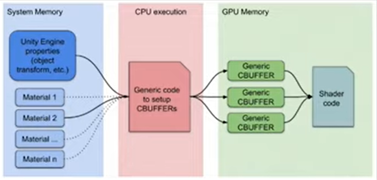
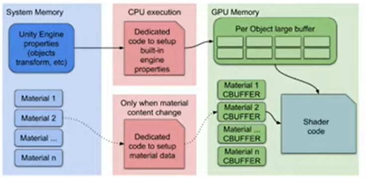
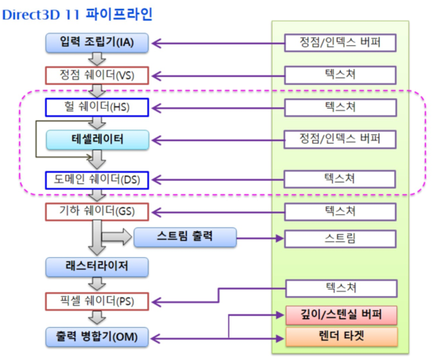
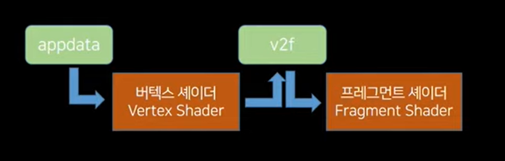

**Deep Dive into the URP Lighting**  
> 군 생활 중, Unity Dev Week 에서 진행한 **URP 셰이더 뜯어보기**를 단순 정리한 내용입니다.  
> 노션에 작성했던 내용을 블로그로 옮겨 작성해 가독성에 문제가 있을 수 있습니다. 
>
> *약 1:17:35 정도까지 작성되었습니다.* 

<div style="position: relative; width: 100%; padding-bottom: 56.25%">
<iframe width="560" height="315" src="https://www.youtube.com/embed/9K1uOihvNyg?si=FaLQlK6cD0FDZE9o" title="YouTube video player" frameborder="0" allow="accelerometer; autoplay; clipboard-write; encrypted-media; gyroscope; picture-in-picture; web-share" referrerpolicy="strict-origin-when-cross-origin" allowfullscreen style="position: absolute; width:100%; height: 100%;"></iframe>
</div>

<div style="margin-top: 12px"> </div>

[▶ **Unity ShaderLibrary** Github 링크](https://github.com/Unity-Technologies/Graphics/tree/master/Packages/com.unity.render-pipelines.universal/ShaderLibrary)

---

### URP 왜 써야 할까요?

**Universal Render Pipeline**

- Unity 2020부터 기본 파이프라인이 Legacy → URP 방식으로 변화
- URP에서는 기존 Legacy 방식의 셰이더 (Surface, Fragment) 들을 지원하지 않는다.
- URP 방식으로 넘어가야 하는 것은 시대의 변화. 힘들어도 받아들이는 수 밖에!
- 하지만 그걸 받아들이기 전에 어떤 것들이 좋아졌길래 바뀌어야 하는지 정도는 알고 넘어가자!
- 오늘 세션에서는 HDRP에 대한 내용은 다루지 않음.

**레거시와 URP의 장단점 / Legacy vs URP**

- **Legacy**
    - 손쉽게 셰이더 코딩할 수 있는 환경 (서피스, 프레그먼트)
    - 노드방식 지원하지 않음
    - 다이나믹 배칭은 극히 제한적으로 사용 가능
    - 멀티 패스 렌더링에 별다른 제약 없음
    - 렌더 시점에 대한 별로 큰 고민 안함 (그랩패스 등…)
- **URP**
    - 다소 복잡해진 셰이더 코딩 환경 (HLSL)
    - 노드 방식 지원
    - <red>SRP Batcher</red> 사용 가능
    - 멀티패스 렌더링 하려면 골치아픔
    - 렌더 시점에 대해서 고민이 필요함
    - 렌더 오브젝트, 렌더 피쳐 등 패스 추가 기능이 생겼음

- 대략 큰 차이점은 이정도. 
- 이 중 특히 <red>SRP Batcher</red> 라는 기능이 추가되면서 Dynamic 오브젝트가 많아지더라도 좋은 퍼포먼스를 유지하는 것이 가능해졌다.

**SRP Batcher**

<div style="width: 100%; height: 100%; display: flex; flex-direction: row; gap: 10px;">





</div>

- Per Object Large Buffer 가 추가되었다.
- 이는 머티리얼에서 변화가 필요한 부분만 CBUFFER에 넣어놓고 나머지 머티리얼 콘텐츠를 GPU 메모리에 유지 (Per Object Large Buffer) 시키고 그 계산을 재사용하는 방식
- Batcher라는 이름을 달고 있지만 사실 정말 배칭을 해주는 (드로우 콜이 줄어드는) 기능은 아니다.
- 드로우 콜이 발생할 때 렌더 스테이트를 올리는 비용을 재사용을 통해 줄여주어 사실상 배칭과 거의 비슷한 퍼포먼스를 내게 해준다.
- CPU Instancing과 퍼포먼스 비교시, GPU Instancing이 미세한 차이로 조금 빠르기는 하나, GPU Instancing은 메시가 동일해야하지만, SRP Batcher는 메시가 틀려도 사용 가능하기 때문에 SRP Batcher 판정승

**URP는 확실히 좋다! 그치만…!**

- 확실히 빨라집니다. (레거시 때 10프레임 나오던 프로젝트가 URP 전환 후 50프레임이 되기도)
- 하지만 기존에 했던 방식과 호환이 안되고, 새로운 방식을 학습해야하는 문제가 있다.
- 셰이더 그래프라는 ‘손쉽게’ 셰이더를 작성할 수 있는 도구도 있음.

**그렇게 만져본 셰이더 그래프**

- UX는 좀 불~편
- 단축키도 없고, 그룹 안에서 노드 생성 불가능하고, 컴포넌트 마스크도 없고, UV는 무조건 float4고… 등등등
- 근데 컬링이 없어서 코드로 생성하고 바꿔줘야 한다…?
- 어라…? 블렌드 모드를 넣을 수도 없다…?
- 당연히 Zwrite, Ztest, 스텐실 등의 옵션도 사용하지 못한다…?
- 그리고 노드 크기가 너무 크다…

**그 외 불편했던 점들…**

- Unlit Master는 Receive Shadow가 안먹고 Ambient도 안먹고 심지어 Fog 까지 안먹는다.
- 아마도 이펙트 등에 사용하라고 이렇게 만든 것이겠지만 모든 사물을 굳이 PBR로만 만들어야 하다니…?
- PBR이 아닌 Stylized 스타일에서도 라이트 연산하려면 굳이 무거운 PBR 연산을 해야한단 말인가..?
- PBR Master는 그림자 색도 맘대로 못바꿈. 디퓨즈 라이팅 계산도 변경 불가
- NPR 프로젝트에서는 명암이 셀셰이드처럼 나와야 하기 때문에 PBR보다는 Unlit방식으로 작업을 해야함
- 이렇게 Unlit이지만 Light Vector도 알고싶고, Shadow도 받고 싶고, Fog도 적용되게 하고싶을 때 어떻게 해야하나
- 셰이더 그래프에서 Custom Node를 활용하면 라이트벡터와 섀도우는 어찌저찌 해결이 되기는 함. 하지만 이거나 코딩이나…
- Header, Space 등의 어트리뷰트도 넣을 수 없어서 머티리얼 창 가독성이 굉장히 떨어짐
- 생성한 코드 또한 가독성이 무척 떨어짐. 자동으로 생성된 괴로운 변수명들
- 텍스쳐 uv Tiling Offset 기본 [No ScaleOffset]으로 되어있음…?
- 뎁스페이드를 Transparent로 사용할 때만 제대로 나옴
- 그 외에 버텍스 셰이더 계산인지 픽셀 셰이더 계산인지 헷갈려 하는 상황이 발생하거나…
- 레거시 방식에서 구현한 함수 등을 복붙하기 넘 괴로움…
- 테셀레이션, 지오메트리 셰이더 사용 불가
- 그리고 무엇보다 가장 중요한 글로벌 키워드 멀티컴파일이 동작하지 않는다!

**셰이더 그래프의 좋은점도 있습니다**

- 서브그래프 생성시 자동으로 변수들 만들어 주는 것도 괜찮고
- 멀티컴파일, 키워드이넘 등 만들기 편하고
- float4를 float3에 연결했을 때 다이나믹하게 float3으로 연결
- 웹상에 자료가 많은 편
- 어 음… 더 있었던 것 같은데 기억이 나지 않는군요! 생각나진 않아도 더 있을 것 같습니다!

**앞서 언급했던 문제들을 해결하려면..**

- 그것은 바로 코딩으로 셰이더를 작성하는 것.
- HLSL 방식이라고는 하지만 Legacy에서 프레그먼트 셰이더를 작성해봤다면 생각보다 어렵지 않습니다!
- 한편 서피스 방식 사용자에게는 슬픈 일이지만 몇 가지 신경써야 할 부분들이 있습니다.
- 가장 큰 부분이 행렬. 서피스 방식은 행렬을 자동으로 계산해주었지만, 이제는 직접 해야한다.
- 하지만 두려울 것은 없다. 그냥 코드 한줄 넣어주면 되기 때문. 일단 외워서라도 해 볼만 합니다
- 버텍스 인풋 아웃풋에 조금 더 신경을 써주고, 버텍스 셰이더에서 각 데이터들에 값을 정확하게 잘 넣어주는 것이 중요

**서피스, 프레그먼트 방식과 URP의 다른점**

1. 인클루드 파일이 *UnityCG.cginc* 하나에 다 들어있는 것이 아니라 여러가지 파일로 나뉘어져 있습니다.
2. 예전에는 베이스패스 하나만 작성하면 되었지만, HLSL에서는 섀도우캐스터, 뎁스온리 등 다른 패스도 작성해야 합니다.
3. 행렬 이름이 달라졌습니다 (이제 unity…로 시작하는 행렬 이름을 보지 않아도 된다!)
4. 텍스쳐 샘플링 코드가 달라졌습니다.
5. CBUFFER라는 것이 생겼습니다.
6. 라이트를 여러 개 사용할 수 있고, 라이트 관련 코드가 많이 바뀌었습니다.  등 등…


**1. 인클루드 파일 / Include**

- *Lighting.hlsl* - 라이트 구조체, 디퓨즈, 스펙큘러 계산, GI (SH, 라이트맵)
- *Shadows.hlsl* - 섀도우맵 샘플링, 케스케이드 계산, ShadowCoord 계산, Shadow Bias 계산 등
- *Core.hlsl* - 버텍스 인풋 구조체 정의, 스크린 UV계산, 포그계산 등
- *Common.hlsl* - 각종 수학관련 구현, 텍스쳐 유틸리티, 뎁스 계산 등
- *SpaceTransforms.hlsl* - 각종 공간변환 행렬 정의, Tangent ↔ World 행렬이 추가되었음
- *EntityLighting.hlsl* - SH, ProveVolume, Lightmap 계산 등
- *ImageBasedLighting* - PBR에서 IBL 관련 부분만 떨어진 것. GGX, Anisotropy, ImportanceSample 등
　
<div style="margin-top: -60px;"></div>

- Leagacy - *UniryCG.cginc* 안에 각종 계산, 행렬, 라이트, 뎁스, 포그, 패럴렉스 등 함수들이 모여 있습니다.
- URP - *Lighting.hlsl, Shadows.hlsl, Common.hlsl, SpaceTransforms.hlsl, Core.hlsl, EntityLighting.hlsl* 등 코드가 기능별로 분리되어 있습니다.

**2. 패스 / Pass**

- Legacy - 섀도우 캐스터나 뎁스 등은 자동 생성되는 방식
    - 멀티패스, 그랩패스 등에 대해서도 딱히 제약 없었습니다.
- URP - 섀도우, 뎁스 패스는 물론이고 때론 meta, universal 2D 패스 등도 작성해 주어야 합니다.
    - 하지만 크게 어렵지는 않습니다. 포지션만 잘 맞춰서 보내주면 됩니다.
- 그랩패스 같은거 하려면 복잡 - 불투명한 것만 가져오려면 CameraOpaqueTexture를 이용하면 되지만, 캡쳐 렌더타겟을 바꾸고 싶다면 c#을 이용하여 새로운 렌더타겟에 그릴 렌더패스를 작성해야 합니다.


**3. 행렬 / Matrix**

```hlsl
// Fragment
o.vertex = UnityObjectToClipPos(v.vertex);

// URP HLSL
o.vertex = TransformObjectToHClip(v.vertex.xyz);
```

- 서피스 방식으로 작업해 오던 사람에게는 좀 어려울 수도 있는 부분 (서피스는 행렬을 안써도 셰이더 작성이 가능)
- 일단은 행렬을 원리부터 이해하려고 하지 말고 쉽게 접근해 봅시다.
- 행렬은 쉽게 말하면 이동, 회전, 스케일을 해 주는 계산을 말합니다.
- 그런데 그냥 이동 회전 스케일을 해주는 것이 아니라 이 계산을 통하여 중심축을 이동 회전 스케일 해준다고 생각하면 됩니다. 그렇게 중심이 바뀌면 ‘공간’을 ‘변환’했다고 말합니다 ( ex : 로컬공간 → 월드공간, 월드공간 → 뷰 공간 )
- 로컬공간에 있는 오브젝트는 월드, 뷰 를 거쳐 클립공간에 이르게 됩니다.
- 클립공간으로 변환해주는 행렬을 보면 기존과 방식이 달라졌음을 알 수 있습니다.
- Unity…로 시작하던 행렬들이 Transform…로 바뀐 점은 대단히 직관적이어서 확실히 좋은 점입니다.


**4. 샘플링 / Sampling**

```hlsl
// UnityCG
half4 c = tex2D(_MainTex, i.texcoord);

// URP HLSL
float4 c = SMAPLE_TEXTURE2D(_MainTex, sampler_MainTex, i.texcoord);
```

- 텍스쳐, 큐브맵등을 샘플링하는 코드가 달라졌습니다.
- Sampler를 표시해주는 등 HLSL 표준 방식으로 변환 (그래도 샘플러 정의를 해 주는 부분은 없어서 좋음)
- 예전보다 직관적인 것 같기도 한데, 타이핑 할 코드가 많아진 부분은 ~~조금~~ 불만
- `tex2D(Texture Object, uv)` → `SAMPLE_TEXTURE2D(Texture Object, Sampler, uv)`
- `texCUBElod(Cubemap Object, float4(Reflection Vector, mipLevel))` → `SAMPLER_TEXCUBE_LOD(Cubemap Object, Sampler, Reflection Vector, mipLevel)`


**5. CBUFFER**

```hlsl
// UnityCG
sampler2D _MainTex;
float4 _MainTex_ST;
float4 _Color;

// URP HLSL
CBUFFER_START(UnityPerMaterial)

TEXTURE2D(_MainTex);
SAMPLER(sampler_MainTex);
float4 _MainTex_ST;
half4 _Color;

CBUFFER_END
```

- 그냥 CBUFFER로 변수들을 감싸주면 끝
- CBUFFER로 감싼 변수들은 GPU 메모리 상에 업로드되어 SRP Batcher 계산을 위한 데이터로 쓰입니다.
- 혹시 SRP Batcher를 사용하지 않고 GPU Instancing을 사용하고 싶다면 CBUFFER라고 쓰인 부분을 지워주면 됩니다.
- CBUFFER를 적어주면 SRP Batcher가 GPU Instancing보다 우선순위가 높기 때문에 SRP Batcher만 돌게 됩니다.


**6. 라이트 / Light**

```hlsl
// UnityCG
half3 worldSpaceLightDir = normalize(_WorldSpaceLightPos0);

// URP HLSL
Light mainLight = GetMainLight(i.shadowCoord);
```

- 라이트 관련 처리가 가장 많이 바뀌었습니다.
- 기존에는 1패스 당 1라이트 방식이었는데, 이제 1패스에 16개까지의 라이트를 한 번에 연산합니다.
- 디렉션만 따로 받아올 수도 있지만, 구조체 방식으로 받아오는 것이 생각보다 코드 작성에 좋습니다.
- 라이트 관련 처리가 바뀌면서 그림자에 대한 부분도 함께 바뀌었습니다.
- 이 부분은 특히 가장 중요한 부분이니 후에 픽셀셰이더를 다룰 때 더 자세히 다루도록 하겠습니다.


---

### 셰이더 제작 

자 그럼, 처음부터 하나하나 짚어가면서 CustomLighting 셰이더를 만들어봅시다

**간단 렌더링 파이프라인**

<div style="width: 100%; height: 100%; display: flex; flex-direction: row; gap: 10px;">





</div>

- DX11까지의 렌더링 파이프라인은 좌측과 같으나, 이걸 다 다루면 상당한 시간이 걸립니다.
- 셰이더를 만들때는 오른쪽과 같은 느낌으로 간단하게 생각해주세요
- appdata 는 버텍스 인풋이라고도 불리고, v2f 는 버텍스 아웃풋이라고도 불립니다
- 서피스 함수에서 Input이라고 불렸던 구조체는 버텍스 아웃풋과 동일한 구조체입니다


**셰이더 명, 프로퍼티, 각종태그**

```hlsl
Shader "CustomLighting/Master"
{
		Properties
		{
				_Color ("Color", Color) = (1, 1, 1, 1)
				_MainTex ("BaseColor Texture", 2D) = "white" {}
		}
	
		.
		.
		.

		SubShader
		{
				Tags
				{
						"RenderPipeline" = "UniversalPipeline"
						"RenderType" = "Opaque"
						"Queue" = "Geometry+0"
				}
				LOD 100

				.
				.
				.
			
				Pass
				{
						Name "Universal Forward"
						Tags
						{
								"LightMode" = "UniversalForward"
						}
						Cull Back

				...
```

- 여기는 기존 Legacy 방식과 거의 비슷합니다
- `[Header]`, `[Space()]`, `(Enum.UnityEngine.Rendering.BlendMode)`등 기존 어트리뷰트 동일하게 사용가능
- 태그 렌더 파이프라인에 `UniversalPipeline`이라고 넣어주고, Pass 안에서는 LightMode를 정의해줍니다
- 컬링, 블랜드모드, Zwrite, Ztest 등도 모두 여기에서 기존과 동일한 방식으로 입력 가능
- 라이트 모드는 기존 ForwardBase에서 UniversalForward로 바뀌었습니다 (Forward Add는 이제 없습니다)


**멀티 컴파일, 인클루드**

```hlsl
HLSLPROGRAM

#pragma prefer_hlslcc gles
#pragma exclude_renderers d3d11_9x
#pragma vertex vert
#pragma fragment frag

#include "Packages/com.unity.render-pipelines.universal/ShaderLibrary/Lighting.hlsl"

// GPU Instancing
#pragma multi_compile_instancing

// Fog
#pragma multi_compile_fog

// Light & Shadow
#pragma multi_compile _ _MAIN_LIGHT_SHADOWS
#pragma multi_compile _ _MAIN_LIGHT_SHADOWS_CASCADE
#pragma multi_compile _ _ADDITIONAL_LIGHTS
#pragma multi_compile _ _ADDITIONAL_LIGHT_SHADOWS
#pragma multi_compile _ _SHADOWS_SOFT

// lightmap
#pragma multi_compile _ DIRLIGHTMAP_COMBINED
#pragma multi_compile _ LIGHTMAP_ON
```

- GPU Instancing은 SRP Batcher를 사용할 것이라면 빼도 무방합니다
- 라이트를 하나만 사용할 거면 `_ADDITIONAL_LIGHTS` 키워드도 사용하지 않아도 됩니다.
- 하드라이트만 사용할 거라면 `_SHADOWS_SOFT` 키워드를 빼도 됩니다
- 라이트 맵을 사용할 거라면 `LIGHTMAP_ON` 키워드를 추가해주세요
- *Lighting.hlsl* 은 완전 unlit을 할게 아니라면 거의 사용하게 될 주요 hlsl입니다.


**CBUFFER, Vertex Input, Vertex Output**

```hlsl
CBUFFER_START (UnityPerMaterial)

TEXURE2D(_MainTex);
SAMPLER(sampler_MainTex);
float4 _MainTex_ST;
half4 _Color;

CBUFFER_END

struct appdata
{
		float4 vertex : POSITION;
		float2 texcoord : TEXCOORD0;
		float3 normal : NORMAL;
		UNITY_VERTEX_INPUT_INSTANCE_ID
};

struct v2f
{
		float4 vertex : SV_POSITION;         // vertex : 버텍스 포지션 (필수)
		float3 normal : NORMAL;              // normal : 라이팅 계산 해야하면 추가
		float2 texcoord : TEXCOORD0;         // texcoord : 텍스쳐 넣을거면 추가
		float fogCoord : TEXCOORD1;          // fogDoord : 포그 넣을거면 추가
		float4 shadowCoord : TEXCOORD2;      // shadowCoord : 실시간 그림자 맵 사용할거면 추가
		float3 worldPos : TEXCOORD3;         // worldPos : 뭔가 월드에서 포지션 계산할 일이 있으면 추가
		UNITY_VERTEX_INPUT_INSTANCE_ID       // GPU 인스턴싱 할거면 추가
		UNITY_VERTEX_OUTPUT_STEREO           // VR에서 사용할 셰이더라면 추가
};
```

- 프로퍼티 변수들은 무조건 *CBUFFER* 로 감싸줍니다
- GPU 인스턴싱을 사용하지 않을 거면 `UNITY_VERTEX_INPUT_INSTANCE_ID`는 없어도 됩니다
- VR을 사용하지 않는다면 `UNITY_VERTEX_OUTPUT_STEREO`는 없어도 됩니다
- 포그를 사용하지 않는다면 `fogCoord`가 없어도 되고
- 그림자를 생성하지 않는다면 `shadowCoord`가 없어도 되고
- 라이트를 여러 개 사용하지 않는다면 worldPos가 없어도 됩니다 (만 WorldPos는 다른데에 사용할일이 많긴 합니다)
- v2f라는 구조체 이름은 *vertex to fragment*라는 뜻 입니다
- 이 값들에 대한 자세한 내용은 버텍스 셰이더를 보면 나옵니다.
- 예전에는 `appdata_tan`, `appdata_full`등의 미리 지정된 구조체들이 있었지만, 이제는 잊으세요!


**버텍스 셰이더**

```hlsl
v2f vert (appdata v)
{
		v2f o;
		UNITY_SETUP_INSTANCE_ID(v);
		UNITY_TRANSFER_INSTANCE_ID(v, o);
		
		o.vertex = TransformObjectToHClip(v.vertex.xyz);           // vertex : 버텍스 클립포지션은 무조건 필요합니다
		o.texcoord = TRANSFORM_TEX(v.texcoord, _MainTex);          // texcoord : texcoord는 일반적으로 uv라 부르는 텍스쳐 샘플링 좌표입니다. TRANSFORM_TEX 함수로 _MainTex_ST와 연결시켜줍니다. ST는 Scale Translate의 약자입니다
		o.normal = TransformObjectToWorldNormal(v.normal);         // normal : 오브젝트 노멀을 월드노멀로 변환해줍니다. 라이팅연산을 안할거면 해당 코드를 지워도 됩니다
		o.fogCoord = ComputeFogFactor(o.vertex.z);                 // fogCoord : 클립포지션의 z값을 기반으로 어느정도 포그가 적용되어야 할지에 대한 값을 구합니다
		o.worldPos = TransformObjectToWorld(v.vertex.xyz);         // worldPos : 뭔가 월드에서 계산할일이 있으면 추가 (라이트 계산등은 주로 월드에서 합니다)
		o.shadowCoord = TrnasformWorldToShadowCoord(o.worldPos);   // shadowCoord : 그림자 맵의 좌표를 구합니다

		return o;
}
```

- 각 버텍스 아웃풋 데이터들이 거의 하나의 함수로 간단하게 계산되고 있는 것을 볼 수 있습니다

**공간변환**

```hlsl
o.vertex = TransformObjectToHClip(v.vertex.xyz);
o.normal = TransformObjectToWorldNormal(v.normal);
o.worldPos = TransformObjectToWorld(v.vertex.xyz);
```

```hlsl
// SpaceTransforms.hlsl
float4 TransformWorldToHClip(float3 positionWS)
{
		return mul(GetWorldToHClipMatrix(), float4(positionWS, 1.0));
}

float3 TransformObjectToWorldNormal(float3 normalOS)
{
#ifdef UNITY_ASSUME_UNIFORM_SCALING
		return TransformObjectToWorldDir(normalOS);
#else
		// Normal need to be multiply by inverse transpose
		return SafeNormalize(mul(normalOS, (float3x3)GetWorldToObjectMatrix()));
#endif
}

float3 TransformObjectToWorld(float3 positionOS)
{
		return mul(GetObjectToWorldMatrix(), float4(positionOS, 1.0)).xyz;
}
```

- *SpaceTransforms.hlsl* 을 열어봅시다
- 유니티는 행렬과 벡터를 연산할 때 행렬 * 벡터 순으로 계산해야합니다
- 다만 노멀의 경우 월드로 갈 때 Inverse Transpose (전치역행렬)을 곱해주어야 틀어지지 않은 제대로된 노멀값을 얻을 수 있으므로 순서를 바꿔줍니다
- 회전행렬의 경우 곱하는 순서를 바꾸면 역행렬 계산을 할 수 있기 때문에 이것을 알아두면 공간변활할 때 굉장히 유용합니다
- 행렬을 구하는 코드들을 보면 `UNITY_MATRIX_M` ← 이렇게 예전방식 행렬들을 그대로 사용하고 있는 것을 알 수 있습니다

**텍스쳐 좌표**

```hlsl
// vert()
o.texcoord = TRANSFORM_TEX(v.texcoord, _MainTex);
o.texcoord = v.texcoord * _MainTex_ST.xy + _MainTex_ST.zw;   // 윗줄 코드와 같다
```

- `TRANSFORM_TEX`는 사실 `_MainTEX_ST`라는 변수의 xy값을 곱해서 스케일로 사용하고, zw를 더해서 옵셋으로 사용한 것을 간편한 함수로 표현한 것입니다
- 여전히 레거시 방식 그대로 사용이 가능합니다

**포그 좌표**

```hlsl
// frag()
o.fogCoord = ComputeFogFactor(o.vertex.z);

// Core.hlsl
real ComputeFogFactor(float z)
{
		float clupZ_01 = UNITY_Z_0_FAR_FROM_CLIPSAPCE(z);

#if defined(FOG_LINEAR)
		// factor = (end-z)/(end-start) = z * (-1/(end-start)) + (end/(end-start))
		float fogFactor = saturate(clipZ_01 * unity_FogParams.z + unity_FogParams.w);
		return real(fogFactor);
#elif defined(FOG_EXP) || defined(FOG_EXP2)
		// factor = exp(-(density*z)*2)
		// -density * z computed at vertex
		return real(unity_FogParams.x * clipZ_01);
#else
	return 0.0b;
#endif
}
```

- *Core.hlsl* 파일을 열어보면 포그좌표 구하는 공식을 볼 수 있습니다
- Linear, Exponential, Exponential Squared 방식에 따라 각각 계산방법이 정의되어 있습니다
- 포그는 좌표만 구하면 픽셀 셰이더에서는 보간만 해주는 방식
- 포그는 셰이더 그래프에 포그 노드가 있지만 Unlit Master에서는 `multi_compile_fog`가 없어서 작동하지 않습니다
- (PBR Master는 `multi_compile_fog` 키워드도 있고 Mixfog 계산도 다 되어있어서 포그노드 없이도 알아서 잘 작동)

**그림자 좌표**

```hlsl
// frag()
VertexPositionInputs vertexInput = GetVertexPositionInputs(v.vertex.xyz);
o.shadowCoord = GetShadowCoord(vertexInput);

o.shadowCoord = TransformWorldToShadowCoord(o.worldPos);

// Core.hlsl
VertexPositionInputs GetVertexPositionInputs(float3 positionOS)
{
		VertexPositionInputs Input;
		Input.positionWS = TransformOjbectToWorld(positionOS);
		Input.positionVS = TransformWorldToView(Input.positionWS);
		Input.positionCS = TransformWorldToHClip(Input.positionWS);

		float4 ndc = Input.positionCS * 0.5f;
		Input.positionNDC.xy = float2(ndc.x, ndc.y * _ProjectionParams.x) + ndc.w;
		Input.positionNDC.zw = Input.positionCS.zw;

		return Input;
}

// Shadows.hlsl
float4 GetShadowCoord(VertexPositionInputs vertexInput)
{
#if SHADOWS_SCREEN
		return ComputeScreenPos(vertexInput.positionCS);
#else
		return TransformWorldToShadowCoord(vertexInput.positionWS);
#endif
}

float4 TransformWorldToShadowCoord(float3 positionWS)
{
#ifdef _MAIN_LIGHT_SHADOWS_CASCADE
		half cascadeIndex = ComputeCascadeIndex(positionWS);
		return mul(_MainLightWorldToShadow[cascadeIndex], float4(position...);
#else
		return mul(_MainLightWorldToShadow[0], float4(position...);
#endif
}
```

- *Core.hlsl* 과 *Shadows.hlsl*을 보면 해당 코드가 있습니다
- `ShadowCoord`를 구할 때 `VertexInput`을 넣어주는건 결국 `worldPosition`을 구하기 위함입니다
- 각 공간의 포지션 값을 굳이 다 계산할 것 없이, `GetShadowCoord()`를 쓰지말고, 바로 `TransformWorldToShadowCoord()`를 사용하는 것도 좋은 방법입니다

**프레그먼트 셰이더 / Fragment Shader**

```hlsl
half4 frag (v2f i) : SV_Target
{
		UNITY_SETUP_INSTANCE_ID(i);

		// Get MainLight
		Light mainLight = GetMainLight(i.shadowCoord);
		i.normal = normalize(i.normal);

		// Diffuse
		float3 lambert = LightingLambert(mainLight.color, mainLight.direction, i.normal);
		float4 c = SAMPLE_TEXTURE2D(_MainTex, sampler_MainTex, i.texcoord) * _Color;

		// Specular
		float3 specular = LightingSpecular(mainLight.color, mainLight.direction, i.normal, i.viewDir, 1, _Gloss);

		// GI
		half3 ambient = SampleSH(i.normal);

		// Combine
		c.rgb *= lambert * mainLight.distanceAttenuation * mainLight.shadowAttenuation;
		c.rgb += ambient + specular;

		// Get Additional Light
		#ifedf _ADDITIONAL_LIGHTS
				uint pixelLightCount = GetAdditionalLightsCount();
				for (uint lightIndex = 0u; lightIndex < pixelLightCount; ++lightIndex)
				{
						Light addLight = GetAdditionalLight(lightIndex, i.worldPos);
						float3 addLightResult = LightingLambert(addLight.color, addLight.direction, i.normal) * addLight.distanceAttenuation;
						float3 addLightSpecular = LightingSpecular(addLight.color, addLight.direction, i.normal, i.viewDir, 1, _Gloss);
						c.rgb += addLightResult + addLightSpecular;
				}
		#endif

		// Fog
		c.rgb = MixFog(c.rgb, i.fogCoord);
	
		return c;
}
```

**라이트 구조체 / Light struct**

```hlsl
// frag()
Light mainLight = GetMainLight(i.shadowCoord);

// Lighting.hlsl
struct Light
{
		half3 direction;
		half3 color;
		half  distanceAttenuation;
		half  shadowAttenuation;
};

// Lighting.hlsl
Light GetMainLight()
{
		Light light;
		light.direction = _MainLightPosition.xyz;
		// unity_LightData.z is 1 when not culled by the culling mask, otherwise 0.
		light.distanceAttenuation = unity_LightData.z;
#if defined(LIGHTMAP_ON) || defined(_MIXED_LIGHTING_SUBTRACTIVE)
		// unity_ProbesOcclusion.x is the mixed light probe occlusion data
		light.distanceAttenuation *= unity_ProbesOcclusion.x;
#endif
		light.shadowAttenuation *= unity_ProbesOcclusion.x;
		light.color = _MainLightColor.rgb;

		return light;
}

Light GetMainLight(float4 shadowCoord)
{
		Light light = GetMainLight();
		light.shadowAttenuation = MainLightRealtimeShadow(shadowCoord);
		return light;
}
```

- *Lighting.hlsl*에서 해당 내용을 확인할 수 있습니다
- `GetMainLight`의 인자를 비워두느냐 `shadowCoord`를 넣어주느냐에 따라 `Attenuation`값이 달라집니다
- 굳이 구조체로 안해도 `_MainLightPosition.xyz`라는 값으로 메인라이트의 포지션을 가져올 수 있긴 합니다
- 하지만 Light 구조체를 이용해야 `Attenuation`값들을 이용할 수 있으니 습관을 들이도록 합시다

**감쇠 / Attenuation**

```hlsl
// Lighting.hlsl
flaot3 lightVector = lightPositionWS.xyz - positionWS * lightPositionWS.w;
float distanceSqr = max(dot(lightVector, lightVector), HALF_MIN);

half3 lightDirection = half3(lightVector * rsqrt(distanceSqr));
half attenuation = DistanceAttenuation(distanceSqr, distanceAndSpotAttenuation.xy) * AngleAttenuation(spotDirection.xyz, lightDirection, distanceAndSpotAttenuation.zw);

Light light;
light.direction = lightDirection;
light.distanceAttenuation = attenuation;
light.shadowAttenuation = AdditionalLightRealtimeShadow(perObjectLightInedx, positionWS);
light.color = color;
```

- `distanceAttenuation`은 광원과 표면의 ‘거리’에 대한 감쇠와 스팟라이트일 때 스팟라이트의 ‘범위각(AngleAttenuation)’에 zw. 이렇게 두가지의 값이 곱해진 값입니다. 즉 Directional Light일 경우에는 감쇠가 되지 않으므로 항상 1인 값입니다. (첫줄에서 `lightPositionWS.w`를 곱해주어 이것을 판별합니다. 디렉셔널 라이트는 이 값이 0이 되어, `lightPositionWS`만으로 벡터를 구할 수 있습니다.
- `shadowAttenuation`은 실시간 그림자가 드리워져서 어두워지는 것을 의미합니다 (리얼타임 섀도우)

**실시간 그림자 / Realtime Shadow**

```hlsl
// Lighting.hlsl
Light GetMainLight(float4 shadowCoord)
{
		Light light = GetMainLight();
		light.shadowAttenuation = MainLightRealtimeShadow(shadowCoord);
		return light;
}

#pragma multi_compile _ _SHADOWS_SOFT

// Shadows.hlsl
half MainLightRealtimeShadow(float4 shadowCoord)
{
#if !defined(_MAIN_LIGHT_SHADOWS) || defined(_RECEIVE_SHADOWS_OFF)
		return 1.0h;
#endif

#if SHADOWS_SCREEN
		return SamplesScreenSpaceShadowmap(shadowCoord);
#else
		ShadowSamplingData shadowSamplingData = GetMainLightShadowSamplingData();
		half4 shadowParams = GetMainLightShadowParams();
		return SampleShadowmap(TEXUTRE2D_ARGS(_MainLightShadowmapTexture, sampler_MainLightShadowmapTexture), shadowCoord, shadowSamplingData, shadowParams, false);
#endif
}

real SampleShadowmap(TEXTURE2D_SHADOW_PARAM(ShadowMap, smapler_ShadowMap), float4 shadowCoord, ShadowSamplingData samplingData, half4 shadowParams, bool isPerspectiveProjection = true)
{
		// Compiler will optimize this branch away as long as isPerspectiveProjection is known at compile time
		if (isPerspectiveProjection)
				shadowCoord.xyz /= shadowCoord.w;

		real attenuation;
		real shadowStrength = shadowParams.x;

		// TODO : We could branch on if this light has soft shadow (shadowParams/y) to save perf on some platforms.
#ifdef _SHADOW_SOFT
		attenuation = SampleShadowmapFiltered(TEXTURE2D_SHADOW_ARGS(ShadowMap, sampler_ShadowMap), shadowCoord, samplingData);
#else
		// 1-tap hardware comparison
		attenuation = SAMPLE_TEXTURE2D_SHADOW(ShadowMap, sampler_ShadowMap, shadowCoord.xyz);
#endif

		attenuation = LerpWhiteTo(attenuation, shadowStrength);

		// Shadow coords that fall out of the light frustum volume must always return attenuation 1.0
		// TODO : We could use branch here to save som perf on som platforms.
		return BEYOND_SHADOW_FAR(shadowCoord) ? 1.0 : attenuation;
}

real SampleShadowmapFiltered(TEXTURE2D_SHADOW_PARAM(ShadowMap, sampler_ShadowMap), float4 shadowCoord, ShadowSamplingData samplingData)
{
    real attenuation;

#if defined(SHADER_API_MOBILE) || defined(SHADER_API_SWITCH)
		// 4-tap hardware comparison
		real4 attenuation4;
		attenuation4.x = SAMPLE_TEXTURE2D_SHADOW(ShadowMap, sampler_ShadowMap, shadowCoord.xyz + samplingData.ShadowOffset0.xyz);
		attenuation4.y = SAMPLE_TEXTURE2D_SHADOW(ShadowMap, sampler_ShadowMap, shadowCoord.xyz + samplingData.ShadowOffset1.xyz);
		attenuation4.z = SAMPLE_TEXTURE2D_SHADOW(ShadowMap, sampler_ShadowMap, shadowCoord.xyz + samplingData.ShadowOffset2.xyz);
		attenuation4.w = SAMPLE_TEXTURE2D_SHADOW(ShadowMap, sampler_ShadowMap, shadowCoord.xyz + samplingData.ShadowOffset3.xyz);
		attenuation = dot(attenuation4, 0.25);
#else
		float fetchesWeights[9];
		float2 fetchesUV[9];
		SampleShadow_ComputeSamples_Tent_5x5(samplingData.shadowmapSize, shadowCoord.xy, fetchesWeights, fetchesUV);

		attenuation = fetchesWeights[0] * SAMPLE_TEXTURE2D_SHADOW(ShadowMap, sampler_ShadowMap, float3(fetchesUV[0].xy, shadowCoord.z));
		attenuation += fetchesWeights[1] * SAMPLE_TEXTURE2D_SHADOW(ShadowMap, sampler_ShadowMap, float3(fetchesUV[1].xy, shadowCoord.z));
		attenuation += fetchesWeights[2] * SAMPLE_TEXTURE2D_SHADOW(ShadowMap, sampler_ShadowMap, float3(fetchesUV[2].xy, shadowCoord.z));
		attenuation += fetchesWeights[3] * SAMPLE_TEXTURE2D_SHADOW(ShadowMap, sampler_ShadowMap, float3(fetchesUV[3].xy, shadowCoord.z));
		attenuation += fetchesWeights[4] * SAMPLE_TEXTURE2D_SHADOW(ShadowMap, sampler_ShadowMap, float3(fetchesUV[4].xy, shadowCoord.z));
		attenuation += fetchesWeights[5] * SAMPLE_TEXTURE2D_SHADOW(ShadowMap, sampler_ShadowMap, float3(fetchesUV[5].xy, shadowCoord.z));
		attenuation += fetchesWeights[6] * SAMPLE_TEXTURE2D_SHADOW(ShadowMap, sampler_ShadowMap, float3(fetchesUV[6].xy, shadowCoord.z));
		attenuation += fetchesWeights[7] * SAMPLE_TEXTURE2D_SHADOW(ShadowMap, sampler_ShadowMap, float3(fetchesUV[7].xy, shadowCoord.z));
		attenuation += fetchesWeights[8] * SAMPLE_TEXTURE2D_SHADOW(ShadowMap, sampler_ShadowMap, float3(fetchesUV[8].xy, shadowCoord.z));
#endif

    return attenuation;
}
```

- `GetMainLight`의 인자에 `ShadowCoord`를 넣으면 `MainLightRealtimeShadow()`계산
- `SampleShadowMap()`안에서 `_SHADOWS_SOFT` 키워드가 들어오면 `SampleShadowmapFiltered()` 함수를 실행
- 셰이더 그래프에서는 글로벌 키워드 작성이 불가능하므로 커스텀 노드에서 `SampleShadowmapFiltered()` 함수를 직접 실행히야합니다

**램버트 라이트 모델 (디퓨즈) / LightingLambert**

```hlsl
// frag()

// Diffuse
float3 lambert = LightingLambert(mainLight.color, mainLight.direction, i.normal);
float4 c = SAMPLE_TEXTURE2D(_MainTex, smapler_MainTex, i.texcoord) * _Color;

// Lighting.hlsl
half3 LightingLambert(half3 lightColor, half3 lightDir, half3 normal)
{
		half NdotL = saturate(dot(normal, lightDir));
		return lightColor * NdotL;
}
```

- 램버트는 라이트벡터와 노멀의 내적연산으로 간단하게 구할 수 있지만 코드정리를 위해 *Lighting.hlsl*의 `LightingLambert`함수를 써 주었습니다 (굳이 쓰지 않아도 됩니다)
- NPR이나 Stylized 한 표현을 하고싶다면 `LightingLambert`함수를 쓰지말고, 내적만 한 NdotL 값에 `* 0.5 + 0.5` 를 한 후 `SmoothStep`을 사용하면 됩니다 (컬러는 그 후에 곱하면 됩니다)

**GI**

```hlsl
// frag()
half3 ambient = SampleSH(i.normal);

// Lighting.hlsl
#ifdef LIGHTMAP_ON
#define SMAPLE_GI(lmName, shName, normalWSName) SampleLightmap(lmName, normalWSName)
#else
#define SMAPLE_GI(lmName, shName, normalWSName) SampleSHPixel(shName, normalWSName)
#endif

half3 indirectDiffuse = bakedGI * occlusion;
half3 indirectSpecular = GlossyEnvironmentReflection(reflectVector, brdfData.perceptualRoughness, occlusion);

half3 SampleSHVertex(half3 normalWS)
{
#if defined(EVALUATE_SH_VERTEX)
		return max(half3(0, 0, 0), SampleSH(normalWS));
#elif defined(EVALUATE_SH_MIXED)
		// no max since this is only L2 contribution
		return SHEvlaLinearL2(normalWS, unity_SHBr, unity_SHBg, unity_SHBb, unity_SHC);
#endif

		// fully per-pixel. Nothing to compute
		return half3(0.0, 0.0, 0.0);
}

half3 SampleSHPixel(half3 L2Term, half3 normalWS)
{
#if defined(EVALUATE_SH_VERTEX)
		return L2Term;
#elif defiend(EVALUATE_SH_MIXED)
		half3 L0L1Term = SHEvalLinearL0L1(normalWS, unity_SHAr, unity_SHAg, unity_SHAb);
		return max(half3(0, 0, 0), L2Term + L0L1Term);
#endif

		// Default : Evaluate SH fully per-pixel
		return SampleSH(normalWS);
}
```

- GI는 `indirectDiffuse`와 `indirectSpecular`가 있습니다
- `indirectDiffuse`는 라이트맵이 있을때는 라이트맵으로 계산하고 라이트맵이 없을때는 `VertexSH + PixelSH`로 계산합니다
- SH는 `SampleSH`함수로 간단하게 `VertexSH + PiexlSH`를 한 번에 계산 가능합니다
- `indirectSpecular`는 큐브맵으로 계산합니다. `GlossyEnvironmentReflection` 함수를 추가해주세요
- 즉, BRDF 데이터를 사용하지 않을때에는 `indirectDiffuse`만 쓴다 정도로 정리하면 될 것 같습니다

**구면조화 / SH**

```hlsl
// Lighting.hlsl
half3 SampleSH(half3 normalWS)
{
		//LPPV is not supported in Lightweight Pipeline
		real4 SHCoefficients[7];
		SHCoefficients[0] = unity_SHAr;
		SHCoefficients[1] = unity_SHAg;
		SHCoefficients[2] = unity_SHAb;
		SHCoefficients[3] = unity_SHBr;
		SHCoefficients[4] = unity_SHBg;
		SHCoefficients[5] = unity_SHBb;
		SHCoefficients[6] = unity_SHC;

		return max(half3(0, 0, 0), SampleSH9(SHCoefficients, normalWS));
}

float3 SmapleSH9(float4 SHCoefficients[7], float3 N)
{
		float3 res = SHEvalLinearL0L1(N, shAr, shAg, shAb); // Linear + constant polynomial terms
		res += SHEvalLinearL2(N, shBr, shBg, shBb, shCr);   // Quadratic polynomials
		return res;
}

// EntityLighting.hlsl
real3 SHEvalLinearL0L1(real3 N, real4 shAr, real4 shAg, real4 shAb)
{
		real4 vA = real4(N, 1.0);
		
		real3 x1;
		// Linear (L1) + constant (L0) polynomial terms
		x1.r = dot(shAr, vA);
		x1.g = dot(shAg, vA);
		x1.b = dot(shAb, vA);
		
		return x1;
}

real3 SHEvalLinearL2(real3 N, real4 shBr, real4 shBg, real4 shBb, real4 shC)
{
		real3 x2;
		// 4 of the quadratic (L2) polynomials
		real4 vB = N.xyzz * N.yzzx;
		x2.r = dot(shBr, vB);
		x2.g = dot(shBg, vB);
		x2.b = dot(shBb, vB);

		// Final (5th) quadratic (L2) polynomial
		real vC = N.x * N.x - N.y * N.y;
		real3 x3 = shC.rgb * vC;

		return x2 + x3;
} 
```

- SH는 Spherical Harmonics의 줄임
- 간단하게 표현하면 노멀방향의 radiance정보들을 주기함수(`sin`, `cos`)를 이용하여 다양한 길이의 파장 조합 형태로 미리 계산하고 사용하는 것입니다. (Furier Transform)
- 구면조화 함수에는 계수라고해서 파장 형태를 다양하게 나타내는 수치가 있는데 유니티에서는 9를 사용 (3단계)
- 계수가 높아질수록 더 디테일한 값을 구할 수 있겠지만 적당히 근사치로 표현하는 편
- `VertexSH`는 `SHEvalLinearL2`를, `PixelSH`는 `SHEvalLinearL0L1`함수를 각각 실행합니다.

**추가 라이트 / Additional Light**

```hlsl
// frag()
// Get Additional Light
#ifdef _ADDITIONAL_LIGHTS
		uint [ixelLightCount = GetAdditionalLightsCount();
		for (uint lightIndex = 0u; lightIndex < pixelLightCount; ++lightIndex)
		{
				Light addLight = GetAdditionalLight(lightIndex, i.worldPos);
				float3 addLightResult = LightingLambert(addLight.color, addLight.direction, i.normal) * addLight.distanceAttenuation;
				float3 addLightSpecular = LightingSpecular(addLight.color, addLight.direction, i.normal, i.viewDir, 1, _Gloss);
				c.rgb += addLightResualt + addLightSpecular;
		}
#endif

//Light.hlsl
int GetAdditionalLightsCount()
{
		// TODO : we need to expose in SRP api an ability for the pipeline cap the amount of lights
		// in the culling. This way we could do the loop branch with an uniform
		// This would be helpful to support baking exceeding lights in SH as well
		return min(_AdditionalLightsCount.x, unity_LightData.y);
}
```

- Legacy에서는 추가로 라이트를 연산하려면 Forward Add 패스를 사용해야 했었기 때문에 많은 라이트 = 드로우콜 상승의 주범이 되었으나, URP에서는 이렇게 라이트들을 모두 얻어와서 for문으로 한 번에 처리 가능합니다.
- 추가 라이트는 디렉셔널 라이트가 아닐수도 있으므로, `distanceAttenuation`을 곱해주어야 제대로 라이팅 처리가 가능합니다.
- 위에서는 `Lighting Lambert`함수를 사용했지만, 메인 라이트에서 NPR계산을 해 주었다면 추가 라이트 또한 NPR 계산을 하는 것이 통일성에는 좋습니다. 하지만 적당히 어울리는 표현을 잘 선택하는 것이 중요합니다.

**스펙큘러 / LightingSpecular**

```hlsl
// frag()
o.viewDir = normalize(_WorldSpaceCameraPos.xyz - o.worldPos.xyz);

half3 viewDirWS = GetCameraPositionWS() - vertexInput.positionWS;

// Lighting.hlsl
half3 LightingSpecular(half3 lightColor, half3 lightDir, half3 normal, half3 viewDir, half4 specular, half smoothness)
{
		float3 halfVec = SafeNormalize(float3(lightDir) + float3(viewDir));
		half NdotH = saturate(dot(normal, halfVec));
		half modifier = pow(NdotH, smoothness);
		half3 specularReflection = specular.rgb * modifier;
		return lightColor * specularReflection;
}
```

- `NdotH`를 구해서 직접 구현해도 되지만 이 또한 *Lighting.hlsl*안에 포함되어있습니다.
- 카메라월드포지션은 `GetCameraPositionWS()`로 구할수도 있습니다.
- 간단한 블린퐁 방식으로 구현된 스펙쿨러
- 인자 중에 `specular`라고 되어있는 것은 스펙큘러 마스킹 맵을 사용 (01:17:09)

---


```toc
```