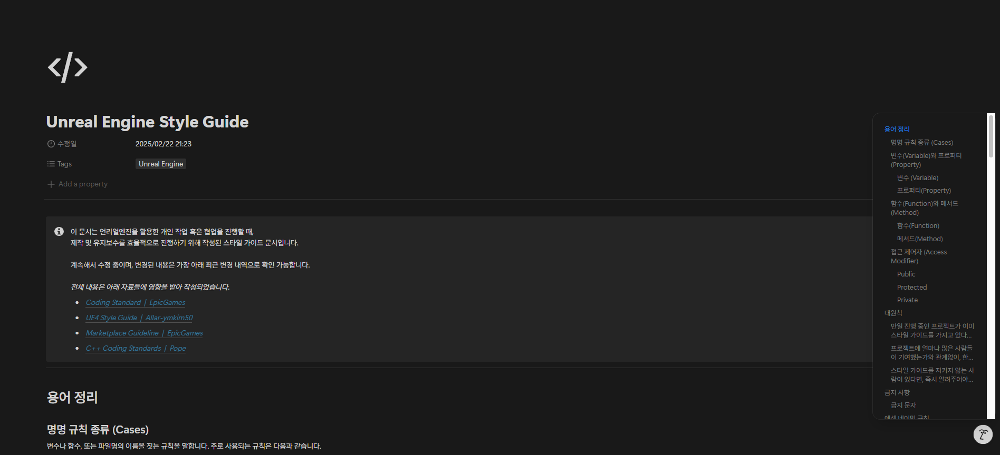
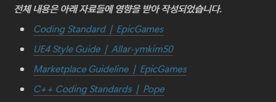
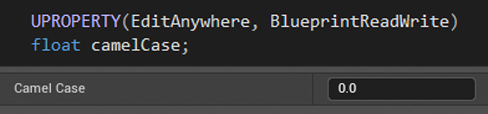
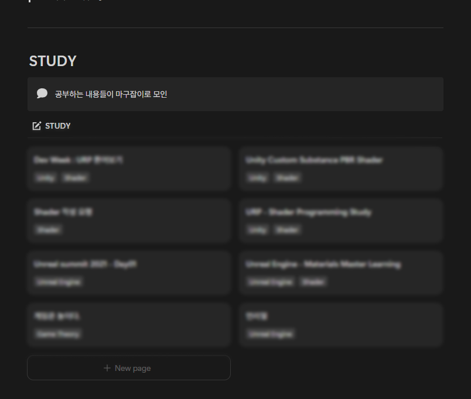

> 개인 작업 및 협업에 사용하기 위해 스타일 가이드를 제작했습니다.  
> 협업 시 이슈를 최소화하기 위함이며, 특히 개인 작업에 있어서 **일관성**을 유지하기 위함이기도 합니다.

---

## 스타일 가이드를 제작했습니다.


**[Unreal Engine Style Guide - 링크](https://junyangyee.notion.site/ue-styleguide-junyangyee)**  

  


계속 써야지 써야지 하면서 미루기만하던 개인 스타일 가이드 문서를 작성했습니다.  
작성하면서 생각났던 내용들이나, 어떤 이유로 해당 형식으로 작성하게 되었는지 한 번 써보려합니다.

### 왜 만들었을까?

사실 개인적으로는 크게 없어도 문제되지 않는 부분이긴 하지만, 가끔씩 이런 스타일 가이드의 필요성을 느꼈습니다. 다른 사람의 작업물을 이어받아 작업을 하게 되거나, 새로 작업을 시작하거나.

특히 옛날 제가 했던 작업물을 열어볼 때 필요성을 크게 느꼈습니다.  
매번 작업 파일을 다시 열어보면 폴더 구조부터 파일 이름 등, 직접 하나하나 확인해봐야 하는 부분이 많았습니다. 제가 했던 작업인데도, 간단한 수정이 힘들 정도로 정리가 안되어있고, 지금 작업 방식과 다른 부분이 많았습니다.

지금이라도, 제 개인 작업물에는 일정하게, 일관성있는 규칙대로 정리하면서 작업하는 게 좋을 것 같아서 작성했습니다.  
물론 다른 사람들과 협업할 일이 생기면, 해당 스타일 가이드를 바탕으로 하게되면 협업에도 크게 도움이 된다는 장점도 있죠.

그래서 일단 제일 주로 사용하는 언리얼엔진 기준 스타일 가이드부터 작성을 시작했습니다.  
추후 C++나 다른 스타일 가이드도 이어서 작성하려고 합니다.

### StyleGuide with Notion

처음에는 개인적으로 자주 사용하던 Obsidian에 작성하려 했습니다. 워낙 자유도도 높고 예쁘게 꾸미기 좋으니까요.  
다만 Obsidian에 작업하면 공유하기도 힘들고, 메인 PC가 아니면 확인하기 힘들다는 큰 단점이 있었습니다. 물론 Obsidian-Git을 사용하긴 하지만, Git 연동이 필요하다는 것 역시 충분히 귀찮은 과정이죠.

역시 이런 문서 작성에는 Notion이 제일 좋은 것 같습니다.  
온라인으로 확인/수정도 편하고, Publish를 통해 공유하기도 편한데에다가 문서 꾸미기도 편리해서 작성하기 좋았습니다.

### 도움받은 문서들

처음부터 제가 원하는 방향으로 작성하려 했으나, 역시 이런 문서 작성은 전체적인 형식을 잡기가 어려웠습니다. 어떤 것부터 작성해야할지 엄두가 안났습니다.

  

위 문서들에 도움을 받았습니다. 특히 두번째 문서는 표준 스타일가이드처럼 사용되는 곳이 많아서 해당 문서에서 형식부터 내용까지 도움을 정말 많이 받았습니다.

---

## About Guide

이제부터는 스타일 가이드 내용들을 바탕으로 작성 이유들을 적어보려합니다.  
스타일 가이드 문서와 함께 읽어주세요 :)

### camelCase vs PascalCase

사실 여태 코딩하는 대부분의 상황에서 카멜 케이스를 선호해왔습니다. 특히 변수명 지을 때에는 거의 무조건 카멜 케이스로 썼던 것 같습니다. 그래서 생각보다 변수명 규칙에서는 꽤 일관성있게 작업했었는데, 언리얼엔진에서는 자동으로 보기 편하게 대문자/띄어쓰기를 해주는 기능도 있고 코딩하는 느낌은 아니었던지라 되게 대충 했던 것 같습니다.

이번 스타일 가이드를 작성하면서, 함수·구조체는 파스칼 - 변수·매게변수는 카멜로 작성하는 방식으로 하려했는데, 생각보다 많은 언리얼엔진 가이드와 심지어 에픽 공식 코딩 표준에서도 파스칼 케이스로 통일해서 쓰는 걸 발견했습니다.

아무래도 언리얼엔진 내에서는 자체적으로 변수명을 바탕으로 보기 편하게 바꿔주는 기능이 있어서 그런 것 같습니다.  
언리얼엔진 내에서 자동으로 첫글자 대문자 + 띄어쓰기가 되어서 보여지기 때문에, 특히 카멜 케이스의 경우 규칙과 달라도 오류를 발견하기 힘들어지는 것 같습니다.

스타일 가이드의 목적이 이슈를 최대한 줄이는 게 목적이기에, 굳이 카멜케이스를 사용하지 않고 파스칼 케이스로 통일하는 방향으로 작성했습니다.



### 명명 규칙 - 동사의 사용

명명 규칙이 정말 사람마다 스타일이 다른 것 같습니다. 불리언 변수의 경우도 어떤 문서는 동사를 허용하고 어떤 문서는 함수에만 동사를 허용하기도 하는 등 사람마다 많이 다르게 사용합니다.

이전까지는 이름을 지을 때, 특히 불리언 변수명을 정말 대충 지어서 사용했었기에, 이 기회에 제대로 잡고 가는게 나을 것 같아 하나로 딱 정했습니다. 

기존에는 불리언 변수를 하나의 함수처럼 생각해서 동사를 넣어서 사용했는데, 그럴 경우 함수와 변수를 혼동할 가능성이 높아지고 직관적이지 않을 수 있어 의문형 동사를 사용하지 않는 것으로 했습니다. 즉, 불리언 변수는 하나의 상태를 나타낸다는 개념이 조금더 명확하다고 판단했습니다.

```cpp
// "죽은" 이라는 상태. 참/거짓
// 상태를 명확히 이야기할 수 있게.
bool bDead;

// "죽었나요?" 라는 상태. 참/거짓 ? ... 뭔가 어색
// "죽었나요?" 라는 질문 -> 함수의 기능 (반환 값으로 받아오는게 조금 더 이해하기 쉬운.)
bool bIsDead;
bool IsDaed(Player);

```

### 아직 애매한 부분들

스타일 가이드 내용들을 작성하면서, 아직 C++ 프로젝트를 진행해본적이 없어 폴더구조나 파일명을 어떻게 할지 작성하기 애매한 부분이 많았습니디. 일단 블루프린트 작업했던 것 + 참고한 스타일 가이드를 기반으로 작성했지만, 이렇게 애매한 부분들은 최대한 빨리 깔끔하게 수정해야할 것 같습니다.

---

## 여담

일단 스타일 가이드를 작성했으니, 최대한 모든 작업들을 이 스타일 가이드를 따라서 진행해야겠죠. 예전에 했던 작업들이 너무 지저분해서 파일들 중 수정이 가능한 게 얼마나 있을지 모르지만, 최대한 수정할 수 있는 건 수정해봐야할 것 같습니다.



이 스타일 가이드를 준비하면서 개인 노션 파일들도 싹 정리해서 깔끔하게 작업했습니다.  
이렇게 보니 정말 정리해두면서 공부한게 하나도 없네요... 앞으로 공부할 때 손으로나 키보드로나 어디에든 적어가면서 공부해야겠습니다.  
책꽂이에 들어가있는 노트들도 조만간 열어서 다 옮겨둬야겠습니다.

---

```toc
```